# Материалы по теме

**Навигация**
- [← Оглавление курса](index.md)
- [← Предыдущий: 12171 — Отзывы (комментарии) к элементу инфоблока](lesson_12171.md)
- [Следующий: 13040 — Практические задания →](lesson_13040.md)

Официальная страница урока: https://dev.1c-bitrix.ru/learning/course/index.php?COURSE_ID=34&LESSON_ID=12169

Настроить вывод **Материалов по теме** гораздо сложнее, чем включить голосование по элементам. Однако этот функционал может быть очень полезен для Вашего сайта, поэтому разберемся, как же его настроить.


### Видеоурок

### Выводим похожие материалы

**Примечание**: Материалы по теме доступны только в шаблонах **.default** и **web20** комплексного компонента

			Новости

                    Комплексный компонент позволяет создать новостной раздел на сайте. Доступен просмотр детальной информации, списка элементов, настройка экспорта в rss, организация голосования за новости (или другие элементы инфоблоков), настройка отзывов, вывода материалов по темам, настройки ЧПУ и многое другое.

						[Описание компонента «Новости (комплексный компонент)» в пользовательской документации.](http://dev.1c-bitrix.ru/user_help/detail.php?ID=62967)

		 (news).

Чтобы посетитель сайта видел похожие новости, необходимо в административном разделе вручную "рассортировать" все новости. Для этого нужно создать свойство элементов инфоблока, которое будет отображаться в каждом элементе как

			поле выбора тем


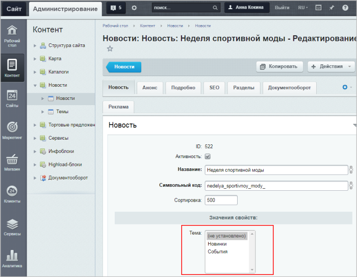

		, а затем привязать каждый элемент к одной из тем.

Рассмотрим пошагово, как вывести **Материалы по теме**:

1. Помимо инфоблока, элементы которого мы будем выводить, нужно **в том же типе инфоблока**
  			создать инфоблок,
  Откройте страницу Контент &gt; Инфоблоки &gt; Типы инфоблоков &gt; название_типа , где вместо *название_типа* у вас отображается реальное название нужного типа инфоблоков (учтите, что после создания инфоблока его тип уже нельзя будет поменять).
  Нажмите кнопку **Добавить инфоблок**.
  Заполните поля формы редактирования инфоблока (см. далее).
  [Подробнее](lesson_4534.md)...
  		 в котором будут определяться будущие темы материалов (т.е. создать некий вспомогательный инфоблок):
  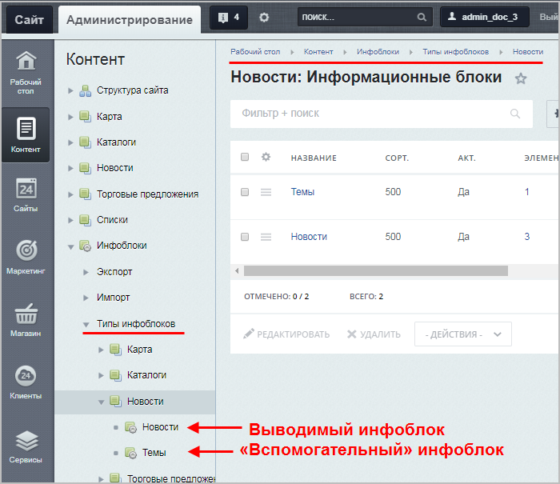
2. Затем необходимо
  			добавить разделы
  Когда инфоблок только что создан и еще не опубликован на сайте, то разделы в него добавляйте с помощью средств административного раздела:
  1) Откройте страницу инфоблока:  Контент &gt; название_типа &gt; название_инфоблока  (где вместо название_типа, название_инфоблока будут реальные названия вашего типа и инфоблока).
  Если требуется новый подраздел создать в уже имеющемся разделе, то дополнительно нажмите на название этого раздела.
  2) Нажмите кнопку **Добавить раздел**.
  [Подробнее](lesson_10077.md)...
  		 этого инфоблока. Добавленные разделы как раз и будут являться темами (при этом в созданные разделы не нужно добавлять элементы):
  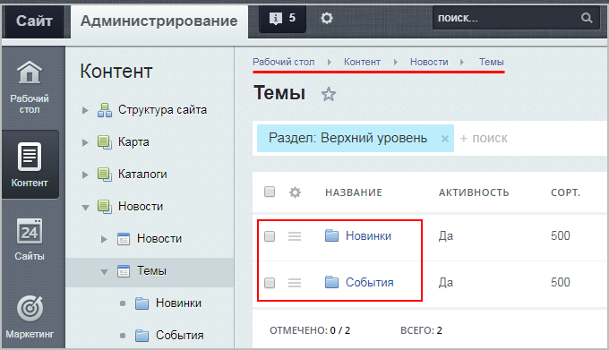
  В примере создан вспомогательный инфоблок **Темы**, в котором добавлены два пустых раздела (т.е. две будущих темы, по которым далее будут распределяться все элементы другого инфоблока - инфоблока **Новости**).
  **Примечание**: Если Вы не видите кнопку
  			Добавить раздел
  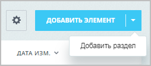
  		, то проверьте, отмечена ли в
  			настройках типа
  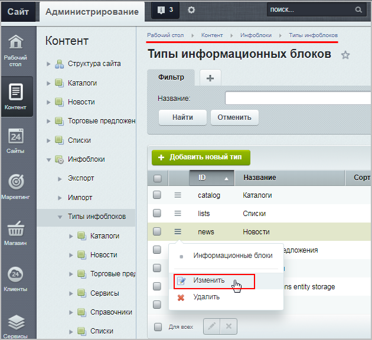
  		 информационного блока опция
  			Использовать древовидный классификатор элементов по разделам
  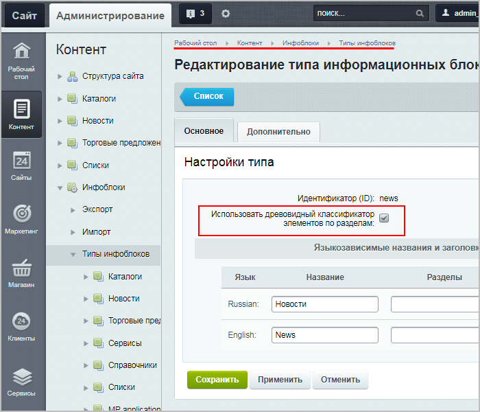
3. Далее нужно
  			создать свойство элементов
  Откройте форму настроек информационного блока (Контент &gt; Инфоблоки &gt; Типы инфоблоков &gt; название_типа &gt; название_инфоблока).
  Перейдите на закладку **Свойства**.
  [Подробнее](lesson_9407.md)...
  		 того инфоблока, для которого настраивается вывод материалов. В нашем примере создаем свойство инфоблока **Новости**.  Тип создаваемого свойства - **Привязка к разделам**.
  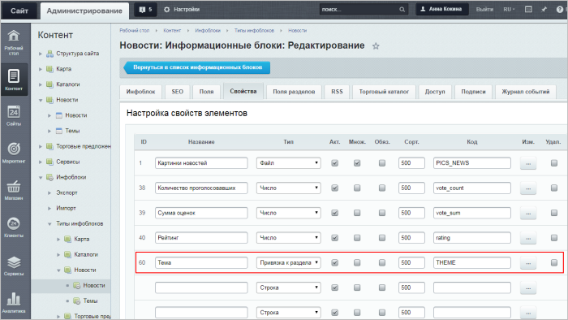
  Теперь в
  			настройках свойства
  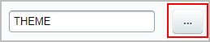
  		 нужно привязать это свойство к созданному инфоблоку (в нашем случае - к инфоблоку
  			Темы
  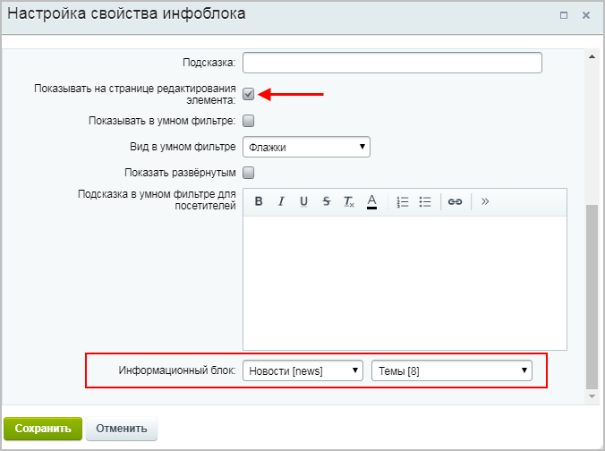
  		).
4. В результате у всех элементов инфоблока **Новости** появилось новое поле –
  			Тема
  
  		.
  Каждой новости, выводимой на сайте, нужно привязать одну из тем. Быстрее всего это можно сделать, добавив новое поле в
  			отображаемые колонки
  Кнопка **Настроить** вызывает окно, в котором вы можете выбрать колонки для показа в таблице элементов данной формы.
  Все, что нужно сделать для обеспечения себе более комфортной работы со списком элементов - выбрать нужные поля и нажать кнопку **Применить!** (соответственно, при нажатии кнопки **Отменить** все внесенные вами изменения удалятся).
  [Подробнее](lesson_11801.md)...
  		 полей списка элементов и редактируя затем
  			одну колонку
  Чтобы быстро отредактировать несколько элементов, отметьте их в колонке флажков и нажмите кнопку **Редактировать**.
  После этого станут доступны для редактирования те поля, которые вы выбрали при настройке списка.
  [Подробнее](lesson_11767.md#edit)...
   (т.е. не придется открывать по отдельности каждую из новостей).
  ## Маленькое замечание
  Если до выполнения описываемых действий вы производили [настройку формы добавления элемента](lesson_1883.md), то поле **Тема** не будет видно. Его нужно будет включить в список отображаемых полей.
5. И последний шаг: в компоненте, выводящем информацию на сайт, в блоке **Настройка материалов по теме** необходимо прописать **Код свойства**, созданного чуть ранее, и настроить
  			остальные параметры отображения:
  **Инфоблоки** – указываются инфоблоки, из которых будет происходить выборка информации.
  В коде задается в виде массива:
  ```
  array(0=>"33",1=>"29",2=>"8",),
  ```
  **Код свойства** – указывается код свойства, в котором хранится привязка элемента
  к определенному разделу (например, **THEMES**).
  **Максимальное количество материалов из одного инфоблока** – указывается максимальное
  количество материалов (элементов), которое можно выбрать из одного инфоблока.
  **Стиль вывода материалов из инфоблока** – выбирается один из двух стилей вывода:
  в виде списка или предпросмотр картинок.
  [Подробнее](https://dev.1c-bitrix.ru/user_help/components/content/articles_and_news/news.php#setting_up_materials_on_the_topic)...
  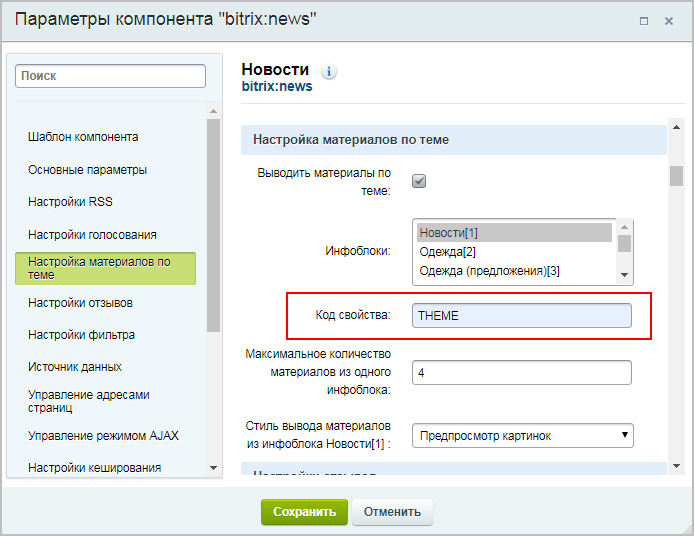

Готово! В результате на странице детального просмотра элемента будет отображаться блок **Материалы по теме**.

## Пример настроенной опции

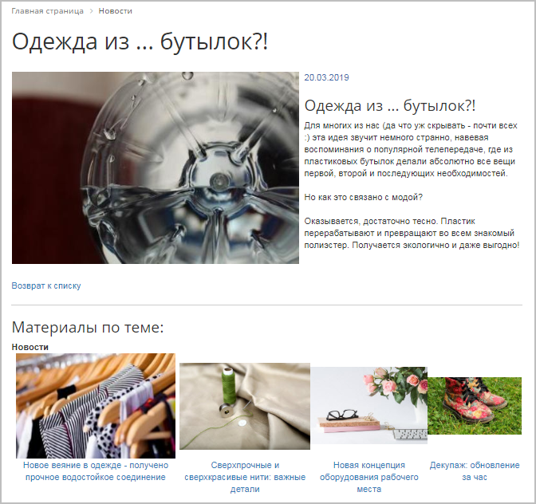

**Важно!** Если при переходе на новость по теме появляется ошибка, то проверьте блок **Управление адресами страниц** в настройках компонента:

1. Должна быть включена поддержка ЧПУ;
2. Для страницы детального просмотра должно быть установлено
  			значение
  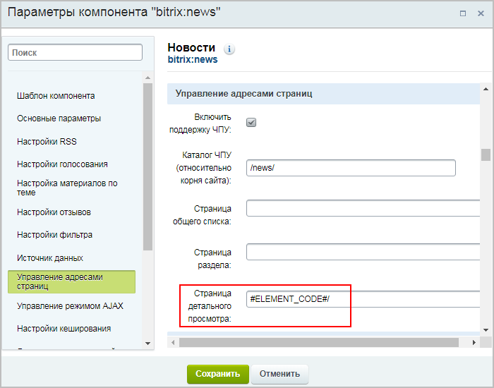
  		, взятое из
  			настроек инфоблока
  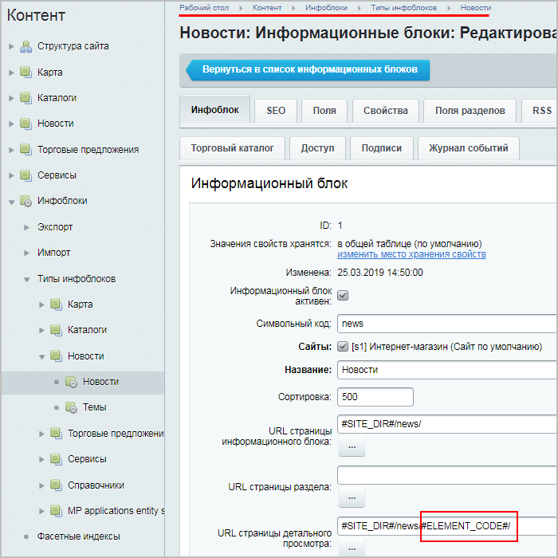
  		 (т.е. либо `#ELEMENT_CODE#/`, либо `#ELEMENT_ID#/`).
