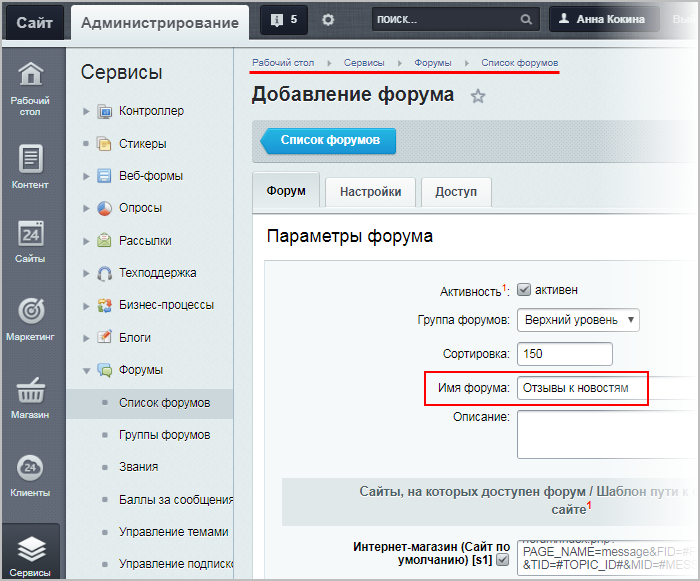
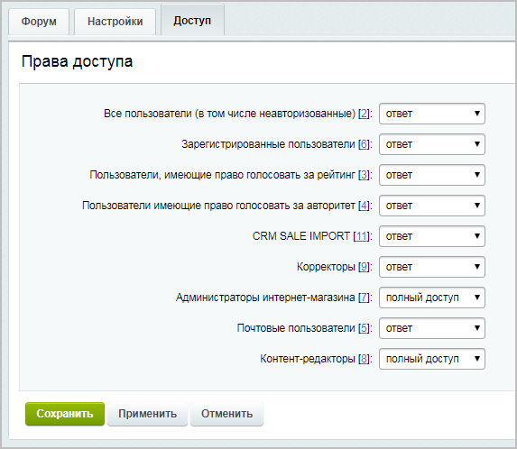
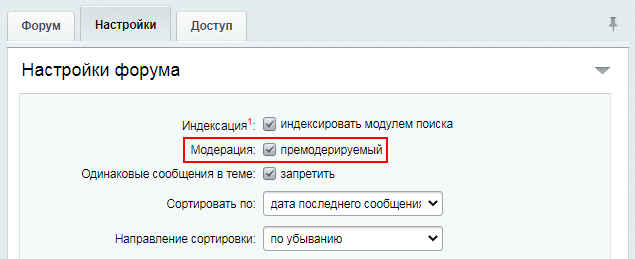
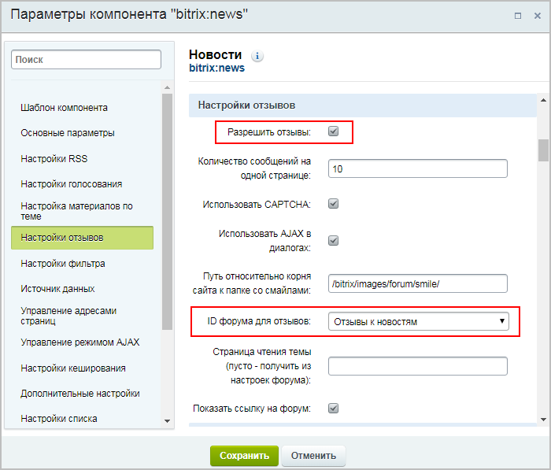
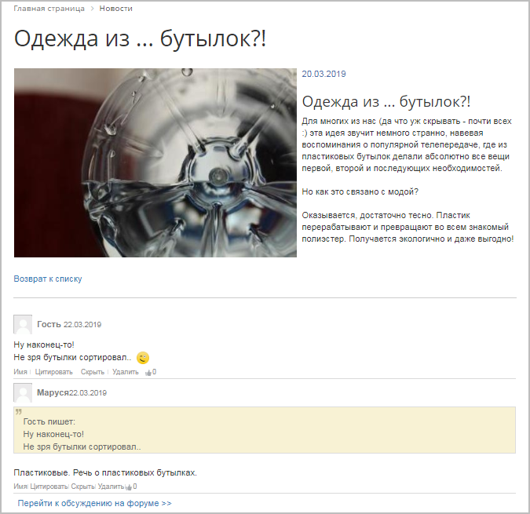

# Отзывы (комментарии) к элементу инфоблока

**Навигация**
- [← Оглавление курса](index.md)
- [← Предыдущий: 12167 — Голосование по элементам инфоблока](lesson_12167.md)
- [Следующий: 12169 — Материалы по теме →](lesson_12169.md)

Официальная страница урока: https://dev.1c-bitrix.ru/learning/course/index.php?COURSE_ID=34&LESSON_ID=12171

Разрешаем оставлять комментарии и отзывы.

### Видеоурок

### Как подключить комментарии и отзывы

Комментарии (отзывы) к элементам инфоблока подключаются за два шага:

1. Сначала
  			создается форум
  Для создания нового форума используется кнопка **Новый форум**, расположенная на контекстной панели. Откроется форма создания форума. Поясним поля формы, значение которых может не совсем понятно из названия или имеет особенности.
  [Подробнее](https://dev.1c-bitrix.ru/learning/course/index.php?COURSE_ID=41&LESSON_ID=2964)...
  		 для отзывов:
  
  ***** Не забудьте настроить
  			права доступа
  
  		 у созданного форума. А если хотите, чтобы отзывы не публиковались сразу, а проходили премодерацию, отметьте в настройках форума соответствующую
  			опцию
  
  		.
  **Примечание**: Для **Фотогалереи** можно добавлять отзывы и через форум, и через блог (соответственно, нужно будет
  			создать блог
  Создание и редактирование блогов осуществляется на странице **Блоги**(Сервисы &gt; Блоги &gt; Блоги).
  Для создания нового блога служит кнопка **Новый блог**, расположенная на контекстной панели.
  [Подробнее](lesson_2935.md)...
  		).
2. А потом отмечается опция **Разрешить отзывы** в настройках комплексного компонента, выбирается нужный форум в поле **ID форума для отзывов** и настраиваются [остальные параметры отображения](https://dev.1c-bitrix.ru/user_help/components/content/articles_and_news/news.php#feedback_settings):
  

Готово! Теперь на странице детального просмотра элемента инфоблока можно оставлять комментарии и отзывы.

## Пример настроенной опции

