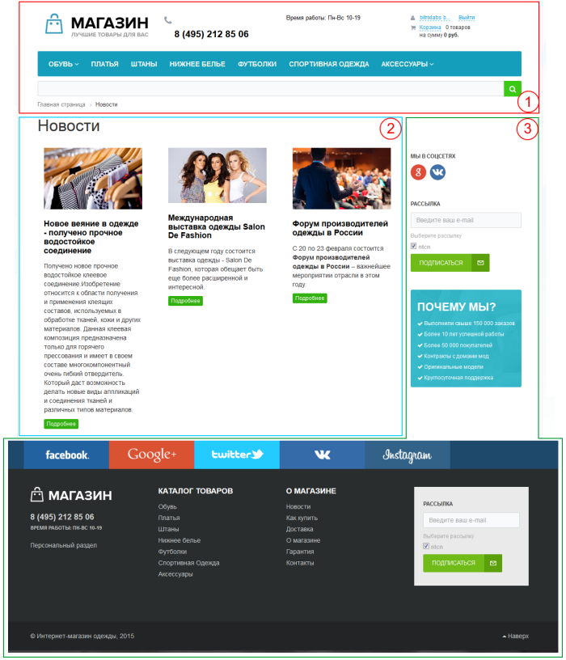
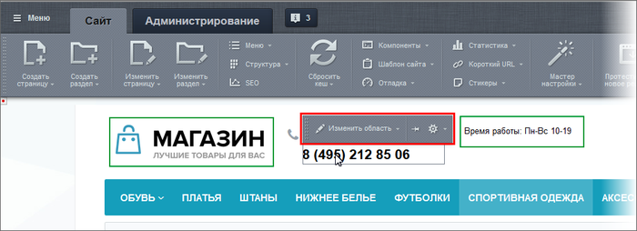
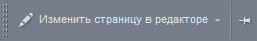
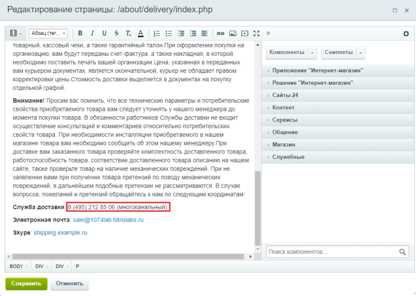

# Как изменить номер телефона на сайте

**Навигация**
- [← Оглавление курса](index.md)
- [← Предыдущий: 4763 — Как заменить favicon.ico](lesson_4763.md)
- [Следующий: 12790 — Как изменить логотип сайта →](lesson_12790.md)

Официальная страница урока: https://dev.1c-bitrix.ru/learning/course/index.php?COURSE_ID=34&LESSON_ID=12273

Представим, что у нас возникла ситуация: нужно поменять номер телефона на сайте.

### Если нужно поменять телефон

Сделать это несложно. Давайте определимся в какой части сайта находится телефонный номер. Страница сайта формируется системой динамически из трёх частей:

Подробнее о частях сайта можно прочитать [в уроке.](lesson_1847.md)

### Видеоурок

### Номер телефона в Верхней или Нижней частях

Информация, которую нам нужно изменить, может быть представлена:

1. включаемой областью;
2. статической информацией в шаблоне сайта.

Если в режиме

			Правка

                    
 [Подробнее](lesson_1832.md)

		 при наведении курсора мыши на информацию, которую мы хотим отредактировать, появится панелька с кнопкой **Изменить область** - это

			включаемая область

                    **Включаемая область** - это специально выделенная область на странице сайта, которую можно редактировать отдельно от основного содержания страницы.
[Подробнее](lesson_1879.md)

		. Нажимаем кнопку **Изменить область** и вносим необходимые правки.

)

**Внимание**! Если признаков включаемой области не появилось, значит номер телефона размещен в шаблоне сайта. В этом случае необходимо

			обратиться к разработчикам

                    Статическая информация, которая не нуждается (либо редко нуждается) в замене, как правило, размещается в статических зонах Footer и Header. Заменить ее можно в кодах самих файлов, но делать это придется квалифицированному разработчику, либо разработчик должен организовать такую замену с помощью компонентов системы силами редакторов сайта

		, т.к. Контент-менеджер работает только в **Основной рабочей области** и во **Включаемых областях**.

### Номер телефона в Рабочей области

Воспользуемся режимом **Правки**. Наведем курсор мыши на рабочую область. Появится кнопка

			Изменить страницу в редакторе

                    

		. При нажатии на эту кнопку откроется

			Визуальный редактор

                     В любой работе важен хороший инструмент. И работа с веб-сайтами не исключение. "1С-Битрикс: Управление сайтом" обладает мощным встроенным WYSIWYG редактором для работы со страницами сайта. Благодаря визуальному редактору мы прямо в браузере выполняем многие операции: от простого редактирования текста до настройки компонентов. По сути, с помощью визуального редактора мы способны редактировать любую информацию на сайте.
[Подробнее](https://dev.1c-bitrix.ru/learning/course/index.php?COURSE_ID=34&CHAPTER_ID=06299&LESSON_PATH=3905.6299)

		, с помощью которого редактируем текстовую информацию. В нашем случае - номер телефона.

### Заключение

Информацию просто отредактировать в любой части сайта, кроме статических зон в **Верхней** и **Нижней** частях страницы сайта. Такие данные лучше изначально размещать во включаемых областях, иначе придется каждый раз обращаться к разработчику.

Желательно это знать:

- [HTMLbook](http://htmlbook.ru/) - справочник по HTML
