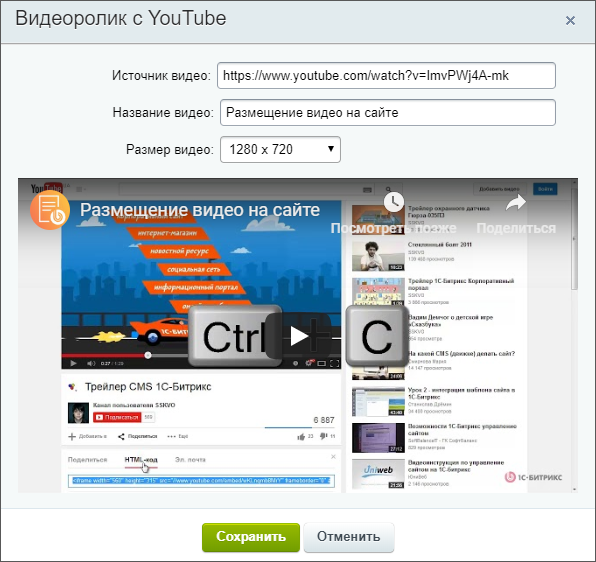
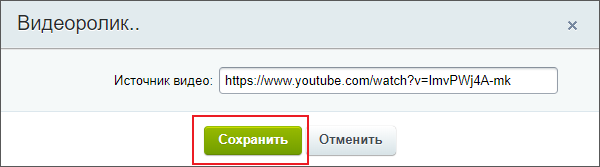
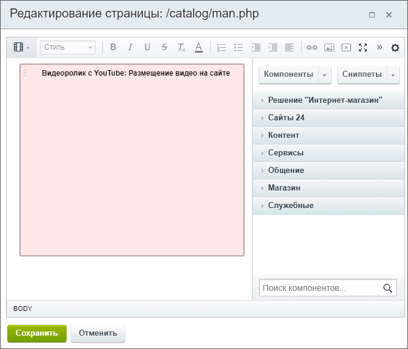
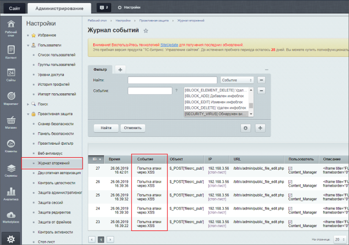
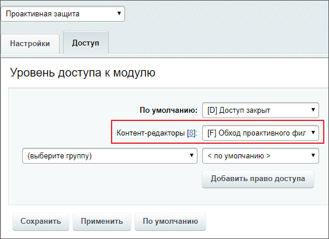
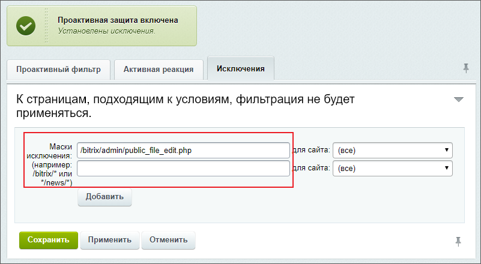
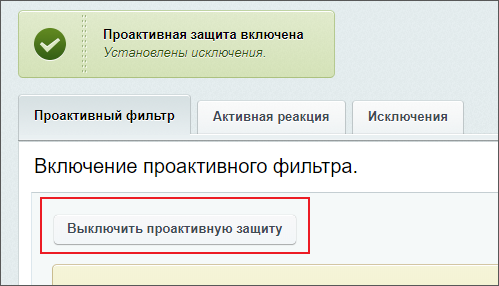

# Если не добавляется видео со стороннего сервиса

**Навигация**
- [← Оглавление курса](index.md)
- [← Предыдущий: 8623 — HTML-код с видеохостинга](lesson_8623.md)
- [Следующий: 7153 — Каталог товаров без использования модуля Торговый каталог →](lesson_7153.md)

Официальная страница урока: https://dev.1c-bitrix.ru/learning/course/index.php?COURSE_ID=34&LESSON_ID=12487

Во время работы по наполнению сайта у **Контент-менеджера** могут возникнуть проблемы с

			добавлением видео

                    Система *"1С-Битрикс: Управление сайтом"* позволяет использовать видео из **Медиабиблиотеки** и видео со сторонних сервисов (таких как *YouTube* и *RuTube*).
[Подробнее](lesson_9249.md)...

		 cо сторонних сервисов:  видео просто не появляется на странице. Давайте рассмотрим причины, почему так происходит.

### Быстрые действия

Первая причина очень проста: при добавлении ссылки на видео необходимо дождаться его

			загрузки

                    

		. Если нажать кнопку

			Cохранить

                    

		 до загрузки - видео не появится. Если ссылка добавлена верно, то после сохранения в визуальном редакторе отобразится:

### Проактивный фильтр

Некоторые действия пользователей, не представляющие угрозы, выглядят подозрительно и вызывают ложное срабатывание

			Проактивного фильтра

                    **Проактивный фильтр** (**Web Application Firewall**) – это набор специализированных средств, которые выполняют фильтрацию трафика.
[Подробнее](https://dev.1c-bitrix.ru/learning/course/index.php?COURSE_ID=35&LESSON_ID=2669&LESSON_PATH=3906.4829.4547.2669#filter)...

		. Воспринято ли ваше действие как **вторжение**

			проверьте

                    Для просмотра журнала и выполнения указанных ниже действий обратитесь к **Администратору** сайта.

		 на странице Настройки &gt; Проактивная защита &gt; Журнал вторжений. В списке видно, как попытки контент-менеджера добавить видео восприняты системой как **Попытка атаки через

			XSS

                    Тип атаки на веб-системы, заключающийся во внедрении в выдаваемую веб-системой страницу вредоносного кода и взаимодействии этого кода с веб-сервером злоумышленника.
[Подробнее](https://ru.wikipedia.org/wiki/Межсайтовый_скриптинг)...**:

Есть несколько способов это исправить:

1. На странице Настройки &gt; Настройки продукта &gt; Настройки модулей &gt; Проактивная защита на закладке **Доступ** выбрать для группы **Контент-редакторы** вариант
  			Обход проактивного фильтра
                      
  		;
2. В журнале вторжений в столбце URL указан путь к файлу (Например: `/bitrix/admin/public_file_edit.php`).
  			Добавим
                      
  		 его в исключения проактивного фильтра;
3. Если не помогло всё вышеперечисленное, то есть возможность
  			отключить
                      
  		 **Проактивный фильтр**.
  **Внимание**! Отключать **Проактивный фильтр** не рекомендуется. Фильтр обеспечивает защиту от большинства известных атак на веб-приложения, распознает опасные угрозы и блокирует вторжения на сайт.

### Документация по теме

- [Проактивный фильтр](https://dev.1c-bitrix.ru/user_help/settings/security/security_filter.php) - пользовательская документация;
- [Проактивная защита](https://dev.1c-bitrix.ru/learning/course/index.php?COURSE_ID=35&CHAPTER_ID=04547&LESSON_PATH=3906.4829.4547) - курс Администратор.Модули.
