# Пример для упрощенного режима: анкета регистрации

**Навигация**
- [← Оглавление курса](index.md)
- [← Предыдущий: 2929 — Публикация веб-формы](lesson_2929.md)
- [Следующий: 12708 — Техническое задание →](lesson_12708.md)

Официальная страница урока: https://dev.1c-bitrix.ru/learning/course/index.php?COURSE_ID=34&LESSON_ID=12645

### Создаем анкету регистрации

Представим, что в вашем магазине планируется провести закрытое мероприятие (например, показ одежды) и организовать регистрацию на мероприятие через сайт. При регистрации необходимо получить такую информацию:

- Имя (обязательное поле);
- Пол;
- Номер телефона (обязательное поле);
- E-mail.

Также обязательно добавить защиту от ботов. Зарегистрированные пользователи должны иметь возможность редактировать свои данные в уже отправленной форме.

Создадим форму регистрации на мероприятие с помощью

			веб-форм

                    **Веб-форма** - специальная область на странице или отдельная страница сайта в которой посетитель может внести ту или иную информацию. Образно - это аналог бумажной анкеты, бланка и опросного листа. Количество веб-форм и количество вопросов в них ничем не ограничено, вам доступно гибкое управление параметрами ваших форм.
[Подробнее](lesson_9923.md)...

		. Используем веб-форму

			в упрощенном режиме

                    **Упрощенный режим** предназначен для решения простых задач, например, создания формы обратной связи. В этом режиме не используются поля и статусы веб-форм.
[Подробнее](lesson_2926.md)...

		.

## Требование законодательства РФ

И последнее требование - это требование законодательства РФ: ФЗ-152 о персональных данных. Страница с Веб-формой должна обязательно содержать чекбокс подтверждения посетителем своего согласия на обработку персональных данных, если такие данные запрашиваются. А мы запрашиваем: e-mail и телефон.

На данный момент, к сожалению, штатно этот функционал в компонентах модуля **Веб-формы** не реализован. Добавить

			чекбокс

                    Элемент графического пользовательского интерфейса, позволяющий пользователю выбрать из двух вариантов: оставить пустым или поставить отметку. Обычно используется для подтверждения данных или согласия. Имеет, например, такой вид:

		 подтверждения согласия можно, но потребуется [привлечение разработчиков](/learning/course/index.php?COURSE_ID=35&LESSON_ID=8407).

### Создание веб-формы и вопросов

Перейдем в

			Административном разделе

                    **Административный раздел** - раздел системы, недоступный для просмотра обычным посетителям сайта. В нём производятся настройки сайта и системы для работы.

[Подробнее...](https://dev.1c-bitrix.ru/learning/course/index.php?COURSE_ID=34&CHAPTER_ID=04459&LESSON_PATH=3905.4455.4459)

		 на страницу Сервисы &gt; Веб-формы &gt; Настройка форм и нажмем кнопку **Создать**. В открывшейся форме:

- Заполним данные на вкладке **Свойства**. Обязательно поставим *"галочку"* на **Использовать CAPTCHA**;
  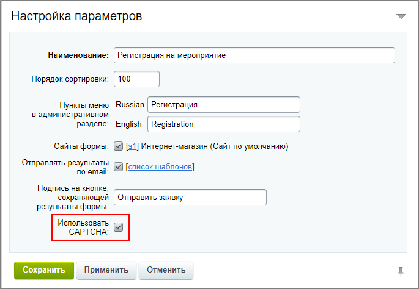
- На закладке **Описание** укажем
  			описание
                      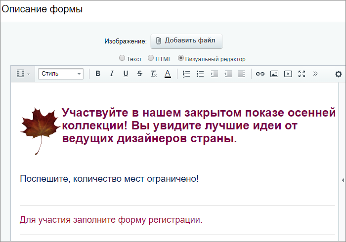
  		 и примечания для нашей формы регистрации;
- На закладке **Шаблон формы** пока выберем
  			Использовать шаблон формы по умолчанию
                      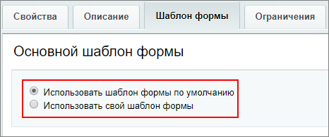
  		;
- На закладке **Доступ** укажем необходимые права. В нашем примере дадим зарегистрированным пользователям возможность
  			редактировать результат
                      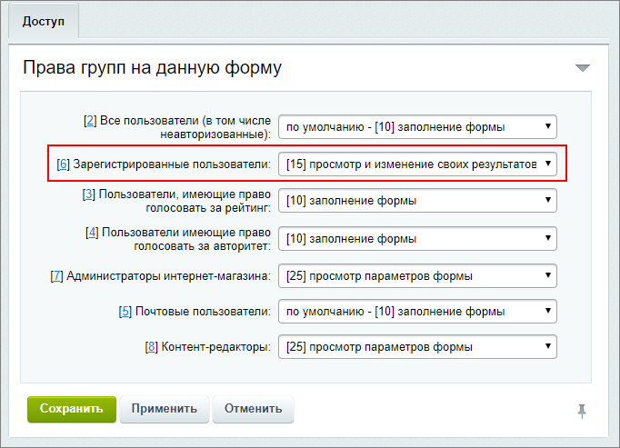
  		 заполнения веб-формы;
- Перейдем по кнопке **Вопросы** к созданию вопросов формы и создадим 4 нужных нам вопроса:

  - **Имя** - тип поля `text`, обязательное;
  - **Пол** - тип поля `dropdown`, т.е выпадающий список;
  - **Номер телефона** - тип поля `text`, обязательное. Также добавим
    			валидатор
                        Проверка на соответствие значению.
    		: мин. и макс. количество символов
    			12
                        Для записи телефонного номера вида `+79123456789` требуется 12 символов.
    		.
  - **E-mail** - тип поля `text`, размер поля `30`.
- Сохраним веб-форму.

### Размещение компонента на странице

Для вывода веб-формы в Публичном разделе, создадим новую страницу **Опросы** и разместим на ней комплексный компонент

			Веб-форма

						[Описание компонента «Веб-форма (комплексный компонент)» в пользовательской документации.](http://dev.1c-bitrix.ru/user_help/detail.php?ID=63057)

		:

- На закладке **Источник данных**
  			выберем
                      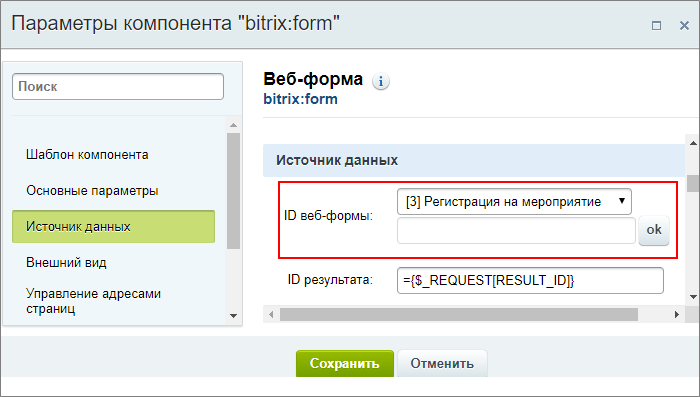
  		 нашу веб-форму **Регистрация на мероприятие**;
- Остальные параметры настройте при необходимости.

Так выглядит созданная нами форма при использовании шаблона по умолчанию:

## Дополнительно: Создаем свой шаблон веб-формы

О том, как создавать свой шаблон веб-формы описано в уроке [Создание шаблона веб-формы](lesson_2928.md). Здесь рассмотрим, как создать шаблон для нашего примера.

Давайте немного разнообразим нашу форму регистрации. Для этого в настройках веб-формы на закладке **Шаблон формы** отметим вариант **Использовать свой шаблон формы**. Откроется

			форма создания

                    Если не нравится как отображается ваш шаблон в стандартном варианте, перейдите на закладку **Шаблон формы** в режиме редактирования веб-формы и создайте свой шаблон, выбрав пункт **Использовать свой шаблон формы**.
[Подробнее](lesson_2928.md)...

		:

- Первым делом из раздела
  			Доп. элементы формы
                      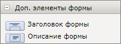
  		 добавим **Заголовок формы** и **Описание**;
- Далее разместим элемент 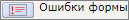 для того, чтобы пользователю выводилась информация об ошибках заполнения при попытке отправить данные;
- Вопросы разместим в таблице. Для создания таблицы нажмем
  			кнопку
                      
  		 в панели и заполним данные;
- В правом столбце разместятся поля для ответов. Т.к. вопросы мы создали заранее, находиться они будут в разделе
  			Существующие поля формы
                      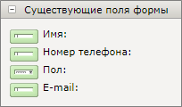
  		;
- В левом столбце укажем вопросы с помощью размещения элементов 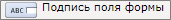 в каждой строке и указав в настройках элементов соответствующие
  			идентификаторы вопросов
                      Посмотреть идентификаторы возможно выбрав поле формы из
  правого столбца таблицы.
  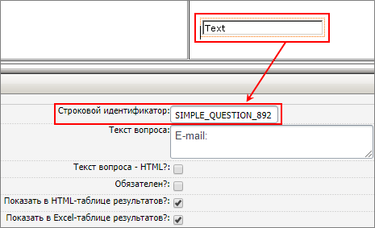
  		;
- Улучшим внешний вид формы добавив иконки к вопросам. С помощью
  			кнопки
                      
  		 в панели выберем добавление картинки;
- После таблицы сделаем сноску *** - *Обязательные поля*, разместим элементы
  			CAPTCHA
                      
  		 и текст *Введите код с картинки*;
- В самом конце расположим кнопку 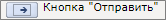 для отправки результатов заполнения формы.

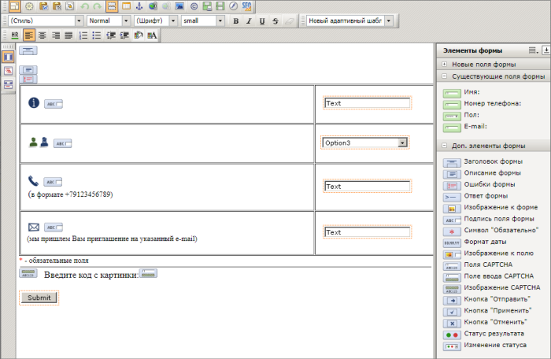

Получим такой результат:

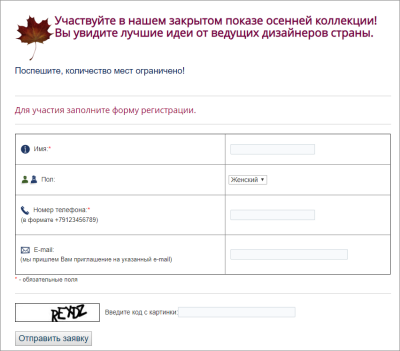

С ошибками заполнения формы:

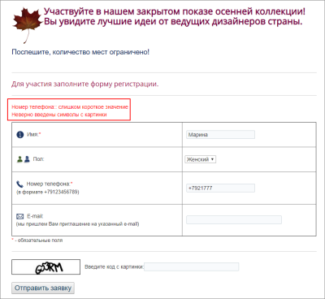

### Анализируем результаты

Для просмотра и анализа собранных данных, перейдем на страницу Сервисы &gt; Веб-формы &gt; Результаты &gt; *[Название_формы]*:

- В фильтре имеется возможность фильтрации по созданным в форме
  			вопросам
                      Например можно отфильтровать список результатов по **полу**:
  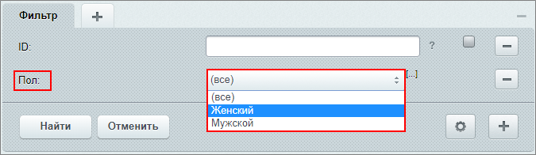
  		;
- Или выполните выгрузку
  			файла Excel
                      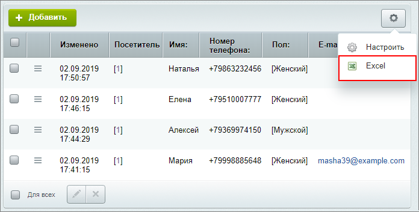
  		, для дальнейшей обработки полученных данных.

### Заключение

Мы настроили форму регистрации на мероприятие c помощью упрощенной веб-формы, а также посмотрели, как сделать свой индивидуальный шаблон.
