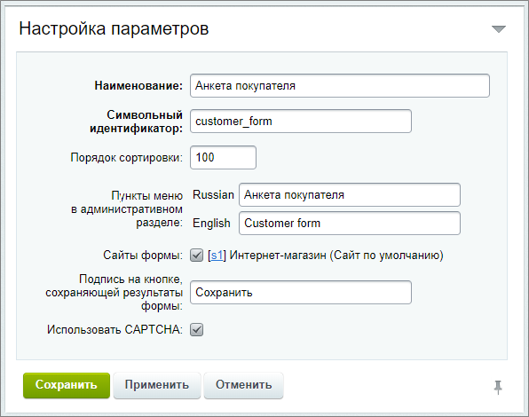
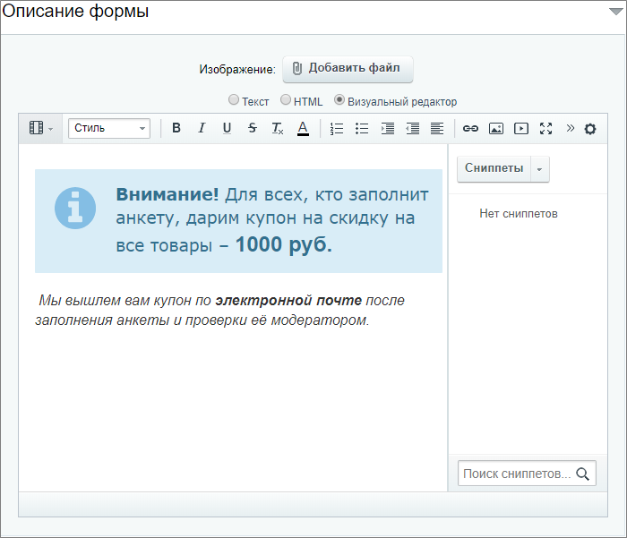
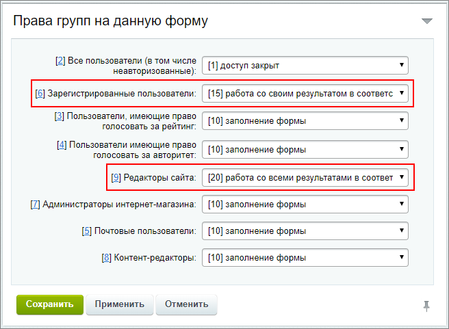

# Создание формы

**Навигация**
- [← Оглавление курса](index.md)
- [← Предыдущий: 12708 — Техническое задание](lesson_12708.md)
- [Следующий: 12714 — Создание вопросов веб-формы →](lesson_12714.md)

Официальная страница урока: https://dev.1c-bitrix.ru/learning/course/index.php?COURSE_ID=34&LESSON_ID=12710

### Создаём форму

Для создания анкеты по нашему ТЗ нам подойдет веб-форма в

			расширенном режиме

                    Для работы в расширенном режиме в настройках модуля Веб-формы необходимо снять флаг с поля **Использовать упрощённый режим редактирования форм**. Если вы работали в **упрощённом режиме**, а потом переключились в **расширенный режим**, то нежелательно возвращаться обратно в упрощенный режим. Данные, сохраненные в расширенном режиме, при переключении могут поменять структуру и сделать работу веб-формы неверной.
[Подробнее](lesson_5219.md)...

		. Расширенный режим работы с веб-формами, помимо управления вопросами и результатами веб-форм, позволяет настраивать статусы результатов.

Организуем сбор информации о покупателях и мнений о магазине с помощью веб-формы, в которой:

- Все поля должны быть обязательными к заполнению;
- Имеются сложные вопросы с разными типами ответов;
- Имеется защита от ботов (CAPTCHA);
- Настроены статусы;
- Организована проверка модератором.

### Требование законодательства РФ

И последнее требование - это требование законодательства РФ: ФЗ-152 о персональных данных. Страница с Веб-формой должна обязательно содержать чекбокс подтверждения посетителем своего согласия на обработку персональных данных, если такие данные запрашиваются. А мы запрашиваем: e-mail и телефон.

На данный момент, к сожалению, штатно этот функционал в компонентах модуля **Веб-формы** не реализован. Добавить чекбокс подтверждения согласия можно, но потребуется [привлечение разработчиков](/learning/course/index.php?COURSE_ID=35&LESSON_ID=8407).

### Настройки

Перейдем в

			Административном разделе

                    **Административный раздел** - раздел системы, недоступный для просмотра обычным посетителям сайта. В нём производятся настройки сайта и системы для работы.

[Подробнее...](https://dev.1c-bitrix.ru/learning/course/index.php?COURSE_ID=34&CHAPTER_ID=04459&LESSON_PATH=3905.4455.4459)

		 на страницу Сервисы &gt; Веб-формы &gt; Настройка форм и нажмем кнопку **Создать**. В открывшейся форме:

- Заполним данные на вкладке **Свойства** и обязательно поставим *"галочку"* на **Использовать CAPTCHA**:
  
- На вкладке **Описание** добавим
  			информацию
                      
  		 о нашем опросе;
- Шаблон формы оставим **по умолчанию**;
- К вкладке **Ограничения** вернемся позже, после создания статусов.
- На вкладке **Доступ**
  			установим
                      
  		:

  - Зарегистрированные пользователи: [15] Работа со **своим** результатом в соответствии с его статусом;
  - Редакторы сайта: [20] Работа со **всеми** результатами в соответствии с их статусами.

### Дополнительно

- [Создание и редактирование веб-формы](lesson_5153.md) в расширенном режиме.
