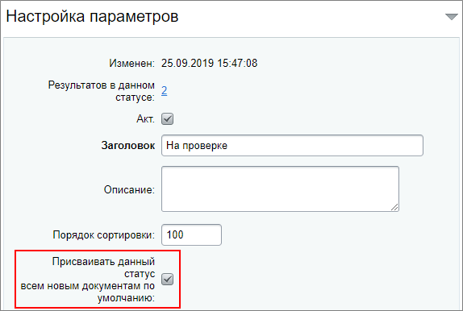
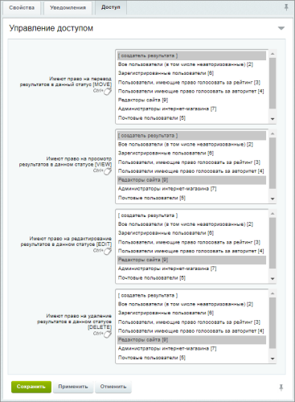
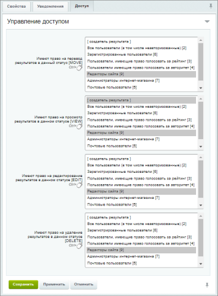
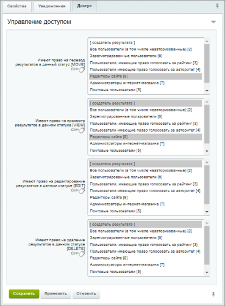
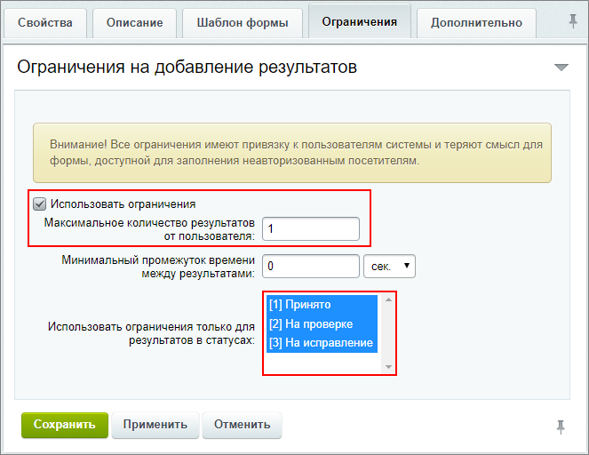

# Создание статусов веб-формы

**Навигация**
- [← Оглавление курса](index.md)
- [← Предыдущий: 12714 — Создание вопросов веб-формы](lesson_12714.md)
- [Следующий: 12786 — Публикация формы →](lesson_12786.md)

Официальная страница урока: https://dev.1c-bitrix.ru/learning/course/index.php?COURSE_ID=34&LESSON_ID=12712

### Создание статусов

В ТЗ требуется возможность просмотра анкет модератором и возврат на исправление анкеты клиентом. Для этого потребуется

			создать статусы

                    Для создания статусов веб-формы кликните либо на **Статусы** на специальной панели в режиме редактирования нужной веб-формы, либо перейдите по ссылке [+] , расположенной в столбце Статусы на странице со списком форм. Откроется окно создания статуса:

[Подробнее](lesson_5154.md)...

		. В нашем случае достаточно трех:

- На проверке;
- Принято;
- На исправление.

1. Статус **На проверке** означает, что анкета находится на проверке у редактора сайта. При создании этого статуса отметим **Присваивать данный статус всем новым документам по умолчанию**, чтобы он устанавливался автоматически для каждой новой анкеты:
  
  На закладке **Доступ** важно правильно настроить
  			права доступа
                      Нажмите на картинку для увеличения:
  
  		 для статуса:

  - Просмотр, редактирование и удаление анкеты доступны Редактору сайта;
  - Создателю анкеты доступны просмотр и перевод анкеты в  статус **На проверке**.
2. Статус **Принято** подтверждает правильность заполнения анкеты:
  - Такой статус сделаем доступным для установки только
    			редактору сайта
                        Нажмите на картинку для увеличения:
    
    		. Также он может удалять и редактировать данные.
  - Пользователю доступен только просмотр принятой анкеты.
3. Статус **На исправление** понадобится редактору, если он обнаружит ошибки в заполнении анкеты. После установки этого статуса для анкеты, она станет доступна создателю для
  			редактирования
                      Нажмите на картинку для увеличения:
  
  		.

### Ограничение количества заполненных анкет

После создания статусов вернемся к настройкам формы на закладку **Ограничения**. Добавим ограничения на заполнение анкеты: от одного пользователя принимается только одна анкета.

### Дополнительно

- [Настройка статусов веб-формы](lesson_5154.md) в расширенном режиме.
