# Создание вопросов веб-формы

**Навигация**
- [← Оглавление курса](index.md)
- [← Предыдущий: 12710 — Создание формы](lesson_12710.md)
- [Следующий: 12712 — Создание статусов веб-формы →](lesson_12712.md)

Официальная страница урока: https://dev.1c-bitrix.ru/learning/course/index.php?COURSE_ID=34&LESSON_ID=12714

В нашем ТЗ перечислена необходимая информация, которую требуется собрать при помощи нашей анкеты. Некоторые вопросы имеют различные возможности ответа. Посмотрим, как их создать.

### Создание вопросов

Перейдем к закладке создания вопросов. Сначала рассмотрим **общие** моменты для всех вопросов:

- Для всех вопросов установим признак
  			обязательный
                      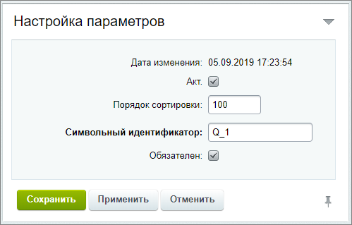
  		 и заполним остальные данные;
- На закладке **Вопрос** с помощью визуального редактора создаём наш вопрос: пишем текст, форматируем его и добавляем изображение, при необходимости;
- Настраиваем
  			отображение результатов
                      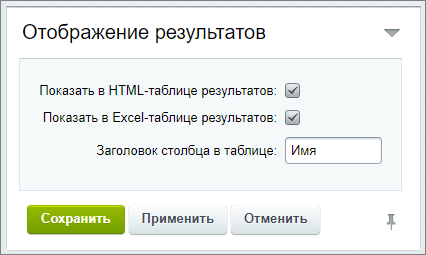
  		 для каждого вопроса на закладке **Результаты**.
- На закладке **Фильтр** указываем по каким значениям ответов использовать фильтр, а также
  			отображение подписи
                      
  		 для вопроса в фильтре.

Подробнее остановимся на создании **ответов** к каждому типу вопросов. Для этого нам понадобятся закладки **Ответ** и **Валидаторы**:

| \| Вопрос \| Описание \| Настройки \| Валидатор \| \| --- \| --- \| --- \| --- \| \| **Ваше имя** \| Тип поля **text**, ширина `70`. В поле **Текст** необходимо поставить  пробел Примечание: если в поле **Текст** не нужно вводить данные (для некоторых типов полей (например - файл, текст) это не нужно), то поставьте пробел. . \| Наведите на текст, чтобы посмотреть настройки 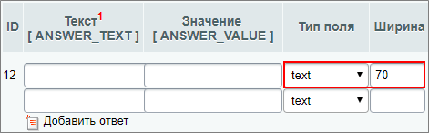 \| Наведите на текст, чтобы посмотреть настройки 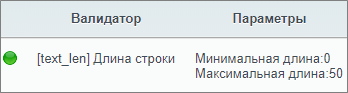 \| \| **Пол** \| Тип поля **dropdown**. Два ответа: женский и мужской. \| Настройки 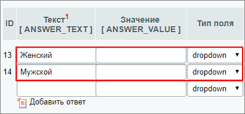 \|  \| \| **Предпочитаемый стиль одежды** \| - Установим пять вариантов **checkbox**, в которых укажем стили; - Один вариант **radio** - отметка для случая, когда ни один не подходит; - Поле **text** - для произвольного текста. \| Настройки 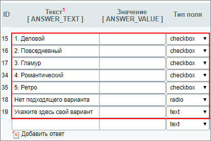 \|  \| \| **Любимый цвет** \| Тип поля **text**. В поле **Текст** необходимо поставить *пробел*. \| Настройки 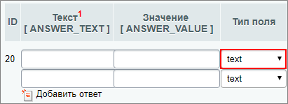 \| Настройки 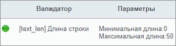 \| \| **Как часто Вы покупаете одежду?** \| Установим четыре варианта типа **radio**. Доступно выбрать один вариант. \| Настройки 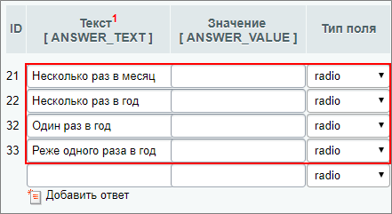 \|  \| \| **Оцените наш магазин по 5-тибальной шкале** \| Установим пять вариантов типа **radio**. Доступно выбрать один вариант. \| Настройки 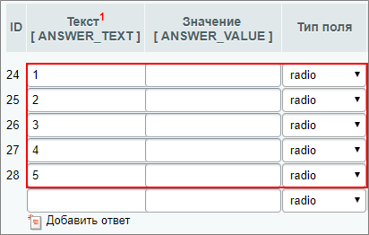 \|  \| \| **Чего не хватает в нашем магазине?** \| Тип поля **textarea** c фиксированными шириной `70` и высотой `5`. В поле **Текст** необходимо поставить *пробел*. \| Настройки 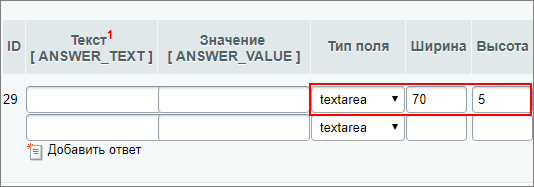 \|  \| \| **Ваши пожелания** \| Тип поля **textarea** c фиксированными шириной `70` и высотой `5`. В поле **Текст** необходимо поставить *пробел*. \| Настройки  \|  \| \| **E-mail** \| Тип поля **text**, ширина `70`. В поле **Текст** необходимо поставить *пробел*. \| Настройки 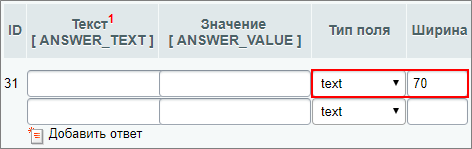 \| Настройки 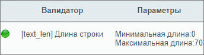 \| |
| --- |

### Дополнительно

- [Создание вопросов веб-формы](lesson_5155.md) в расширенном режиме.
