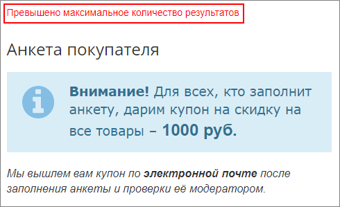
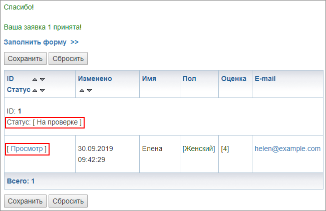
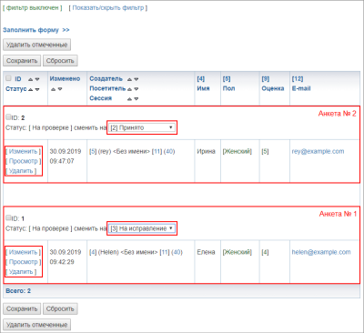
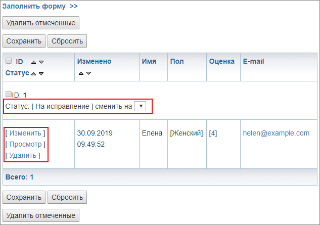
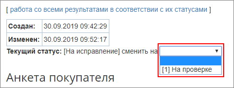
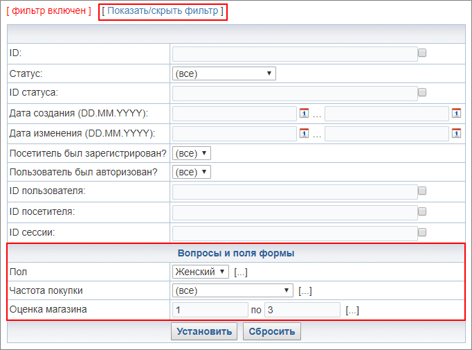
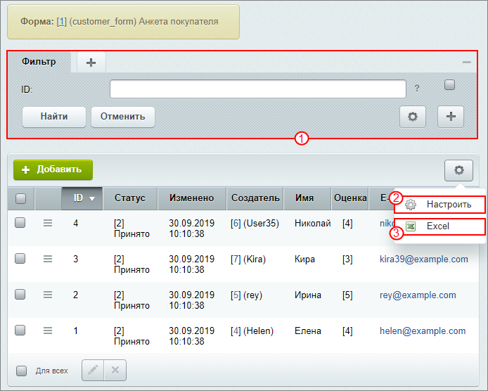

# Работа с созданной веб-формой

**Навигация**
- [← Оглавление курса](index.md)
- [← Предыдущий: 12786 — Публикация формы](lesson_12786.md)
- [Следующий: 25822 — Проверьте себя →](lesson_25822.md)

Официальная страница урока: https://dev.1c-bitrix.ru/learning/course/index.php?COURSE_ID=34&LESSON_ID=12716

Наша веб-форма опубликована. Посмотрим, как же она работает и каким-образом отслеживать результаты и собирать статистику.

### Работа пользователей и редактора с веб-формой

Пользователь заходит на страницу **Анкета**. Возможны варианты:

- У пользователя ещё нет заполненных анкет. Для заполнения анкеты необходимо перейти по кнопке **Заполнить форму** и внести данные;
- Если у него уже есть заполненная анкета, то она отобразится на этой странице. При повторной попытке отправки появится сообщение
  			Превышено максимальное количество результатов
                      
  		.

После заполнения формы открывается страница, на которой указан статус **На проверке** и для пользователя доступна возможность **просмотра**:

**Редактор сайта** видит все анкеты, имеет возможность менять статусы, а также **просматривать**, **изменять** и **удалять** анкеты:

Если **Редактор** изменит статус анкеты на **На исправление**, пользователю станет доступна возможность

			редактировать анкету

                    

		. После внесения изменений необходимо поставить статус на

			На проверке

                    

		 для возврата **Редактору сайта**.

Также в **Публичном разделе** доступен фильтр. Раздел

			Вопросы и поля формы

                    Отображение в фильтре настраивается при создании вопросов.

		 позволяет фильтровать список анкет по ответам пользователей.

**Примечание:** Чтобы сделать аналогичную проверку работы анкеты, как описано выше, вам понадобится зарегистрировать на сайте двух новых пользователей и одного из них добавить в группу **Контент-редакторы**. Добавить пользователя в группу можно в

			форме редактирования пользователя

                    Список всех пользователей сайта находится на странице **Список пользователей** в Административном разделе (Настройки &gt; Пользователи &gt; Список пользователей).

		 во вкладке **Группы**. Далее просто авторизовывайтесь под разными пользователями и смотрите, как меняется работа с анкетой.

### Работаем с данными

Для просмотра и анализа собранных данных, перейдем на страницу Сервисы &gt; Веб-формы &gt; Результаты &gt; *[Название_формы]* в **Административном разделе**:

- В фильтре 1 имеется возможность фильтрации по созданным в форме вопросам;
- Для настройки списка используйте кнопку 2;
- Или выполните выгрузку файла Excel 3 для обработки данных.

### Заключение

Таким образом, при помощи веб-формы в расширенном режиме нам удалось создать сложную анкету с возможностью модерации.

### Дополнительно

О том, как настроить свой шаблон веб-формы, описано в уроках:

- [Создание шаблона веб-формы](lesson_2928.md).
- [Пример для упрощенного режима: анкета регистрации](lesson_12645.md).
