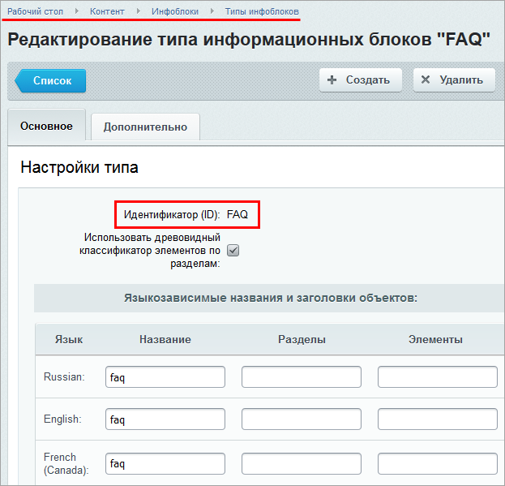
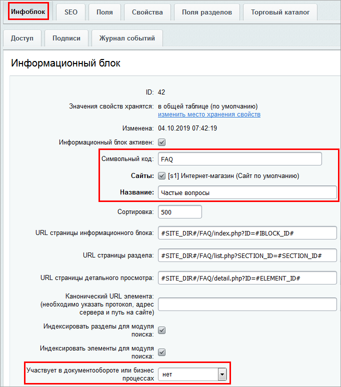
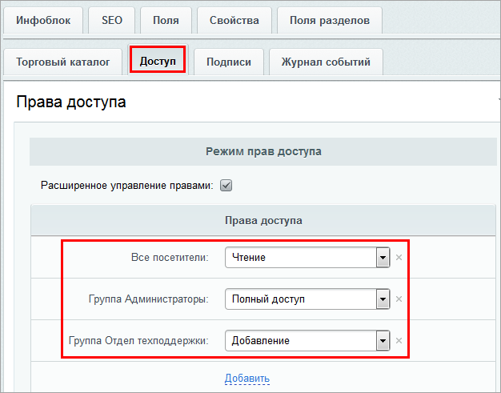
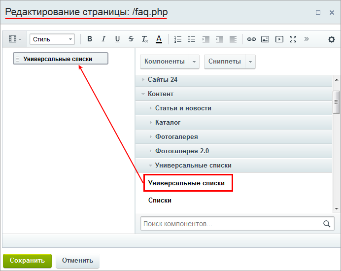
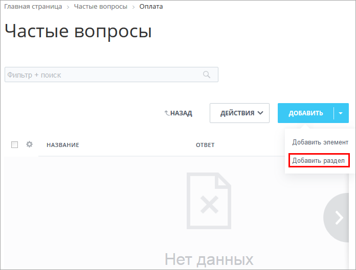
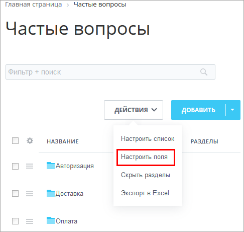
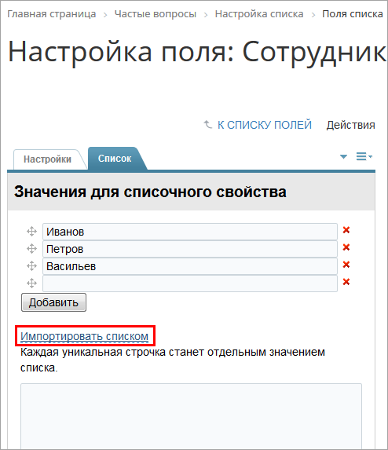
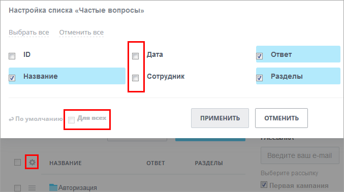
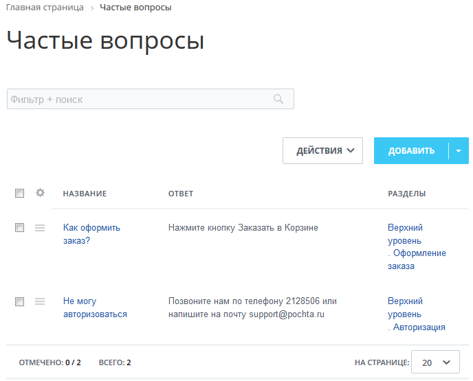

# Пример использования Универсальных списков как самостоятельного инструмента

**Навигация**
- [← Оглавление курса](index.md)
- [← Предыдущий: 4530 — Значения типов полей](lesson_4530.md)
- [Следующий: 26226 — Проверьте себя →](lesson_26226.md)

Официальная страница урока: https://dev.1c-bitrix.ru/learning/course/index.php?COURSE_ID=34&LESSON_ID=12748

### Введение

Рассмотрим пример, когда нужно создать раздел FAQ (frequently asked questions, ЧаВо, часто задаваемых вопросов) для наших посетителей.

Первым делом нужно понять список требований к системе FAQ:

- система помощи должна быть доступна для просмотра всем посетителям, вне зависимости от авторизации.
- нужна внятная система разделов.
- сотрудники техподдержки должны иметь возможность добавлять новые разделы, элементы, ответы.

В результате имеем следующее ТЗ:

> **Техническое задание**: Создать систему **Частые вопросы**. Система должна быть общедоступна для просмотра сотрудникам компании и посетителями, но записи должны заноситься только сотрудниками техподдержки.
>
>
> Должен быть предусмотрен следующий список полей:
>
>
>
> - **Дата выполнения** - дата добавления записи. Не публиковать "на всех";
> - **Сотрудник** - фамилия сотрудника, внесшего запись. Не публиковать "на всех";
> - **Раздел** - одна из нескольких крупных тем, по которым группируются вопросы;
> - **Название** - собственно вопрос;
> - **Ответ** - собственно ответ.

### Видео-пример

### FAQ на Универсальных списках

#### Доступ

Проблему доступа для просмотра всеми, а редактирования только сотрудниками отдела техподдержки можно решить через права группы. То есть нужно создать для сотрудников техподдержки отдельную группу, дать этой группе права не ниже "Добавление". У группы "Все пользователи" могут быть права "Чтение".

#### Создание списка

- В административной части в пункте меню
  			Типы инфоблоков
                      Контент &gt; Инфоблоки &gt; Типы инфоблоков
  		 создайте новый тип с названием **FAQ**:
  
- Создайте сам инфоблок с названием **Частые вопросы** - задайте ему название, символьный код, укажите активность и сайт, к которому относится инфоблок. Бизнес-процессы нам не нужны, их лучше отключить.
  
- Установите права на инфоблок. По нашему ТЗ просматривать список смогут все пользователи, а вносить в него записи - сотрудники отдела техподдержки:
  

#### Создание страницы Частых вопросов

- Создайте новую страницу с помощью
  			Мастера
                      Работа с мастером создания новой страницы описана в уроке [Создание физических страниц](lesson_1911.md).
  		.
- Разместите на странице компонент Универсальные списки:
  

#### Создание структуры и наполнение списка

- С помощью кнопки
  			Добавить раздел
                      
  		 создайте разделы, где будут ответы на вопросы по темам:

  - Авторизация
  - Доставка
  - Оплата
  - Оформление заказа
  - Технические вопросы
- С помощью кнопки
  			Настроить поля
                      
  		 создайте и настройте поля:

  - **Название** - создается автоматически. Сюда будем вносить текст вопроса.
  - **Дата** - задаем тип *Дата изменения*. Здесь автоматически будет проставляться дата создания или изменения записи.
  - **Сотрудник** - задаем тип *Список*. Вручную или с помощью
    			импорта
                         
    		 вносим фамилии сотрудников отдела техподдержки, которые будут пополнять список вопросов и ответов.
  - **Ответ** - тип *Детальный текст*. Сюда будем вносить текст ответа.
- Список готов к использованию. Но для удобства работы можно отключить отображение ненужных в нашем случае полей. Делается это в самом списке с помощью меню настроек списка:
  
  Уберите флажок с полей **Сотрудник** и **Дата**. При необходимости можно сохранить такое представление списка для всех посетителей.

#### Результат

В результате имеем список часто задаваемых вопросов и ответов на них:

