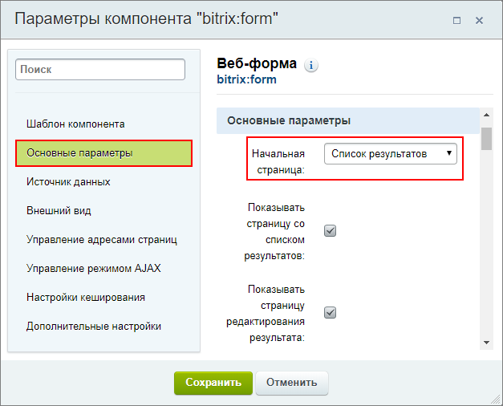
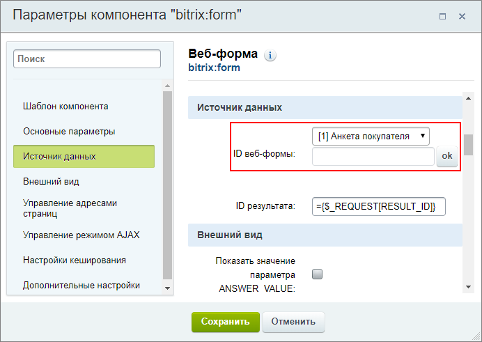
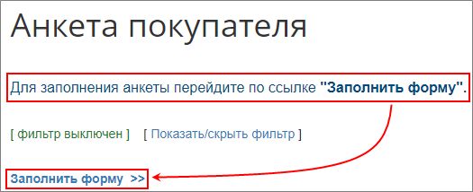
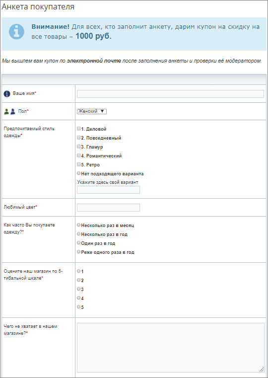
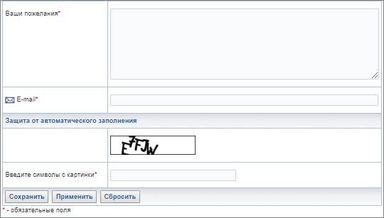

# Публикация формы

**Навигация**
- [← Оглавление курса](index.md)
- [← Предыдущий: 12712 — Создание статусов веб-формы](lesson_12712.md)
- [Следующий: 12716 — Работа с созданной веб-формой →](lesson_12716.md)

Официальная страница урока: https://dev.1c-bitrix.ru/learning/course/index.php?COURSE_ID=34&LESSON_ID=12786

После того, как веб-форма настроена, вопросы и статусы созданы, необходимо опубликовать веб-форму на сайте.

### Создаем страницу и настраиваем компонент

Для вывода веб-формы в Публичном разделе, создадим

			новую страницу

		 **Анкета покупателя**, напишем текст `Для заполнения анкеты перейдите по ссылке "Заполнить форму"` и разместим на ней комплексный компонент

			Веб-форма

						[Описание компонента «Веб-форма (комплексный компонент)» в пользовательской документации.](http://dev.1c-bitrix.ru/user_help/detail.php?ID=63057)

		:

- На закладке **Основные параметры** укажем в качестве начальной страницы
  			Список результатов
                      Если в качестве начальной страницы выбрать **Страница добавления результата**, то в список результатов пользователь сможет попасть только после заполнения формы. Т.е. при повторном заходе на страницу, откроется страница с формой и попасть в список результатов уже не получится. Такой вариант подходит для заполнения веб-форм без дальнейшей модерации. Поэтому в нашем примере мы выбираем в качестве начальной страницы **Список результатов**.
  Организовать заполнение веб-формы для нашего примера можно также с помощью создания нескольких страниц и размещения простых компонентов. Об этом описано в уроке [Публикация веб-формы](lesson_2929.md).
  		, тогда пользователи всегда смогут следить за результатом проверки своей анкеты и отредактировать её при необходимости:
  
  На закладке **Источник данных** выберем нашу веб-форму
  			Анкета покупателя
                      
  		;
  Остальные параметры оставим без изменений. Настройте их на своё усмотрение.

Таким образом, страница **Анкета покупателя** для пользователя выглядит так:

### Как выглядит анкета на публичной странице сайта

### Дополнительно

- [Публикация веб-формы](lesson_2929.md)
