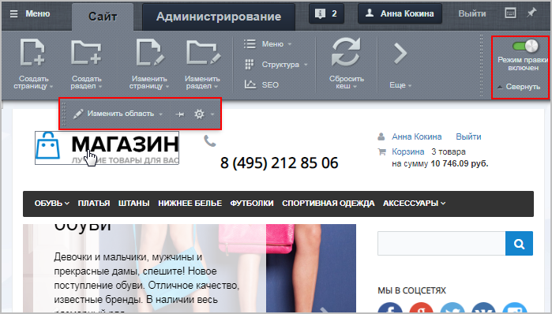
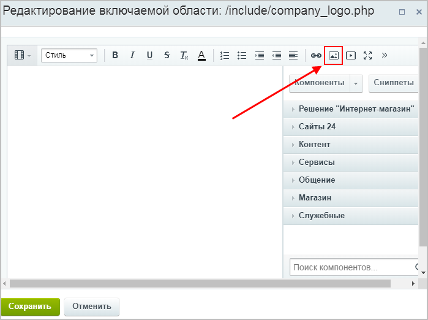
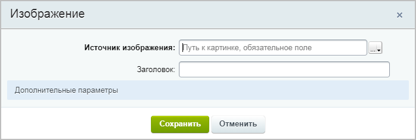
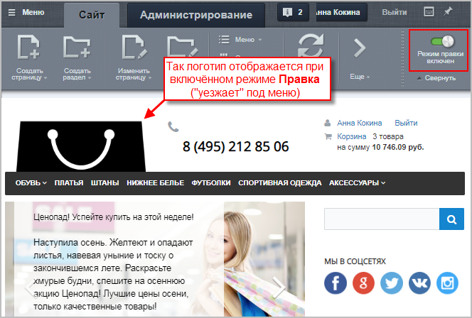

# Как изменить логотип сайта

**Навигация**
- [← Оглавление курса](index.md)
- [← Предыдущий: 12273 — Как изменить номер телефона на сайте](lesson_12273.md)
- [Следующий: 12852 — Как поменять фон сайта →](lesson_12852.md)

Официальная страница урока: https://dev.1c-bitrix.ru/learning/course/index.php?COURSE_ID=34&LESSON_ID=12790

### Меняем логотип

Как и рассмотренный ранее

			контактный телефон,

Представим, что у нас возникла ситуация: нужно поменять номер телефона на сайте. Сделать это несложно. Давайте определимся в какой части сайта находится телефонный номер. Страница сайта формируется системой динамически из трёх частей.

[Подробнее](lesson_12273.md)...

		 логотип может быть размещен либо в

			шаблоне сайта,

Статическая информация, которая не нуждается (либо редко нуждается) в замене, как правило, размещается в статических зонах **Header** (шапка сайта) и **Footer** (подвал сайта). Заменить ее можно в коде самих файлов, но делать это придется квалифицированному разработчику, либо разработчик должен организовать такую замену с помощью компонентов системы силами редакторов сайта.

[Подробнее](lesson_1994.md)...

		 либо во

			включаемой области.

**Включаемая область** - это специально выделенная область на странице сайта, которую можно редактировать отдельно от основного содержания страницы.

[Подробнее](lesson_1879.md)...

**Важно!** Контент-менеджер может заменить логотип **только** в том случае, если логотип располагается во включаемой области (иначе необходимо обратиться к администратору сайта или разработчику).

В режиме

			Правка

                    
 [Подробнее](lesson_1832.md)

		 наведите курсор мыши на логотип – если появилась панель с кнопкой **Изменить область**, то перед вами включаемая область, и можно заменить логотип своими силами:

Нажмите кнопку **Изменить область**, удалите текущий логотип и кликните по иконке

			Изображение

		 на панели инструментов визуального редактора.

В открывшейся форме настроек необходимо задать источник изображения,

			заголовок

Текст, который будет виден посетителю сайта при наведении курсора на логотип.

		 и

			дополнительные параметры

**Дополнительные параметры** (работа опций зависит от настроек включаемой области,

в которой располагается картинка):

**– Выравнивание** – определение положения картинки во включаемой области;

**– Атрибут Alt** – установка альтернативного текста для изображений (если у
пользователя отключена в браузере загрузка изображений, то он увидит заданный текст);

**– CSS класс** – выбор одного из подключённых стилей сайта;

**– Ссылка на изображении** – указывается ссылка, по которой пользователь

перейдёт, кликнув на картинку.

		:

Источник изображения можно задать тремя способами:

- указать прямой адрес;
- выбрать из медиабиблиотеки;
- выбрать из структуры сайта.

Подробно о каждом из способов добавления картинки, а также об остальных настройках читайте в уроке

			Как загрузить и разместить изображение.

Укажите путь к картинке на сервере или полный адрес изображения в сети. После ввода значения вы увидите "миниатюру" изображения, а так же сможете задать его размер . Размер может быть определен в пикселях или процентах. Обратите внимание, что современные шаблоны сайтов используют разные размеры изображения в зависимости от размера экрана. Такой шаблон называется адаптивным . В этих случаях мы рекомендуем отмечать опцию **Не указывать размер**.

[Подробнее](lesson_9247.md)...

### Пример установки логотипа. Видеоурок

В нашем примере пойдём по третьему пути:

1. загрузим
  **Загрузка файлов из Административного раздела**
  Этот способ используется для загрузки файлов в роли статического контента.
  В административном разделе системы перейдите в папку, в которой будет храниться загружаемый файл. Нажмите на кнопку **Загрузить файл** под фильтром, откроется форма для загрузки. Добавьте файлы для загрузки и сохраните их.
  [Подробнее](lesson_1880.md)...
  		 изображение в структуру сайта (в папку **include**);
2. в форме добавления изображения:

  - пропишем путь до этого изображения: `/include/icon.png`;
  - отметим опцию **Не указывать размер**, так как используем
    			адаптивный
    Современные шаблоны сайтов используют разные размеры изображения в зависимости от размера экрана. Такой шаблон называется **адаптивным**.
    		 шаблон сайта;
3. сохраним изменения.

**Примечание**: Для просмотра

			итогового отображения

		 логотипа выключите режим **Правки** (при включенном режиме логотип может отображаться

			некорректно

		).
