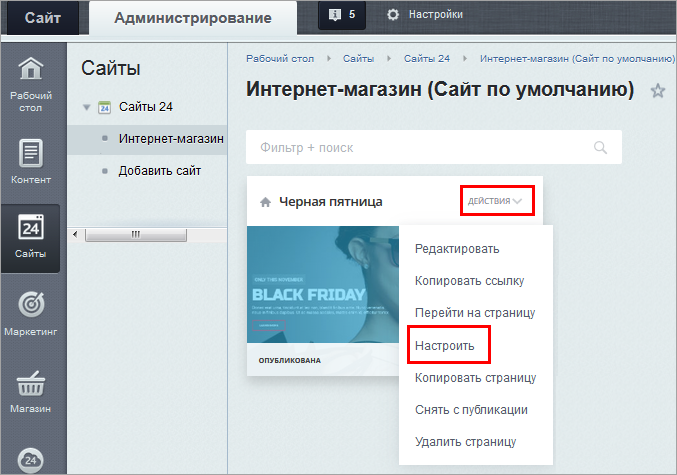
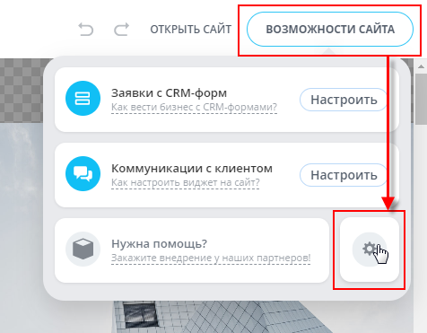
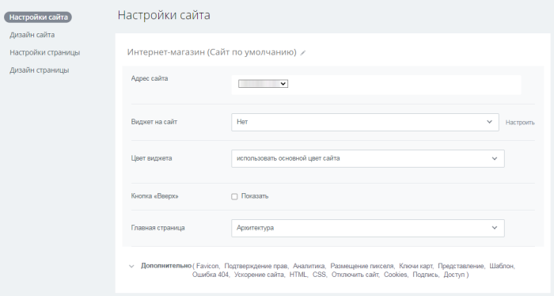
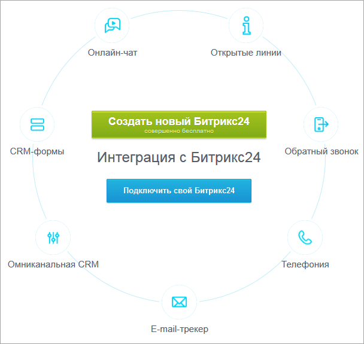
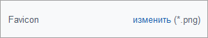
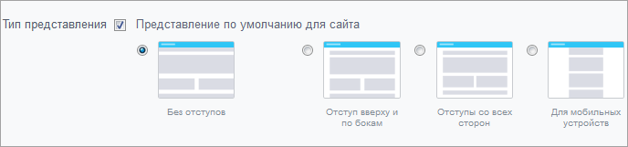
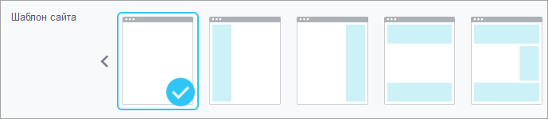
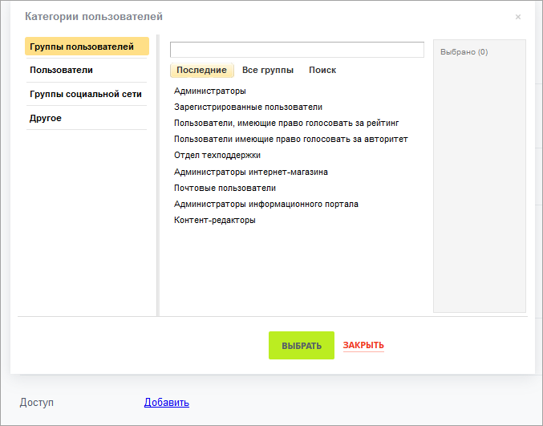

# Как настраивать сайты и страницы

**Навигация**
- [← Оглавление курса](index.md)
- [← Предыдущий: 11245 — Как на сайте вывести каталог товаров](lesson_11245.md)
- [Следующий: 26224 — Проверьте себя →](lesson_26224.md)

Официальная страница урока: https://dev.1c-bitrix.ru/learning/course/index.php?COURSE_ID=34&LESSON_ID=12798

Можно настраивать внешний вид как отдельных страниц, так и всего сайта в целом.

### Видеоурок

### Настройка сайтов

1. В административной части в пункте меню **Сайты 24** в меню той страницы, что нужно настраивать, нажать ссылку
  			Настроить
                      
  		.
2. В открывшемся окне настроить Адрес страницы, Вид страницы в соцсетях, Цветовую палитру.
3. Кликнуть на пункт **Дополнительно** и настроить Мета-теги, Фон, Представление, Шаблон, Аналитику, Размещение пикселя, Индексацию, HTML, CSS.
4. Сохранить.
5. В публичной части в верхней строке меню выбрать **Возможности сайта** и кликнуть по значку
  			шестеренки
                      
  		 – откроются
  			Настройки сайта
  
  		.
6. В Настройках сайта указать Адрес сайта, Виджет на сайт (при необходимости перейти по ссылке Настроить и создать собственный
  			Битрикс24
                      
  		 или подключить его, если он у вас уже есть), Цвет виджета. Отметить, нужно ли показывать кнопку "Вверх", а также назначить главную страницу.
7. Кликнуть на пункт **Дополнительно** и настроить следующие параметры:
  			Favicon
                      
  		,

   Подтверждение прав, Аналитику, Размещение пикселя, Ключи карт,
  			Представление
                      
  		,
  			Шаблон
                      
  		, Ошибка 404, Ускорение сайта, HTML, CSS, Отключить сайт, Cookies (сообщение о согласии на обработку Cookie-файлов), Подпись «Быстро с 1С-Битрикс»,
  			Доступ
                      
  		.
8. Сохранить.
