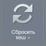
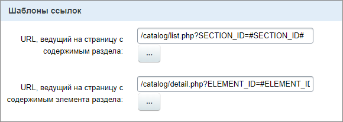
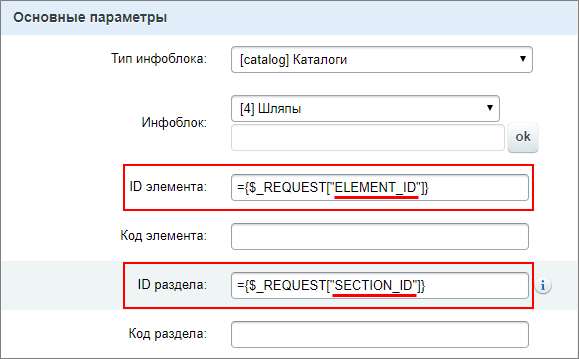
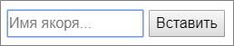
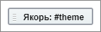

# Как формируются ссылки

**Навигация**
- [← Оглавление курса](index.md)
- [← Предыдущий: 3270 — Кеш, документооборот и информация](lesson_3270.md)
- [Следующий: 3579 — Человеко-понятные URL →](lesson_3579.md)

Официальная страница урока: https://dev.1c-bitrix.ru/learning/course/index.php?COURSE_ID=34&LESSON_ID=12838

### Из чего формируется ссылка

При работе в интернете мы постоянно сталкиваемся со ссылками (

			URL

                    **URL** - система унифицированных адресов электронных ресурсов, или единообразный определитель местонахождения ресурса (файла). Используется как стандарт записи ссылок на объекты в Интернете.
Если говорить проще, то это лишь адрес, который выдан уникальному ресурсу в Интернете.

		) и, конечно же, работаем с ними на своём сайте. Давайте разберемся, как формируются ссылки в *1С-Битрикс: Управление сайтом* на страницах со

			статической

                    Статическая информация - это информация, которая редко меняется с течением времени. Например, рекламные тексты, история компании, контактная информация. Статическая информация создается и редактируется вручную. [Подробнее...](https://dev.1c-bitrix.ru/learning/course/index.php?COURSE_ID=34&CHAPTER_ID=01848&LESSON_PATH=3905.4461.1848)

		 и

			динамической

                    Динамическая информация - информация, хранимая в Базе Данных сайта и выводимая специальными компонентами системы. Как правило, это - часто изменяемая информация со множеством свойств. [Подробнее...](https://dev.1c-bitrix.ru/learning/course/index.php?COURSE_ID=34&CHAPTER_ID=01848&LESSON_PATH=3905.4461.1848)

		 информацией.

В уроке в качестве названия сайта используем mysite.ru

URL содержит большое количество составляющих, мы рассмотрим только видимые в адресной строке браузера, что находятся после mysite.ru.

### Видеоурок

### Статическая информация

- На сайте создана страница newpage.php:
  `mysite.ru/newpage.php`
- На сайте создан раздел. В этом случае имеем два варианта:
  - При создании раздела создана страница с названием
    			index.php
                        **index.php** - это файл главной страницы папки на сайте, то есть тот файл, который загружается, когда посетитель обращается напрямую к какому-либо разделу (папке в физической структуре сайта).
    		. При открытии раздела индексная страница в адресе не отображается:
    `mysite.ru/razdel/`
  - Любая другая созданная страница в этом же разделе (например newpage.php) выглядит так:
    `mysite.ru/razdel/newpage.php`

### Параметры

В адресе Вы встретите параметры, с помощью которых на

			сервер

                    Сервер - компьютер, на котором размещён ваш сайт. Находится, как правило, у специальной организации - провайдера.

		 передается информация для выполнения каких-либо действий. Перечисление параметров начинается с символа **?**. Разделитель параметров (если их несколько) — знак **&**.

**Общий пример:**mysite.ru/newpage.php**?**параметр_1=значение_1**&**параметр_2=значение_2**&**параметр3=значение_3

Сам параметр указывается за знаком **?**. После параметра через **=** указывается его

			значение

                    Например **Y**, что значит **ДА**.

		.

Некоторые примеры параметров из *1С-Битрикс: Управление сайтом*:

| \| **Параметр** \| **Описание** \| \| --- \| --- \| \| `mysite.ru/newpage.php?clear_cache=Y` \| Очистить Кэш. В адресе появляется, например, после  сброса кеша  . \| \| `mysite.ru/personal/orders/?filter_history=Y` \| Появляется в результате применения фильтра (в указанном примере, в результате фильтрации истории заказов).  **Примечание**: Обратите внимание, что так как открыт непосредственно раздел **orders**, индексная страница не отображена и параметр указан сразу после раздела. \| \| `mysite.ru/personal/orders/?filter_history=Y&show_canceled=Y` \| Пример Указанный пример дословно переводится так: фильтровать историю = ДА и показать отмененные = ДА. нескольких параметров для раздела **Заказы**. \| \| `mysite.ru/?bitrix_include_areas=Y` \| Такой параметр Вы увидите при включении  режима правки Режим Правки - специальный режим работы "1С-Битрикс: Управление сайтом", в котором
 происходит изменение информации на сайте.   [Подробнее...](lesson_1832.md) сайта. \| \| `mysite.ru/bitrix/admin/iblock_type_admin.php?lang=ru` \| Пример из административного раздела, страница **Типы информационных блоков**. Для параметра **lang** указано значение **ru**, т.е. административный раздел отображается на русском языке. \| |
| --- |

### Динамическая информация

Формирование адресов для динамической информации рассмотрим на примере инфоблока.

**Внимание**! В этом разделе тема урока рассматривается на примере

			информационных блоков

                    Любую информацию удобнее всего располагать системно, тем более однородную. Модуль **Информационные блоки** предназначен для управления различными блоками однородной информации (на базе информационных блоков можно реализовать каталоги товаров, блоки новостей, справочники и т.д.).
[Подробнее](https://dev.1c-bitrix.ru/learning/course/index.php?COURSE_ID=34&CHAPTER_ID=04477&LESSON_PATH=3905.4477)...

		 и

			компонентов

                    Компонент – это программный код, оформленный в визуальную оболочку, выполняющий определённую функцию какого-либо модуля по выводу данных в Публичной части. Мы можем вставлять этот блок кода на страницы сайта без непосредственного написания кода. [Подробнее...](https://dev.1c-bitrix.ru/learning/course/index.php?COURSE_ID=34&CHAPTER_ID=04457)

		, которые Вы ещё не проходили. Если материал покажется сложным, вернитесь к нему позже.

В

			форме создания инфоблока

 

		 установлены адреса такого вида:

- URL страницы информационного блока: `#SITE_DIR#/catalog/index.php?ID=#IBLOCK_ID#`
- URL страницы раздела: `#SITE_DIR#/catalog/list.php?SECTION_ID=#SECTION_ID#`
- URL страницы детального просмотра:	`#SITE_DIR#/catalog/detail.php?ELEMENT_ID=#ELEMENT_ID#`

Посмотрим каждую часть URL отдельно:

| \| **Элемент адреса** \| **Описание** \| \| --- \| --- \| \| #SITE_DIR# \| Корневая папка сайта. Такая запись присутствует только в настройках. В адресной строке браузера вместо этого отобразится mysite.ru. \| \| catalog \| Название раздела, в котором находятся страницы. \| \| index.php list.php detail.php \| Названия страниц, на которых выводится информация с помощью компонентов. \| \| ID SECTION_ID ELEMENT_ID \| Параметры, которые в качестве значений принимают идентификаторы. \| \| #IBLOCK_ID# #SECTION_ID# #ELEMENT_ID# \| Специальные коды (макросы), вместо которых в значение параметра подставится числовой номер (идентификатор) инфоблока/раздела/элемента, который требуется открыть на странице. Аналогично работают и другие макросы, т.е. автоматически подставляют какое-то значение (символьный код, путь и т.д.) \| |
| --- |

## Какие настройки URL ещё понадобится выполнить

Для отображения динамической информации из инфоблока на страницах сайта используются компоненты, в которых также выполняется настройка URL. Например, для компонента **Элемент каталога детально**:

Важный момент, что параметр, который указан в URL (в нашем случае SECTION_ID и ELEMENT_ID) должен быть указан в полях **ID элемента** или **ID раздела** в настройках компонента таким образом:

Это важно, если Вы меняете стандартные названия параметров.

Результат настройки отображения URL в адресной строке браузера для вывода динамической информации из инфоблока на страницах сайта такой:

- mysite.ru/catalog/
  			index.php?ID=5
                      Такое отображение URL доступно при переходе по ссылке на страницу инфоблока. Если напрямую зайти в раздел catalog, то индексная страница не отобразится и Вы увидите mysite.ru/catalog/.
- mysite.ru/catalog/list.php?SECTION_ID=3
- mysite.ru/catalog/detail.php?ELEMENT_ID=248

**Примечание**: Описанные выше адреса легко читаются компьютером, но сложны для восприятия человеком. Поэтому используют ЧПУ - человекопонятные УРЛ, о которых мы рассказываем в [следующем уроке](lesson_3579.md).

### Якорь

На странице сайта есть возможность поставить

			Якорь

                    **Якорем** называется закладка с уникальным именем на определенном месте веб-страницы, предназначенная для создания перехода к ней по ссылке. Якоря удобно применять в документах большого объема для быстрого перехода к нужному разделу.

		. Использование якорей - опция не обязательная, но она упрощает доступ к информации. Установка якоря доступна в

			визуальном редакторе

                    **Визуальный редактор** - инструмент, позволяющий отображать редактируемый текст в точности так же, как он будет выглядеть на странице, без использования HTML кода.
[Подробнее...](/learning/course/index.php?COURSE_ID=34&CHAPTER_ID=06299)

		 по специальной кнопке:

			

                    При нажатии кнопки **Якорь** откроется окно для заполнения названия:

После сохранения, в визуальном редакторе на странице отобразится
установленный якорь:

		.

В URL страницы название якоря указывается после всех параметров и с помощью символа **#**:

- `mysite.ru/newpage.php#example`

Используйте URL с якорем, когда хотите указать ссылку на конкретное место на странице. Поставить якорь можно в любом месте страницы.

Пример работы якоря из нашего урока: [https://dev.1c-bitrix.ru/learning/course/index.php?COURSE_ID=34&LESSON_ID=3446#database](lesson_3446.md#database)

Благодаря **Якорю** в виде **#database** Вы сразу попали на раздел **База данных**.

### Заключение

Вы узнали из каких составляющих формируются адреса вашего сайта и как меняется вид адреса в зависимости от типа информации на странице. А ещё познакомились с удобным инструментом - **Якорь**. Общая форма записи рассмотренных нами составляющих выглядит так:

`[<путь>][?<параметры>][#<якорь>]`.
