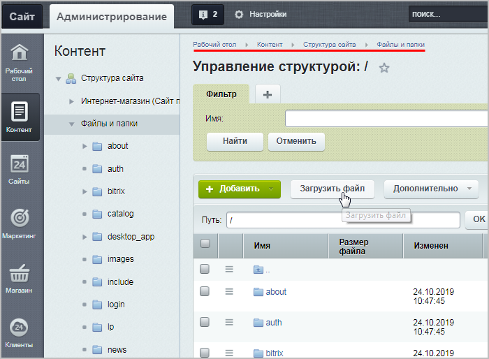
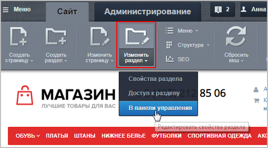
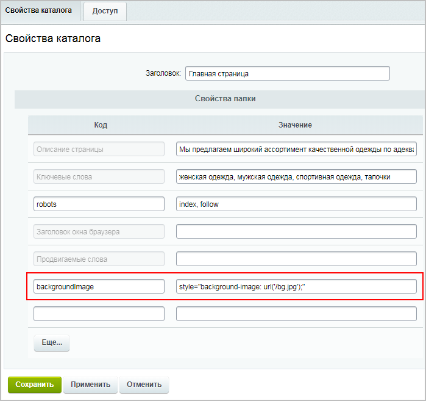

# Как поменять фон сайта

**Навигация**
- [← Оглавление курса](index.md)
- [← Предыдущий: 12790 — Как изменить логотип сайта](lesson_12790.md)
- [Следующий: 25034 — Как изменить ссылки на социальные сети →](lesson_25034.md)

Официальная страница урока: https://dev.1c-bitrix.ru/learning/course/index.php?COURSE_ID=34&LESSON_ID=12852

### Какую часть фона можно поменять

**Примечание**: В этом уроке рассматривается самый простой способ изменения фонового изображения в стандартном шаблоне интернет-магазина *1С-Битрикс: Управление сайтом*.
Для замены фона в другом шаблоне обратитесь к разработчику сайта.

В стандартном шаблоне можно поменять фон только ограниченной части сайта: фоновая картинка будет видна по бокам от общего блока с информацией:

Фоновая картинка выводится через параметр **backgroundImage**, прописанный в

			шаблоне сайта.

Статическая информация, которая не нуждается (либо редко нуждается) в замене, как правило, размещается в статических зонах **Header** (шапка сайта) и **Footer** (подвал сайта). Заменить ее можно в коде самих файлов, но делать это придется квалифицированному разработчику, либо разработчик должен организовать такую замену с помощью компонентов системы силами редакторов сайта.

[Подробнее](lesson_1994.md)...

		 Контент-менеджеру в шаблоне сайта лучше ничего не изменять.

Однако можно этому параметру присвоить новое значение (содержащее ссылку на новую картинку), не вмешиваясь в шаблон сайта.

### Видеоурок

### Как поменять фон на сайте

Итак, рассмотрим пошагово, как заменить фоновую картинку:

1. Загрузите
  			в структуру сайта
  Этот способ используется для загрузки файлов в роли статического контента. Например, вывести файл формата PDF для загрузки его пользователем.
  В административном разделе системы перейдите в папку, в которой будет храниться загружаемый файл. Нажмите на кнопку **Загрузить файл** под фильтром, откроется форма для загрузки. Добавьте файлы для загрузки и сохраните их.
  [Подробнее](lesson_1880.md#admin)...
  		 нужную картинку:
  
2. Теперь добавьте новое
  			свойство раздела
  Управление свойствами раздела идентично управлению свойствами страницы. Это - большое удобство системы "1С-Битрикс: Управление сайтом". Но есть несколько существенных отличий, которые обязательно учитываются в работе контент-менеджером. Сначала расскажем о том как управлять, а потом - об этих различиях.
  [Подробнее](lesson_1959.md)...
  		 (папки), в котором хотите заменить фоновую картинку. Перейдите в нужный раздел на сайте.
  Добавить свойство можно только в Административной части сайта (в Публичной части только редактируются существующие свойства), поэтому кликните на стрелочку кнопки **Изменить раздел** и выберите пункт **В панели управления**:
  
  В открывшейся таблице в новой строке укажите следующий код:
  - колонка **Код**: `backgroundImage`
  - колонка **Значение**: `style="background-image: url('/bg.jpg');"`
    где `/bg.jpg` - это
    			полный путь
    То есть если бы мы загрузили фоновую картинку с именем **my_picture.jpg** в папку **/images**, то вместо `/bg.jpg` нужно было бы прописать `/images/my_picture.jpg`.
    		 от корня сайта до картинки, включая её название и расширение.
  
3. Сохраните результат, и на сайте будет отображаться
  			новый фон!
  

**Примечание**: Фоновая картинка **не** масштабируется в зависимости от экрана, поэтому нужно подготовить достаточно большое изображение (например, по стандартным параметрам экрана: 1920х1280 пикселей).

Если же страницы сайта достаточно длинные (то есть их нужно скроллить вниз), то лучше использовать картинку с бОльшей высотой (иначе при скроллинге картинка будет видна только в верхней части сайта).

Желательно это знать:

- [HTMLbook](http://htmlbook.ru/) - справочник по HTML
