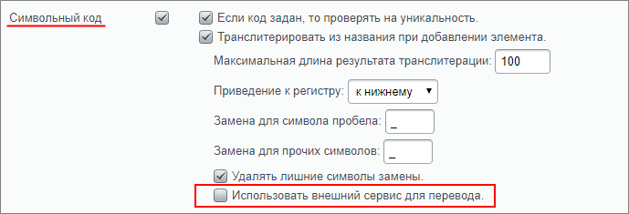
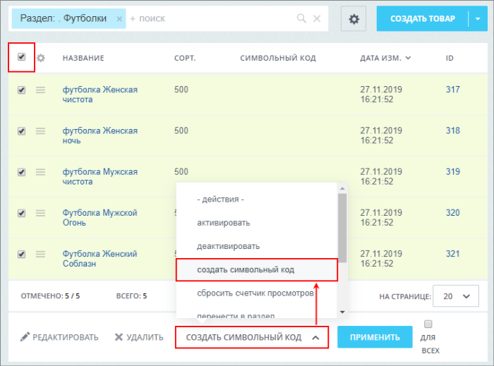
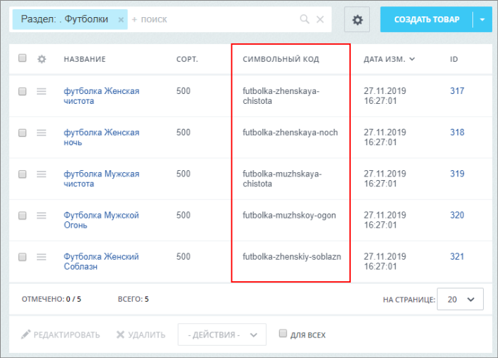

# Групповая генерация символьных кодов

**Навигация**
- [← Оглавление курса](index.md)
- [← Предыдущий: 5364 — Фасетный поиск: улучшаем работу каталога товаров](lesson_5364.md)
- [Следующий: 12165 — Общий вид →](lesson_12165.md)

Официальная страница урока: https://dev.1c-bitrix.ru/learning/course/index.php?COURSE_ID=34&LESSON_ID=12876

### Введение

Может возникнуть ситуация, когда инфоблок с элементами уже давно создан и вы

			не использовали

                    Т.е. такое поле не заполнено для элементов и разделов.

		 символьные коды. А сейчас они вам понадобились (например, для настройки

			ЧПУ

                    Средства *«1С-Битрикс: Управление сайтом»* позволяют сделать ссылки более понятными с помощью специальной функции. Функция встроена во все комплексные компоненты (и отдельные простые) и преобразует стандартный веб-адрес в так называемый человеко-понятный URL (сокращенно ЧПУ).

[Подробнее](lesson_3579.md)...

		). В этом случае пригодится инструмент **групповой генерации символьных кодов**.

**Внимание**! Указанная возможность доступна с версии 19.0.0 модуля Информационные блоки.

### Настройка инфоблока

Для использования функции групповой генерации символьных кодов требуется выполнить настройки

			инфоблока

                    Информационный блок (или Инфоблок) – специальный инструмент "1С-Битрикс: Управление сайтом" с помощью которого заносится информация в Базу данных.
 [Подробнее...](https://dev.1c-bitrix.ru/learning/course/index.php?COURSE_ID=34&CHAPTER_ID=04477&LESSON_PATH=3905.4477)

		. Перейдем на страницу редактирования инфоблока Контент&gt; Инфоблоки &gt; Типы инфоблоков &gt; [ваш тип инфоблока] &gt; [инфоблок]. На закладке **Поля** в настройках символьного кода обязательно должна быть включена функция **Транслитерировать из названия при добавлении элемента** и при этом снята галочка с поля

			Использовать внешний сервис для перевода

                    **Важно**! При использовании внешнего сервиса перевода инструмент групповой генерации символьных кодов недоступен для использования и не отображается в списке.

		.

То же самое повторите на закладке **Поля разделов**, если вам потребуется массово сгенерировать коды для разделов инфоблока.

### Генерация символьных кодов

Перейдем к списку элементов (например, Футболки). Отметим все элементы из списка и в нижней панели действий выберем действие **Создать символьный код**.

После применения действия видим, что в списке в колонке **Символьный код** для каждого элемента появился свой символьный код.

Для списка разделов действия аналогичны.

### Заключение

C помощью функции групповой генерации символьных кодов вы научились

			быстро и легко

                    Для закрепления посмотрите короткий ролик:
<!-- &lt;iframe title="Как быстро создать символьные коды" src="//www.youtube.com/embed/q2bzz18oSUw?feature=oembed&rel=0" allowfullscreen="" frameborder="0" width="360" height="540"&gt;&lt;/iframe&gt; -->

		 получать символьные коды для списка элементов или разделов инфоблока.

**Внимание!** Если у вас где-либо использовались ссылки без символьного кода (сформированное вручную меню, закладки, короткие ссылки и так далее), то эти ссылки станут нерабочими и их надо будет поменять на новые.
