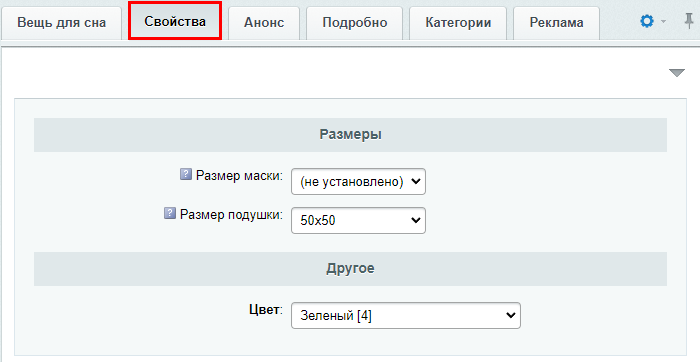

# Практические задания

**Навигация**
- [← Оглавление курса](index.md)
- [← Предыдущий: 7051 — Подсказки в форме элемента](lesson_7051.md)
- [Следующий: 1999 — Экспорт данных →](lesson_1999.md)

Официальная страница урока: https://dev.1c-bitrix.ru/learning/course/index.php?COURSE_ID=34&LESSON_ID=13034

После изучения главы рекомендуем выполнить несколько практических заданий.

### Практические задания

Практические задания состоят из вопроса, скриншота или видео с конечным результатом и объяснением, как это получить в спойлере. Не торопитесь подглядывать в спойлер. 

Изучим интерфейс работы с разделами и элементами инфоблока. Задания необходимо выполнять последовательно. Задания № 3 и № 4 связаны с заданиями из [предыдущей главы](lesson_13032.md).

1. Сначала поработаем в публичном разделе.
  Добавьте в существующий каталог **Одежда** новый раздел Свитеры и элемент (товар) в нём. Для элемента (товара) заполните обязательные поля, пару любых свойств и загрузите детальное
  			изображение
                      
  [Скачать изображение для товара](/images/content_manager/practice/new_element_in_catalog.jpg)
  		. Изображение отредактируйте следующим образом:
  **Обратите внимание**: при создании товара понадобится указать его **цену**. В форме элемента это делается на вкладке Торговый каталог &gt;  Цены в поле **Базовая цена**.
  ## Решение
  **Задание составлено по материалам уроков:**
  - [Разделы: создание, изменение, удаление](lesson_10077.md);
  - [Элементы: создание, изменение, удаление](lesson_10131.md);
  - [Редактор изображений в элементах инфоблока](lesson_7243.md).
  **Результат:**

  - Зеркально отразите его;
  - Обрежьте, так чтобы на картинке осталась только кофта, без полей по краям.
2. Измените расположение нового раздела в меню. Пусть он будет расположен между разделами **Платья** и **Штаны**. После удалите созданные раздел и элемент (удаление выполните средствами публичного раздела).
  ## Решение
  **Задание составлено по материалам уроков:**
  - [Разделы: создание, изменение, удаление](lesson_10077.md);
  - [Элементы: создание, изменение, удаление](lesson_10131.md).
  **Результат:**

3. Теперь поработаем в административном разделе.
  В практических заданиях [предыдущей главы](lesson_13032.md) мы создали новый инфоблок **Вещи для сна**. Теперь добавьте в этот инфоблок два новых раздела: **Подушки** и **Маски**. А в каждом разделе по
  			любому элементу
                      Не забудьте заполнить свойства!
  		.
  Для элемента в разделе Подушки загрузите детальное
  			изображение
                      
  [Скачать изображение для элемента](/images/content_manager/practice/bright_pillow.jpg)
  		. Сохраните элемент, а затем проверьте, сформировалась ли автоматически картинка для анонса с шириной 300px?
  *Дополнительно: при добавлении элементов вы должны увидеть свойства, созданные в заданиях прошлой главы. Найдите там подсказки, которые мы создавали для свойств размера.
  ## Решение
  **Задание составлено по материалам урока:**
  - [Разделы: создание, изменение, удаление](lesson_10077.md);
  - [Элементы: создание, изменение, удаление](lesson_10131.md);
  - [Подсказки в форме элемента](lesson_7051.md).
  **Результат:**

4. Настройте форму элемента следующим образом:
  После удалите разделы и элементы, созданные в задании № 3, средствами административного раздела. Раздел **Подушки** удалите сразу вместе с элементом, а раздел **Маски** после удаления элемента в нём.
  ## Решение
  **Задание составлено по материалам уроков:**
  - [Разделы: создание, изменение, удаление](lesson_10077.md);
  - [Элементы: создание, изменение, удаление](lesson_10131.md);
  - [Настройка форм элементов и разделов под себя](lesson_1883.md).
  **Результат:**

  - Скройте вкладку SEO;
  - Добавьте новую вкладку **Свойства**, после первой вкладки. Перенесите в неё все свойства и разделите их таким образом:
    

### Где выполнять задания?

Демонстрационную версию с пробным периодом в 30 дней вы можете установить на свой компьютер или на хостинг. Подробная информация о настройке каждого варианта представлена в уроке [Где практиковаться и выполнять задания](lesson_26638.md).

**Примечания:**

1. Настоятельно рекомендуем **НЕ** выполнять задания на работающем, «боевом» сайте.
2. Если вы всё же пытаетесь выполнять задания на работающем сайте, где вы не являетесь администратором, то не все задания можно выполнить.
