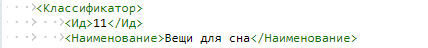
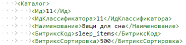

# Практические задания

**Навигация**
- [← Оглавление курса](index.md)
- [← Предыдущий: 1998 — Отображение данных из RSS](lesson_1998.md)
- [Следующий: 1884 — Компоненты: выставляем информацию напоказ →](lesson_1884.md)

Официальная страница урока: https://dev.1c-bitrix.ru/learning/course/index.php?COURSE_ID=34&LESSON_ID=13036

После изучения главы рекомендуем выполнить несколько практических заданий.

### Практические задания

Практические задания состоят из вопроса, скриншота или видео с конечным результатом и объяснением, как это получить в спойлере. Не торопитесь подглядывать в спойлер. 

Научимся выполнять экспорт и импорт инфоблока в разных форматах.

1. Выполните экспорт существующего инфоблока **Новости**. Выгрузите следующие поля: Внешний код, Название, Активность, Детальная картинка, Детальное описание и Символьный код.
  Файл должен быть выгружен в папку /upload/ и иметь название `export_news.csv`. По окончании экспорта скачайте файл на ваш компьютер и откройте его.
  ## Решение
  **Задание составлено по материалам уроков:**
  - [Экспорт данных](lesson_1999.md).
  **Результат:**

2. В практических заданиях главы [Создание и настройка инфоблока](lesson_13032.md) вы создали информационный блок **Вещи для сна**. Выполните импорт файла CSV в этот инфоблок со следующей информацией:
  [Скачать изображения для задания](/images/content_manager/practice/Pictures_for_lesson.zip)
  Импорт файла важно выполнить таким образом, чтобы для всех элементов сработала автоматическая генерация картинки анонса из детальной.
  ## Решение
  **Задание составлено по материалам уроков:**
  - [Как подготовить CSV-файл для загрузки данных](lesson_2012.md);
  - [Импорт данных](lesson_2000.md).
  **Результат:**

  - Два раздела: **Подушки** и **Маски**. В разделе Подушки - 5 элементов, а в разделе Маски - 1 элемент;
  - Для каждого элемента должны быть указаны: Название,
    			Символьный код
                        Укажите любые коды, какие удобно. Можно взять из названий изображений в архиве ниже.
    		, Раздел, Символьный код раздела, Размер подушки / маски,
    			Цвет
                        Свойство цвет в нашем инфоблоке это справочник. Чтобы правильно заполнить значения этого свойства в файле, перейдите в административном разделе в Контент &gt; Highload-блоки &gt; ColorReference и в колонке XML_ID посмотрите значения цветов (green, white и т.д.). Их и указывайте в файле CSV.
    		,
    			Детальное изображение
                        Помните, что картинки надо предварительно загрузить на сайт?
    		.
3. Выполните экспорт инфоблока **Вещи для сна**, наполненного данными в прошлом задании, в формате **XML**. Найдите полученный файл в файловой структуре и откройте на редактирование в режиме текста.
  Внесите небольшие правки в файл, так чтобы затем сделать импорт этого файла на сайт и получить новый инфоблок. Для этого измените
  			данные инфоблока
                      Внести изменения нужно в двух местах. Найдите такие строки:
  
  *Измените ИД и Название
  
  *Измените оба ИД, Название, Символьный код и значение сортировки.
  ИД классификатора должен быть равен ИД, который был указан
  в начале файла.
  		.
  После внесения изменений, сохраните файл и импортируйте его. В результате должен создаться новый инфоблок с такими же данными (элементами и разделами).
  ## Решение
  **Задание составлено по материалам урока:**
  - [Формат XML: импорт данных](lesson_2001.md);
  - [Формат XML: экспорт данных](lesson_2002.md).
  **Результат:**

4. Настройте экспорт в **RSS** для инфоблока **Новости** так, чтобы он выполнялся динамически (без создания файла). Затем в публичном разделе создайте новую страницу и выведите список новостей в формате RSS. Дополнительно создайте одну новую новость и проверьте, добавилась ли она в список.
  ## Решение
  **Задание составлено по материалам уроков:**
  - [Экспорт в RSS](lesson_1995.md).
  **Результат:**

### Где выполнять задания?

Демонстрационную версию с пробным периодом в 30 дней вы можете установить на свой компьютер или на хостинг. Подробная информация о настройке каждого варианта представлена в уроке [Где практиковаться и выполнять задания](lesson_26638.md).

**Примечания:**

1. Настоятельно рекомендуем **НЕ** выполнять задания на работающем, «боевом» сайте.
2. Если вы всё же пытаетесь выполнять задания на работающем сайте, где вы не являетесь администратором, то не все задания можно выполнить.
