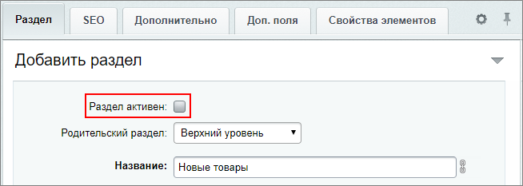
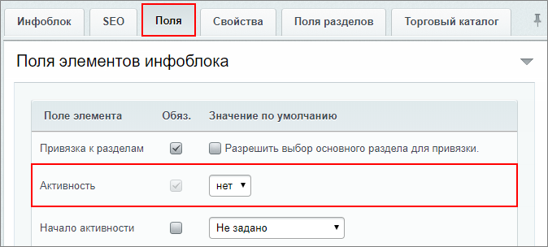
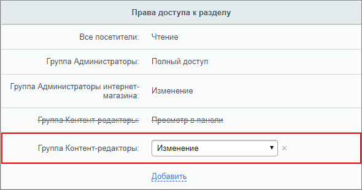
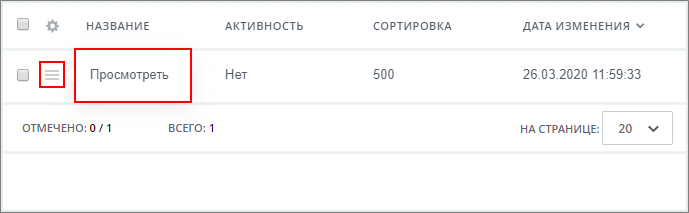

# Организация проверки без документооборота

**Навигация**
- [← Оглавление курса](index.md)
- [← Предыдущий: 5523 — Как закрепить новость наверху списка](lesson_5523.md)
- [Следующий: 13038 — Практические задания →](lesson_13038.md)

Официальная страница урока: https://dev.1c-bitrix.ru/learning/course/index.php?COURSE_ID=34&LESSON_ID=13072

### Как осуществить проверку без документооборота

Самый удобный способ автоматизации проверки нового контента перед публикацией - это использование модуля

			Документооборот

                    Модуль **Документооборот** используется для организации цепочки движения документа от момента создания до момента публикации. Этот механизм используется если документ (новость, товар, страница сайта) должен быть проверен перед выпуском редактором или кем-то ещё.

[Подробнее](https://dev.1c-bitrix.ru/learning/course/index.php?COURSE_ID=34&CHAPTER_ID=05305&LESSON_PATH=3905.4753.5305)...

		. Но модуль доступен только с редакции

			Бизнес

                    Возможности и цены на лицензии 1С-Битрикс: Управление сайтом смотрите на [1c-bitrix.ru](https://www.1c-bitrix.ru/products/cms/license.php).

		. Как же организовать проверку при использовании младших редакций?

Потребуются не только технические настройки, но и организационные меры. Посмотрим на примере добавления новых товаров в каталог интернет-магазина, как организовать такую проверку.

**Внимание**! Организационное требование предлагаемого решения: добавление элементов выполнять только через

			административный раздел

                    **Административный раздел** - раздел системы, недоступный для просмотра обычным посетителям сайта. В нём производятся настройки сайта и системы для работы.

[Подробнее...](https://dev.1c-bitrix.ru/learning/course/index.php?COURSE_ID=34&CHAPTER_ID=04459&LESSON_PATH=3905.4455.4459)

		.

|  | #### Общий сценарий работы и организационные меры |
| --- | --- |

- Контент-менеджер создаёт товары в специальном разделе каталога через административный раздел;
- Администратор магазина проверяет товары, созданные в этом разделе;
- После проверки Администратор магазина публикует товар в нужном разделе.

**Важно**! Объясните сотрудникам, что в таком сценарии работы контент-менеджер должен создавать новые элементы только в специальном разделе инфоблока.

### Видеоурок

### Настройки административного раздела

1 **Создание специального раздела**

В каталоге создадим

			специальный раздел

                    В нашем примере он называется **Новые товары**.

		 для внесения новых товаров (элементов инфоблока):

**Важно**! При создании важно снять **Активность** раздела, иначе он будет доступен в публичном разделе сайта.

2 **Настройки инфоблока**

Все товары до проверки не должны быть каким-либо образом доступны из публичного раздела. Для этого, в настройках инфоблока на вкладке **Поля** для поля элемента **Активность** установим значение по умолчанию

			Нет

                    

		. Т.о. все новые элементы инфоблока создаются

			неактивными

                    Активность элемента установит Администратор магазина после проверки.

		.

3 **Настройки доступа для групп**

Выполните настройки доступа к инфоблоку на вкладке **Доступ**. Для группы пользователей **Администраторы магазина** установите **Изменение**.

Для группы пользователей **Контент-менеджеры** рассмотрим несколько вариантов настройки доступа:

1. **Добавление в панели** - Контент-менеджер сможет добавлять новый товар, но не сможет вносить в него какие-либо
  			изменения
  **Преимущество:** Контент-менеджер не сможет перенести товар в другой раздел.
  **Недостаток:** Любые правки Администратор магазина делает самостоятельно.
  		;
2. **Изменение** - Контент-менеджер имеет
  			те же права
  **Преимущество:** Администратор магазина указывает на необходимые правки, а выполняет их Контент-менеджер.
  **Недостаток:** Контент-менеджер имеет возможность править и переносить непроверенный Администратором товар. И вносить изменения в товары активных разделов.
  		, что и Администратор магазина. Но в этом варианте потребуется решить организационный вопрос: запрет Контент-менеджерам публикации и переноса элементов в другие разделы.
3. Расширенная настройка прав
                      Расширенный режим позволяет настроить права доступа не только целиком ко всему инфоблоку, но и гибко задать права на отдельные его разделы и элементы.
  [Подробнее](lesson_9411.md#advanced_mode)...
  		 - опция позволит гибко настроить  права доступа. Включим её и установим такие настройки:
  Такой вариант настройки немного сложнее первых двух. Но в результате Контент-менеджер может создавать/редактировать товары в специальном разделе, но не имеет таких прав в других разделах и не сможет перенести в них новый товар.

  - в настройках доступа инфоблока для группы пользователей **Контент-менеджеры** установим **Просмотр в панели**;
  - в настройках доступа раздела **Новые товары** для группы пользователей **Контент-менеджеры** установим
    			Изменение
                        
    		.

Таким образом, третий вариант, использование расширенной настройки прав, наилучший.

### Создание товара, проверка и публикация

Все технические настройки выполнены, а сотрудники уведомлены о новом алгоритме работы. Давайте посмотрим, как выглядит весь процесс на примере:

- Контент-менеджер заходит в раздел, предназначенный для новых товаров, и создаёт товар;
- Администратор магазина заходит в раздел новых товаров, просматривает правильность заполнения и вносит сам правки, либо передаёт **Контент-менеджеру** на исправление, если в пункте [Настройки доступа для групп](#access) для группы **Контент-менеджеры** было установлено право доступа **Изменение** (второй или третий вариант);
  ## Если установлено право доступа Добавление в панели
  Если в пункте [Настройки доступа для групп](#access) для группы **Контент-менеджеры** установлено право доступа **Добавление в панели**, то после сохранения, товар останется доступен Контент-менеджеру только для
  			просмотра
                      
  		. В этом случае внести правки сможет только Администратор Магазина.
- Далее он устанавливает признак **Активен** для товара. Теперь доступен
  			просмотр
                      
  		 детальной карточки товара в публичном разделе;
  **Примечание**: В этот момент товар становится доступен в публичном разделе сайта. Но пользователи смогут его увидеть, только если знают точную ссылку на него. Найти его на сайте самостоятельно на этом этапе не получится.
- Если товар готов к публикации, Администратор
  			переносит
                      
  		 его в нужный раздел в настройках товара.

### Дополнительно

- [Документооборот для инфоблоков](https://dev.1c-bitrix.ru/learning/course/index.php?COURSE_ID=34&CHAPTER_ID=03834&LESSON_PATH=3905.4753.5305.3834);
- [Настройка доступа к инфоблокам](lesson_9411.md);
- [Разделы: создание, расположение в меню, удаление](lesson_10077.md);
- [Элементы: создание, изменение, удаление](lesson_10131.md);
- [Создание и редактирование информационного блока](https://dev.1c-bitrix.ru/user_help/content/iblock/iblock_edit.php) - пользовательская документация.
