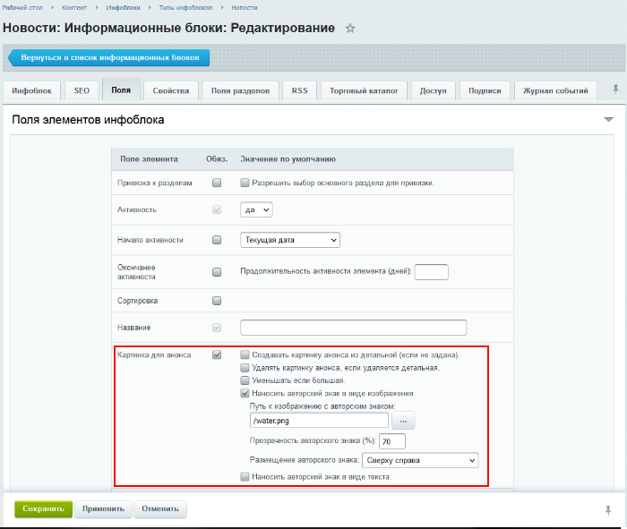
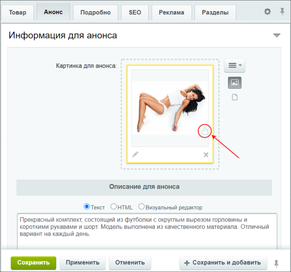
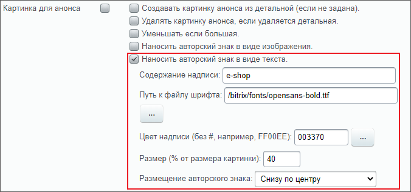
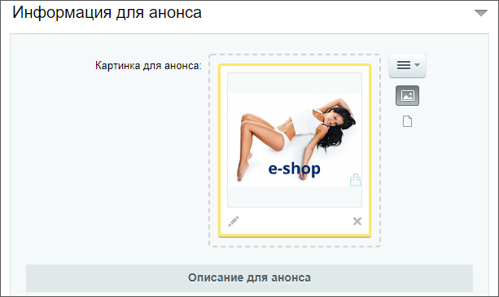

# Нанесение авторского знака

**Навигация**
- [← Оглавление курса](index.md)
- [← Предыдущий: 26248 — Системная обработка фотографий](lesson_26248.md)
- [Следующий: 9409 — Подписи →](lesson_9409.md)

Официальная страница урока: https://dev.1c-bitrix.ru/learning/course/index.php?COURSE_ID=34&LESSON_ID=13272

В

			настройках полей

                    Настройки для полей формы элемента выполняются на закладке **Поля**, а настройки для полей формы раздела - **Поля разделов**.

[Подробнее...](lesson_1912.md)

		 элементов и разделов инфоблока Вы найдете полезный функционал по автоматическому нанесению авторского знака на изображение при загрузке (отдельные настройки для картинки анонса и для детальной картинки). Давайте посмотрим, как его настроить на примере картинки анонса.

### Видеоурок

### Авторский знак в виде изображения

Для установки авторского знака в виде изображения понадобится

			загрузить

                    Добавить файл в конкретную папку на сервере.
[Подробнее...](lesson_1880.md)

		 это изображение в файловую структуру. Пусть в нашем примере это будет

			water.png

                    

		.

В настройках инфоблока на вкладке **Поля** отметим для картинки анонса опцию **Наносить авторский знак в виде изображения**. Появятся дополнительные настройки:

- укажем путь к изображению (по кнопке **[...]** доступен выбор из файловой структуры сайта). Имейте ввиду, изображение должно сразу иметь такой размер, каким вы хотите видеть авторский знак, так как настроек масштабирования не предусмотрено;
- установим
  			прозрачность
                      Чем больше число, тем более прозрачным получится авторский знак.
  		;
- выберем из списка место размещения знака на загруженном изображении.

Готово! Проверим результат наших настроек на элементе инфоблока.

Установим картинку для анонса на вкладке **Анонс** и обязательно нажмем кнопку

			Применить

                    **Внимание!** Вы не увидите авторского знака на загруженном изображении, пока не сохраните новые настройки в карточке элемента инфоблока

		. После сохранения на картинке отобразится наш **авторский знак**:

**Внимание!** Функционал нанесения авторского знака:

- не работает при импорте из файла;
- действует только для изображений, загруженных после его включения. Если изменить настройки авторского знака, то действовать они так же начнут только для
  			вновь загруженных
                      Т.е. уже загруженные изображения останутся без изменений, со старым авторским знаком.
  		 изображений. Это актуально и при отключении функционала: только новые изображения не будут иметь авторский знак, а на старых он останется.

### Авторский знак в виде текста

В настройках инфоблока на вкладке **Поля** отметим для картинки анонса опцию **Наносить авторский знак в виде текста**. Появятся дополнительные настройки:

- укажем текст надписи;
- выберем шрифт (укажите путь к
  			собственному шрифту
                      Файл с шрифтом понадобится загрузить заранее в файловую структуру. Поддерживается формат: кириллический TTF.
  		 в структуре файла или выберите стандартный из папки `/bitrix/fonts/`);
- подберем
  			цвет надписи
                      Простой и быстрый вариант - выбрать из предлагаемой палитры с помощью кнопки **[...]**, но можете указать номер цвета вручную, без **#** .
  		;
- напишем размер надписи, который указывается в процентах от размера картинки;
- выберем из списка место размещения надписи на загруженном изображении.

Аналогично авторскому знаку в виде изображения, проверим результат наших настроек на элементе инфоблока:

**Внимание!** Функционал нанесения авторского знака:

- не работает при импорте из файла;
- действует только для изображений, загруженных после его включения. Если изменить настройки авторского знака, то действовать они так же начнут только для
  			вновь загруженных
                      Т.е. уже загруженные изображения останутся без изменений, со старым авторским знаком.
  		 изображений. Это актуально и при отключении функционала: только новые изображения не будут иметь авторский знак, а на старых он останется.

### Совместное использование

Используйте совместно авторский знак в виде изображения и в виде текста. Просто выполните обе настройки одновременно и результат получится, например, такой:

**Внимание!** Функционал нанесения авторского знака:

- не работает при импорте из файла;
- действует только для изображений, загруженных после его включения. Если изменить настройки авторского знака, то действовать они так же начнут только для
  			вновь загруженных
                      Т.е. уже загруженные изображения останутся без изменений, со старым авторским знаком.
  		 изображений. Это актуально и при отключении функционала: только новые изображения не будут иметь авторский знак, а на старых он останется.

### Дополнительно

- Документация: [Создание и редактирование информационного блока](https://dev.1c-bitrix.ru/user_help/content/iblock/iblock_edit.php);
- Урок: [Предустановленные данные для полей элементов и разделов](lesson_1912.md).
