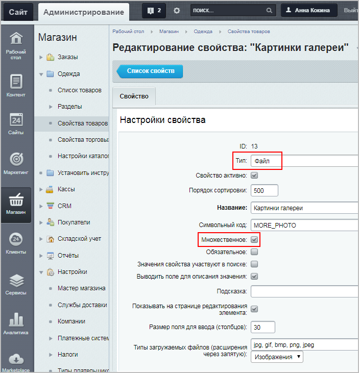
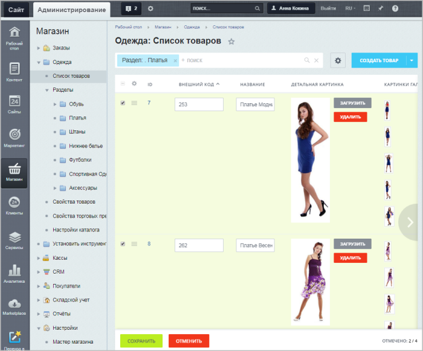
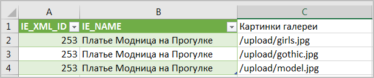
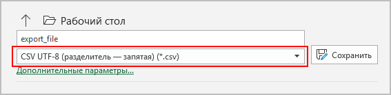
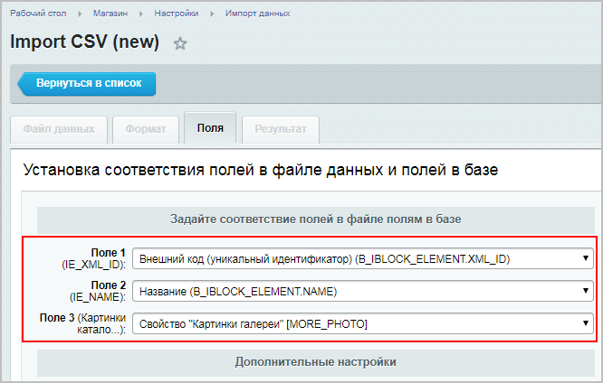

# Как массово поменять картинки в товарах каталога

**Навигация**
- [← Оглавление курса](index.md)
- [← Предыдущий: 7250 — Каталог товаров на простых компонентах](lesson_7250.md)
- [Следующий: 3512 — Как добавить новость →](lesson_3512.md)

Официальная страница урока: https://dev.1c-bitrix.ru/learning/course/index.php?COURSE_ID=34&LESSON_ID=13596

### Видеоурок

При работе с торговым каталогом часто приходится сразу у нескольких товаров изменять различные поля с картинками – например, **Картинки анонса**, **Детальные картинки**, **Картинки галереи** и т. д.

Конечно, можно поменять картинки в форме редактирования каждого товара, однако это занимает довольно много времени.

В этом уроке рассмотрим два способа, как это можно сделать быстрее:

- **Групповое редактирование** (не подходит для свойств товара, которые могут содержать несколько картинок, т.е. для свойств типа
  			файл
                       Такие свойства товаров нельзя отредактировать через групповые действия в списке товаров:
  
  		 со множественным выбором);
- **Редактирование через экспорт/импорт CSV** (подходит для любых свойств).

### Групповое редактирование

Этот способ очень прост и удобен. Таким способом можно заменить, например, **Картинку анонса** или **Детальную картинку**:

1. Настройте список элементов,
  Кнопка **Настроить** вызывает окно, в котором вы можете выбрать колонки для показа в таблице элементов данной формы.
  Чтобы быстро поменять расположение колонок на экране, перетяните их в требуемые места, ухватив левой кнопкой мыши. При этом в настройках списка порядок тоже изменится.
  [Подробнее](lesson_11801.md)...
  		 выбрав требующиеся поля (например, **Детальная картинка**);
2. Отметьте в колонке флажков нужные товары и нажмите кнопку
  			Редактировать
  
  		;
3. Загрузите новую картинку (она заменит текущую).

### Редактирование через экспорт/импорт CSV

Это универсальный способ редактирования элементов. Но такой способ сложнее, и желательно перед его использованием ознакомиться с темой

			Экспорт и импорт данных

Модуль **Торговый каталог** позволяет выполнять экспорт и импорт данных информационных блоков, работающих в режиме торгового каталога (т.е. экспорт и импорт каталогов).

[Подробнее](https://dev.1c-bitrix.ru/learning/course/index.php?COURSE_ID=42&CHAPTER_ID=03457&LESSON_PATH=3912.4580.3457)...

		 торгового каталога.

1. Сначала проведите
  			экспорт торгового каталога,
  Перед импортом/экспортом данных необходимо произвести настройку полей торгового каталога (Настройки &gt; Настройки продукта &gt; Настройки модулей &gt; Торговый каталог &gt; Экспорт/Импорт).
  [Подробнее](https://dev.1c-bitrix.ru/learning/course/index.php?COURSE_ID=42&LESSON_ID=12317)...
  		 отметив поля **XML_ID** (внешний код) и **Название**, и скачайте файл;
2. Загрузите
  В административном разделе системы перейдите в папку, в которой будет храниться загружаемый файл. Нажмите на кнопку Загрузить файл под фильтром, откроется форма для загрузки. Добавьте файлы для загрузки и сохраните их.
  [Подробнее](lesson_1880.md#admin)...
  		 новые картинки в файловую структуру сайта (администраторы сайта могут массово загрузить картинки на сайт по FTP-соединению). Картинки могут быть расположены в любом месте в рамках файловой структуры, главное – указать при импорте правильный путь до них. Рекомендуется использовать папку `/upload`.  Картинки загружаются в файловую структуру, если это разрешено настройками хостинга;
3. Откройте файл в подходящем редакторе (например, Excel). Если название товаров отображается в виде странных символов, то поменяйте кодировку в файле на
  			кодировку вашего сайта
  Посмотреть кодировку сайта можно на странице **Языки интерфейса** (Настройки &gt; Настройки продукта &gt; Языковые параметры &gt; Языки интерфейса).
  [Подробнее](https://dev.1c-bitrix.ru/learning/course/index.php?COURSE_ID=35&LESSON_ID=2071)...
  		 (в большинстве случаев это Юникод UTF-8);
4. Добавьте новое поле (например, **Картинки галереи**) и пропишите путь до загруженных картинок в папке сайта, а также их название и расширение:
  
  Если вы хотите обновить свойство товара, которое содержит несколько картинок (т.е. свойство типа "файл" со множественным выбором), то необходимо повторить строку с товаром столько раз, сколько картинок вы планируете загрузить для этого свойства. Например, в случае со свойством **Картинки галереи** мы хотим для товара "Платье Модница на Прогулке" разместить три картинки галереи. Следовательно, в файле **CSV** получится три строки для этого товара.
  **Примечание:** Изображения также можно добавить со сторонних сайтов (но не из облачных хранилищ), прописав
  			полные URL этих картинок
                      В случае, если в URL содержатся кириллические символы, они должны быть кодированы в формате Unicode. То есть, например, вместо https://www.google.ru/search?q=кодирование+кириллицы должно быть https://www.google.ru/search?q=%D0%BA%D0%BE%D0%B4%D0%B8%D1%80%D0%BE%D0%B2%D0%B0%D0%BD%D0%B8%D0%B5+%D0%BA%D0%B8%D1%80%D0%B8%D0%BB%D0%BB%D0%B8%D1%86%D1%8B.
  		.
  Этот способ не рекомендуется для загрузки больших каталогов, т.к. при импорте каталога изображения будут копироваться на ваш сайт (если php на сервере это разрешает), и сам процесс импорта займёт значительно большее время.
  Сохраните файл в
  			формате CSV
  
  		 и кодировке вашего сайта.
5. Импортируйте
  Перейдем на страницу Магазин &gt; Настройки &gt; Импорт данных &gt; Import CSV (new). Откроется трехшаговый мастер импорта. С помощью кнопки **Выбрать** укажем путь до файла **CSV** (если файл до этого не был загружен в систему, то загрузите его).
  [Подробнее](https://dev.1c-bitrix.ru/learning/course/index.php?COURSE_ID=42&LESSON_ID=5224)...
  		 каталог на сайт,
  			сопоставив поля
  
  		 файла и базы данных.

В результате на сайте будут отображаться новые картинки галереи:

**Примечания**:

- Технически в первом шаге достаточно экспортировать только одно поле – **XML_ID**. При последующем импорте именно по этому полю загружаемые товары сопоставляются с базой данных.
- Данный способ редактирования подходит не только для каталогов товаров, но и для
  			каталогов торговых предложений
  Допустим, вам нужно создать каталог **Кровати**, товары которого (кровати, каркасы кроватей) будут различаться по цветам и ширине.
  Для этого нужно создать инфоблок **Кровати**, перевести его работу в режим торгового каталога, а потом создать и привязать к нему инфоблок торговых предложений.
  [Подробнее](https://dev.1c-bitrix.ru/learning/course/?COURSE_ID=42&LESSON_ID=3155)...
  		. Шаги редактирования при этом остаются такими же.
