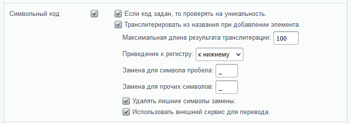
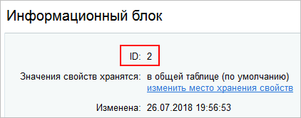

# Символьный код

**Навигация**
- [← Оглавление курса](index.md)
- [← Предыдущий: 9253 — Основные настройки](lesson_9253.md)
- [Следующий: 5840 — Настройка SEO данных в инфоблоке →](lesson_5840.md)

Официальная страница урока: https://dev.1c-bitrix.ru/learning/course/index.php?COURSE_ID=34&LESSON_ID=16862

В своей работе программы не используют смысловые значения, аналогичные человеческим. Последовательность "jkuhj43d0i" для человека не имеет смысла, для программы может иметь. Чтобы людям было легче оперировать с программными сущностями, используют мнемоники.

### Символьный код в инфоблоках

Мнемонический код – это последовательность символов (букв, цифр, специальных символов и др.), облегчающих запоминание необходимой информации. Мнемоники бывают цифровыми и символьными. В *«1С-Битрикс: Управление сайтом»* в основном используются Символьный код. В разных сущностях он может называться немного по-разному: символьный код, код, мнемонический код, символическое имя.

> **Символьный код** – последовательность букв и цифр, используемая в IT-технологиях для обращения внутри программного кода  к какому-то элементу сущности программы.

Символьные коды используются много где, но наиболее часто Контент-менеджеру придётся сталкиваться с ними в Инфоблоках, их разделах и элементах. При этом в разделах и элементах их использование может быть обязательным, если эту обязательность настроил администратор в

			настройках инфоблока

                    В закладках "Поля" и "Поля разделов" есть такие настройки:

		.

Используется этот код при обращении к инфоблоку (разделам или элементам) через API или компоненты, когда не используется

			**идентификатор инфоблока**

                    Если символьный код – это название инфоблока (раздела,
 элемента) на латинице (напр., **clothes**),
а идентификатор – это всегда число:

		. Внешне эта замена отображается в том, что адрес страницы элемента становится понятным для человеческого восприятия. Правда, для этого нужно настроить компоненты для

			работы именно с символьным кодом

                    Чтобы изменить вид адресов на более приятный и понятный, выполните следующие действия...

[Подробнее ...](lesson_3579.md)

		, а не с идентификатором.

При задании символьного кода следует придерживаться определённых правил. Он должен:

1. быть написан латинскими буквами, цифры и спецсимволы применять можно.
2. отражать суть Инфоблока, раздела или элемента
3. быть однообразно написан:
  | \| **Где используется** \| **Написание** \| \| --- \| --- \| \| **Контент-менеджерами:** \|  \| \| Настройки инфоблока \| Можно использовать оба регистра, но рекомендуется верхний (UPPER_CASE), так легче различать сам инфоблок  и его разделы и элементы. \| \| В элементах инфоблоков \| В нижнем регистре (lower-case) \| \| В разделах \| В нижнем регистре (lower-case) \| \| **Разработчиками:** \|  \| \| Ключи массивов arParams, arResult \| В верхнем регистре (UPPER_CASE) \| \| Ключи массива языковых файлов \| В верхнем регистре (UPPER_CASE) \| |
  | --- |

### Коды в других сущностях

Символьный код используется и в других сущностях *«1С-Битрикс: Управление сайтом»*. В некоторых из них он обязателен, например, сущности Местоположений, Цены в магазине, Группы опросов.

Кроме символьного кода в системе используется ещё и Внешний код, и это не одно и то же. Внешний код хоть и может изменяться пользователем, но, как правило, задаётся системой: Битриксом или внешней системой. Он применяется для связи какой-то сущности сайта с внешним источником данных, например с Яндексом или SMS сервисами. Синонимы Внешнего кода, которые могут встретиться: Код сервиса, Цифровой код.

Есть ещё поля **Символьный код API**, это – для разработчиков.

Внешний код и Символьный код API контент-менеджерами не используются.
