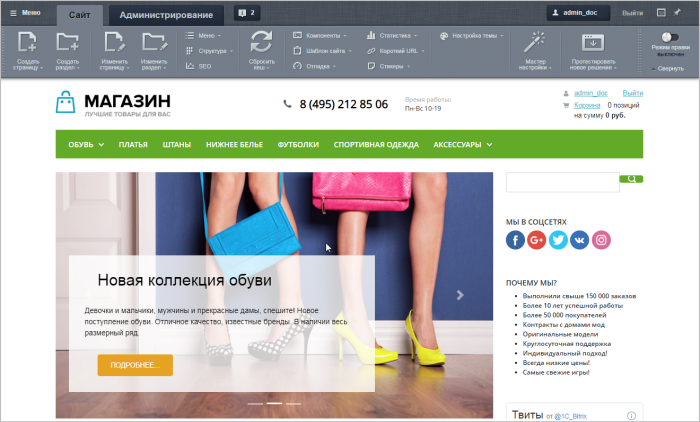
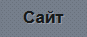
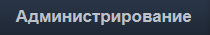
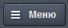
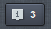
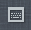

# Панель управления

**Навигация**
- [← Оглавление курса](index.md)
- [← Предыдущий: 3557 — Публичный раздел](lesson_3557.md)
- [Следующий: 1832 — Режим правки →](lesson_1832.md)

Официальная страница урока: https://dev.1c-bitrix.ru/learning/course/index.php?COURSE_ID=34&LESSON_ID=1831

Панель управления - ваш основной инструмент работы.

### Как же ведется работа с сайтом?

Панель управления - это простой и понятный инструмент для выполнения повседневных задач контент-менеджера. От простого редактирования информации до распределения прав доступа - всё это можно выполнить в одном месте.

Что же представляет из себя панель управления? После того, как мы перешли на сайт и

			авторизовались

                    Выполнили вход на сайт. [Подробнее..](https://dev.1c-bitrix.ru/learning/course/index.php?COURSE_ID=34&CHAPTER_ID=02339&LESSON_PATH=3905.2339)

		, в верхней части страницы появится панель:

**Примечания:**

1. Панель управления доступна только для пользователей с достаточными правами. Если вы авторизовались, а панель управления не появилась - обратитесь к администратору сайта.
2. В [Битрикс24 в коробке](https://www.bitrix24.ru/features/box/box.php) по умолчанию Административная панель не отображается для всех пользователей. Для выполнения работ можно перейти в административный раздел с помощью ссылки
  			Администрирование
                      
  		, либо включить отображение панели в публичном разделе в настройках [Главного модуля](https://dev.1c-bitrix.ru/user_help/settings/settings/settings.php).

Поначалу количество элементов на этой панели и их назначение немного сбивает с толку, однако к концу курса всё встанет на свои места.

## Видеоролик "Обзор панели управления"

### Из чего состоит панель управления?

Две основных части панели управления - это вкладки

			Сайт

                    

		 и

			Администрирование

                    

		:

- Вкладка **Сайт** 2 представляет собой непосредственно
  			публичную часть
                      **Публичный раздел** - основное место работы контент-менеджера. Он является частью
  *1С-Битрикс: Управление сайтом*, видимой обычным пользователям. При наличии достаточных прав
  в нем можно производить работы по редактированию содержимого сайта
  
  		 сайта и панель инструментов. Такой режим отображения очень нагляден, так как мы можем внести изменения и сразу увидеть их на странице. Однако в этом режиме у нас нет доступа ко всем настройкам и возможностям. Все инструменты на вкладке **Сайт** мы разберем чуть дальше;
- Вкладка **Администрирование** 3 переносит нас
  			в административную часть
  
  		 системы. В административном разделе мы имеем доступ ко всем настройкам и возможностям системы.

Представьте себе автомобиль. Мы можем внести небольшие внешние изменения, сесть за руль и поехать. Однако для более глубокой настройки и понимания принципа работы машины нам нужно "залезть под капот". Таким же образом устроена панель управления в *"1С-Битрикс: Управление сайтом"*. Вкладка **Сайт** позволяет быстро и наглядно внести небольшие изменения. В то время как вкладка **Администрирование** предназначена для опытных пользователей и решения более сложных задач.

Также из важных элементов панели стоит отметить:

- кнопка Меню
                      
  		 1 - большое выпадающее меню позволяет быстро перейти в любую часть административного раздела;
  ## Видеоролик "Кнопка меню"

- окно уведомлений
                      
  		 4 - здесь выводятся важные системные сообщения и оповещения. Цифра рядом обозначает количество новых уведомлений;
- настройка горячих клавиш
                      
  		 5 - окно настроек горячих клавиш, где мы можем назначить нужную нам комбинацию клавиш почти на любую частую операцию.

|  | #### Заключение |
| --- | --- |

Панель управления - наш основной инструмент для работы с системой. Работа ведется на вкладках **Сайт** и **Администрирование**. В следующих уроках мы подробно разберем все важные элементы панели управления.
