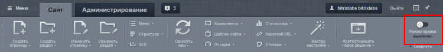
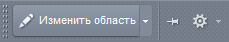
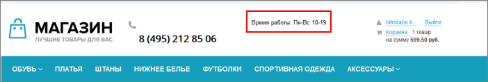
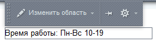
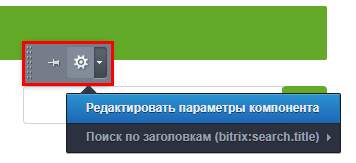
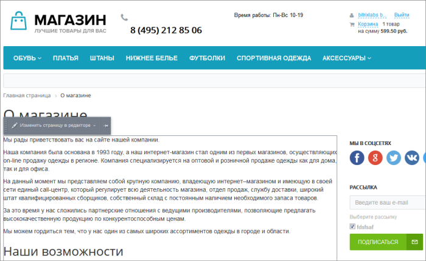
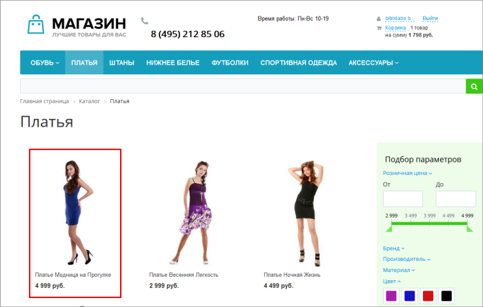
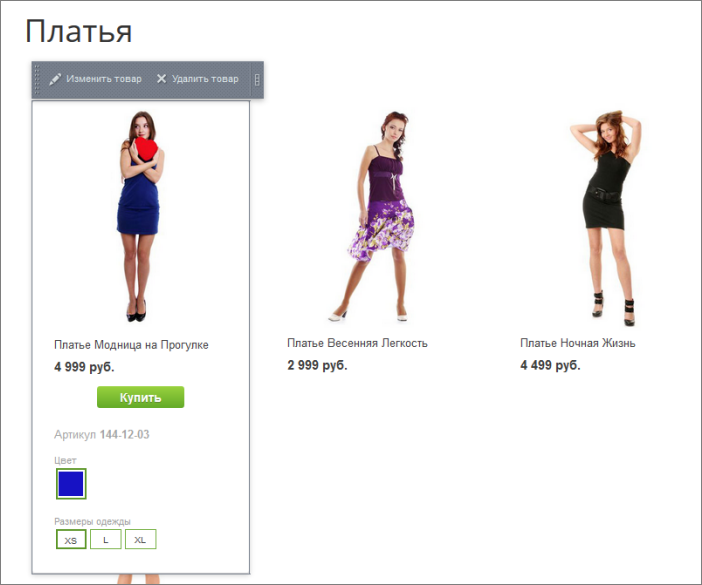
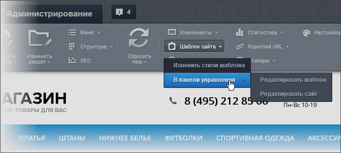

# Режим правки

**Навигация**
- [← Оглавление курса](index.md)
- [← Предыдущий: 1831 — Панель управления](lesson_1831.md)
- [Следующий: 3567 — Горячие клавиши →](lesson_3567.md)

Официальная страница урока: https://dev.1c-bitrix.ru/learning/course/index.php?COURSE_ID=34&LESSON_ID=1832

Режим правки: наводим мышь и редактируем

### Описание

Предположим, перед нами стоит задача

			изменить номер телефона

                    Пример: меняем номер телефона на сайте. [Подробнее](lesson_12273.md)...

		 на главной странице. Или быстро добавить товар в каталог. Как нам действовать? Можно открыть страницу в редакторе и внести правки, но это не очень быстро и наглядно. Нас выручит режим правки - мы просто наведем мышь на нужное место страницы и изменим элемент на "на лету".

Для включения режима нажмите на

			кнопку

                    

		. После этого при наведении мыши на области страницы мы увидим

			всплывающую панель

                    

		. Вид этой панели зависит от той области, с которой мы работаем.

Существует три ситуации для режима правки:

- Включаемые области
- Рабочая область страницы
- Область компонента

### Включаемые области

Когда мы навели мышь на

			включаемую область

                    **Включаемая область** - это специально выделенная область на странице сайта, которую можно редактировать отдельно от основного содержания страницы. [Подробнее...](lesson_1879.md)

		. Наиболее простой случай, в этом случае панель будет иметь такой вид - .

Например, нам нужно изменить время работы нашего магазина:

Наводим мышь на эту область, нажимаем кнопку

			Изменить область

                    

		 и редактируем текст. Легко и просто.

Также возможен другой вариант отображения, без кнопки **Изменить область**, если во включаемой области размещен файл с компонентом (например, строка поиска или ссылки на социальные сети), а не текст. В таком случае вы увидите кнопку закрепления меню и шестеренку. Нажатие на шестеренку откроет настройки компонента:

### Рабочая область страницы

Мышь расположена над

			рабочей областью

                    Предположим наша страница состоит из шапки, верхнего меню, бокового меню и подвала. Оставшееся место в центральной части страницы - это и есть рабочая область. Именно в ней размещается вся информация.

		 страницы. В этом случае панель примет вид .

К примеру, мы хотим изменить текст на странице **О магазине**:

  Повторяем общий порядок действий: наводим мышь на текст, нажимаем кнопку **Изменить** и редактируем текст.

### Область компонента

Последняя ситуация - когда выбрана область

			компонента

                    **Компонент** - программный код, оформленный в специальную оболочку. Мы можем вставлять этот блок кода на страницы сайта без непосредственного написания кода. То есть это "кирпичики", из которых мы выстраиваем внешний вид сайта. [Подробнее...](https://dev.1c-bitrix.ru/learning/course/index.php?COURSE_ID=34&CHAPTER_ID=04457&LESSON_PATH=3905.4457)

		. В системе огромное количество компонентов и вид панели будет зависеть от конкретной ситуации.

К примеру, у нас на странице расположен каталог платьев и мы хотим изменить название левого платья:

Для вывода списка платьев используется

			компонент

                    Компонент – это программный код, оформленный в визуальную оболочку, выполняющий определённую функцию какого-либо модуля по выводу данных в Публичной части. Мы можем вставлять этот блок кода на страницы сайта без непосредственного написания кода. [Подробнее...](https://dev.1c-bitrix.ru/learning/course/index.php?COURSE_ID=34&CHAPTER_ID=04457)

		 **Каталог**. Наведем мышь на нужную нам область. Панель примет вид:

Нажмем **Изменить товар** и в открывшейся

			форме

                    

		 редактирования изменим название товара.

### Редактирование шаблона

Это зависит от настроек прав, но, возможно, вам будет доступна кнопка **Шаблон сайта**:

Команды этой кнопки позволяют перейти в Административный раздел для редактирования сайта и его шаблона.

Пользоваться этими командами нужно очень осторожно и с пониманием того, что вы делаете:

- **Изменить стили шаблона** - это правка
  			CSS стилей
                      CSS (англ. Cascading Style Sheets «каскадные таблицы стилей») - формальный язык описания внешнего вида документа (веб-страницы), написанного с использованием языка разметки (чаще всего HTML или XHTML).
  [Подробнее](https://ru.wikipedia.org/wiki/CSS)...
  		. Если вы не знаете, как работают эти стили и к чему могут привести их изменение, то лучше не трогать эту кнопку.
- **Редактировать сайт** - это не править страницы сайта, а изменять настройки сайта, с которым вы работаете. Подробнее смотрите в курсе
  			Администратор Базовый
                      Важной особенностью системы «1C-Битрикс: Управление сайтом» является поддержка многосайтовости, что позволяет создать несколько сайтов на одной копии продукта (при этом, в соответствии с условиями лицензионного соглашения, все сайты должны работать с использованием одной базы данных и единого ядра продукта). Каждый сайт может характеризоваться собственным доменным именем, внешним видом, языком интерфейса и информационным наполнением.
  [Подробнее](https://dev.1c-bitrix.ru/learning/course/index.php?COURSE_ID=35&CHAPTER_ID=04502)...
  		.
- Команда **Редактировать шаблон** позволяет изменить внешний вид сайта. Но то, что доступно для изменения Контент-менеджеру описано в главе
  			Как изменить внешний вид сайта
                      Контент-менеджер может управлять внешним видом сайта, который определяется шаблоном сайта. Создать этот шаблон может только разработчик: слишком много надо знать о HTML, PHP и многом другом. Но после того как шаблон создан и размещён на сайте, управление им доступно контент-менеджеру.
  [Подробнее ...](https://dev.1c-bitrix.ru/learning/course/index.php?COURSE_ID=34&CHAPTER_ID=01851)
  		. А сама правка шаблона сайта требует не только знаний по "1С-Битрикс: Управление сайтом", но и знаний HTML и, частично, PHP. Если вам нужно отредактировать именно шаблон сайта, то познакомьтесь с
  			этим разделом
                      Bitrix Framework позволяет использовать неограниченное число шаблонов и назначать их по разным условиям. Рассмотрим простейший вариант, что на всех этих страницах простого сайта фактически меняется только контентная часть, а дизайн – не изменяется.
  [Подробнее ...](https://dev.1c-bitrix.ru/learning/course/index.php?COURSE_ID=43&CHAPTER_ID=02880)
  		 в курсе Разработчик Bitrix Framework.

|  | #### Заключение |
| --- | --- |

Режим правки - крайне полезная функция для быстрого выполнения основных задач контент-менеджера. Режим правки позволяет работать со включаемыми областями, рабочей областью страницы и компонентами.
