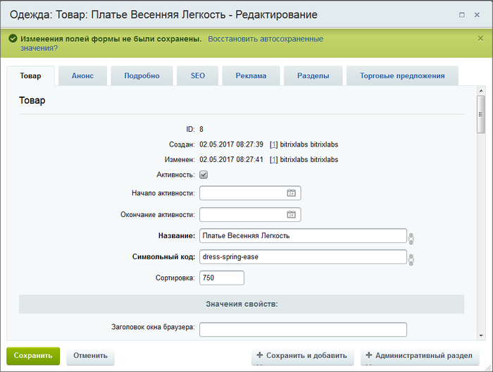

# Автосохранение

**Навигация**
- [← Оглавление курса](index.md)
- [← Предыдущий: 1879 — Включаемые области](lesson_1879.md)
- [Следующий: 1965 — Отмена действий →](lesson_1965.md)

Официальная страница урока: https://dev.1c-bitrix.ru/learning/course/index.php?COURSE_ID=34&LESSON_ID=1833

Досадная неприятность — потеря работы из-за нештатной или не зависящей от вас ситуации. Примеры: отход от компьютера на долгое время с потерей авторизации, аварийное отключение питания компьютера, случайное закрытие наполовину заполненной формы, обрыв соединения с Интернетом по вине провайдера и другие. В «1С-Битрикс: Управление сайтом» для таких случаев предусмотрена функция автосохранения, когда на сайте сохраняются добавленные вами данные. Данные сохраняются не в явном виде, и требуется ваше подтверждение на их сохранение в нужном месте.

### Видеоурок

### Восстановление сохранённых данных

Вы заполняли форму, произошла нештатная ситуация, в которой вы не смогли сохранить введённые данные. При следующем открытии формы, если в ней есть сохраненные системой значения полей, система выдаст запрос (зелёная плашка) на восстановление данных:

Подтверждать или не подтверждать восстановление данных - ваш выбор.

### Важно запомнить!

**Внимание!** Автосохранение работает только для первого повторного открытия. Если просто открыть и закрыть форму, а потом опять открыть, то добавленные данные будут потеряны. Система запоминает только последнее состояние формы.

Автосохранение происходит все время, пока контент-менеджер редактирует страницу (изменяет значения полей), и сработает сразу после окончания редактирования формы.

Функция включена на большинстве форм редактирования по умолчанию, но не для всех. Администратору доступно её отключение через

			настройки системы

                    Для задания общего административного уровня настроек по умолчанию откройте страницу **Настройка интерфейса пользователя** (Настройки &gt; Настройки продукта &gt; Интерфейс &gt; Персональные настройки).

Подробнее в курсе [Администратор. Базовый](https://dev.1c-bitrix.ru/learning/course/index.php?COURSE_ID=35&LESSON_ID=8587).

		.

Если сбой произошел во время создания нового элемента, то автосохранение сработает для формы создания соответствующей новой страницы/элемента. То есть, когда в следующий раз будет открыта форма добавления, выведется запрос на сохранение данных.

### Заключение

Вам не нужно бояться потери данных в случае нештатной ситуации. Вас защитит функция Автосохранение.

> **Автосохранение** - функция, позволяющая сохранить данные, введенные в поля формы, и восстановить их в случае нештатной ситуации.

Функция имеет свои особенности использования: работает только для первого открытия.
