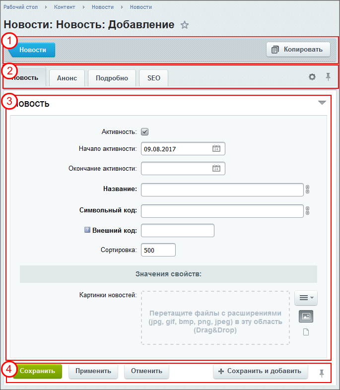

# Форма редактирования элемента

**Навигация**
- [← Оглавление курса](index.md)
- [← Предыдущий: 11801 — Настройка списка элементов (новый интерфейс)](lesson_11801.md)
- [Следующий: 2771 — Навигация и поиск →](lesson_2771.md)

Официальная страница урока: https://dev.1c-bitrix.ru/learning/course/index.php?COURSE_ID=34&LESSON_ID=1841

Каждый элемент системы можно изменить: отредактировать новость, изменить описание товара, изменить SEO параметры страницы, создать скидку, настроить параметры модуля и так далее.

### Видеоурок

### Что общего в разных формах

Форма изменения появляется по команде

			Изменить

                    

		. Несмотря на то, что формы различаются полями, объёмом изменяемой информации, можно выделить некоторые общие моменты для всех форм. Общие моменты рассмотрим на примере формы изменения элемента

			Информационного блока

                    Информационный блок (или Инфоблок) – специальный инструмент "1С-Битрикс: Управление сайтом" с помощью которого заносится информация в Базу данных.
 [Подробнее...](https://dev.1c-bitrix.ru/learning/course/index.php?COURSE_ID=34&CHAPTER_ID=04477&LESSON_PATH=3905.4477)

		:

#### Что есть на любой форме

1 - Контекстная панель. Её

			состав разный

                    Например, в параметрах Опроса в Контекстной панели очень много команд:

		 в зависимости от формы, но на любой панели есть кнопка возврата к списку элементов.

2 - Область закладок. Формы редактирования могут иметь большое число изменяемых свойств, поэтому схожие поля собраны в логические группы и выводятся в виде **закладок**. Обычно свойства сгруппированы так, что на первых страницах свойств (в порядке слева направо) помещаются наиболее часто используемые, а на последних - другие, дополнительные параметры. Доступен просмотр всех полей в одной закладке  (или возврата в режим закладок) с помощью

			кнопки-треугольника

                    

		 в правой части области полей формы.

Несмотря на использование вкладок Область полей может быть большой и не помещаться на один экран. Для удобства сделайте постоянно видимыми Область закладок и Панель команд с помощью

			кнопки-гвоздика

		.

Внешний вид формы можно настроить для удобства работы: изменить состав и количество вкладок и полей. (Доступно не для всех форм редактирования.)

			Настройка формы

                    Облегчите свой труд, используйте инструмент настройки форм инфоблоков. Инструмент учитывает индивидуальные потребности, позволяет настроить формы редактирования разделов и элементов инфоблока под себя:

[Подробнее ...](lesson_1883.md)

		 и возвращение вида по умолчанию - по

			кнопке-шестерёнке

                    

		.

3 - Область полей. Здесь и выводятся поля для редактирования. Названия полей, обязательных для заполнения, выделяются жирным шрифтом. Все формы, работающие с контентом, позволяют выбрать изображения для размещения

			однотипным способом

                    

		.

4 - Панель команд.

**Сохранить**: внесённые изменения сохраняются, форма закрывается.

**Сохранить и добавить**: изменения сохраняются, форма изменения закрывается и открывается новая форма для добавления элемента.

**Применить**: изменения сохраняются, форма остаётся открытой для дальнейшего редактирования. Команда "Отменить" применённые изменения не отменяет.

**Отменить**: форма закроется, все изменения внесённые в форму после её открытия не сохранятся.

**Примечание**: есть ещё одно свойство, общее для всех форм. Это опция

			Автосохранение

                    Вы заполняли форму, произошла нештатная ситуация, в которой вы не смогли сохранить введённые данные. При следующем открытии формы, если в ней есть сохраненные системой значения полей, система выдаст запрос (зелёная плашка) на восстановление данных...

[Подробнее](lesson_1833.md)...

		, функция, позволяющая сохранить данные, введенные в поля формы, и восстановить их в случае нештатной ситуации.

### Заключение

- Несмотря на обилие форм редактирования, у всех них есть общие области.
- Формы редактирования настраиваются под конкретные условия работы.
