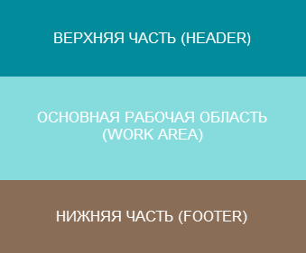
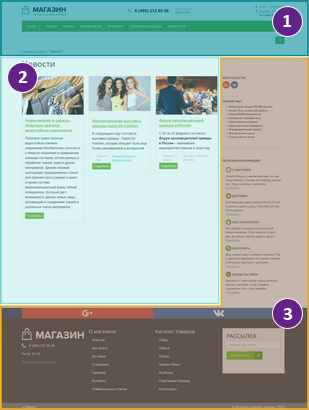
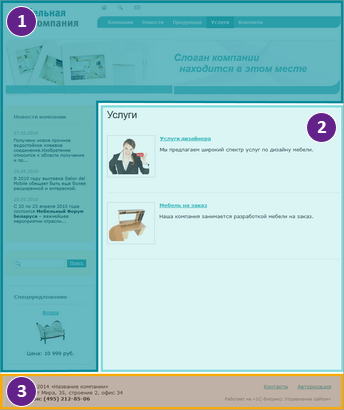
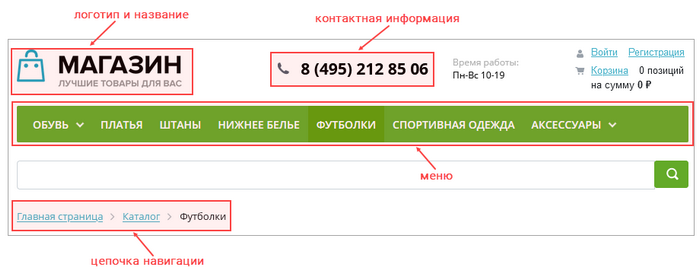
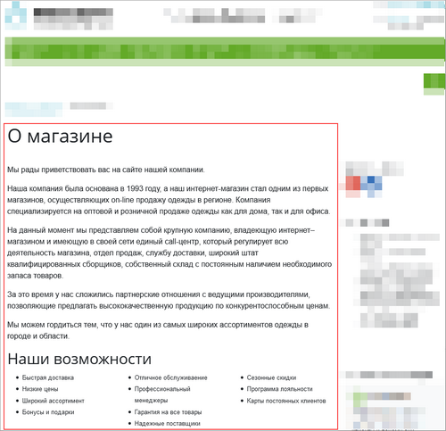
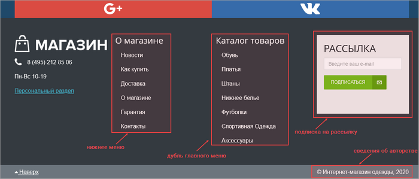
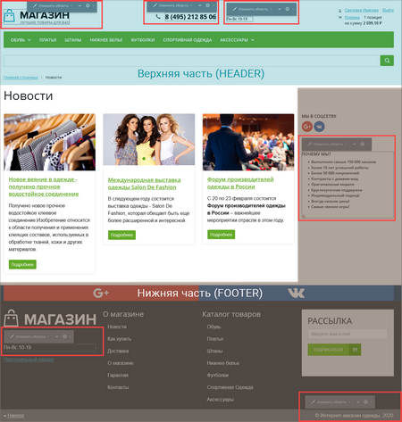

# Из чего состоит страница сайта

**Навигация**
- [← Оглавление курса](index.md)
- [← Предыдущий: 9135 — Пример размещения информации](lesson_9135.md)
- [Следующий: 4576 — Управление заголовком →](lesson_4576.md)

Официальная страница урока: https://dev.1c-bitrix.ru/learning/course/index.php?COURSE_ID=34&LESSON_ID=1847

Ранее мы с вами уже [познакомились](lesson_3742.md) с тем, что страница создаётся на основе шаблона сайта. Шаблон формирует каркас страницы, в который добавляется

			динамическая

                    Динамическая информация - это часто изменяемая однородная информация, выводимая на страницах сайта с помощью специальных программных компонентов системы.  [Подробнее](https://dev.1c-bitrix.ru/learning/course/index.php?COURSE_ID=34&CHAPTER_ID=01848&LESSON_PATH=3905.4461.1848)...

		 и/или

			статическая

                     Статическая информация - это редко изменяемая информация, которая выводится непосредственно в тексте самой страницы сайта вручную контент-менеджером. [Подробнее](https://dev.1c-bitrix.ru/learning/course/index.php?COURSE_ID=34&CHAPTER_ID=01848&LESSON_PATH=3905.4461.1848)...

		 информация. В этом уроке поговорим о типовых составляющих страницы.

### Базовая структура страницы

У любой страницы сайта можно выделить три составляющих: верхнюю часть (**header**), основную рабочую область (**work area**) и нижнюю часть (**footer**).

Как правило, верхняя и нижняя части одинаковы для всех страниц в рамках одного конкретного сайта. На разных страницах меняется содержимое основной рабочей области.

**Обратите внимание, что** эти три части могут занимать разную площадь страницы, иметь разную форму. Неизменно лишь одно: их порядок.

Когда верхняя (или нижняя) часть сайта содержит большой объем информации, то некоторые данные размещают слева (справа) от основной рабочей области. Таким образом, визуально формируется боковая панель. Для лучшего понимания рассмотрим две страницы в разных шаблонах:

|  |  | **1. HEADER 2. WORK AREA 3. FOOTER** |  |  |
| --- | --- | --- | --- | --- |
| *Рис. 1* |  |  |  | *Рис. 2* |

На первом рисунке нижняя часть сайта (**3**) расположена справа и снизу от основной рабочей области (**2**), а на втором – верхняя часть (**1**) расположена слева и сверху от основной рабочей области (**2**). Таким образом, формы частей разные, но порядок их следования неизменен.

### Верхняя часть

Самую верхнюю часть часто называют «шапкой сайта» либо «хедером» (от англ. *header*). Именно в шапке рекомендуется размещать название компании, логотип, контактную информацию, а также главное и/или второстепенное

			меню

                    Меню – Один из ключевых элементов дизайна любого сайта, с помощью которого посетитель может перемещаться по разделам и страницам, и находить нужную ему информацию.

		. В верхнюю часть также может быть вынесена динамическая информация, например,

			цепочка навигации

                    Цепочка навигации – один из способов навигации по сайту, состоит из последовательности названий разделов от главной страницы сайта до той, где находится посетитель.

		 и другие необходимые элементы.

### Основная рабочая область

Основная рабочая область – это место размещения основного контента сайта. Зачастую это самая большая по площади и наиболее важная для посетителей сайта часть страницы. В ней публикуются информационные материалы сайта, а именно: статьи и обзоры, новости, товары и услуги, галереи, аудио и видеоролики и т.д.

Иногда в основной рабочей области размещают рекламу. Это обусловлено тем, что рекламные материалы выглядят достаточно естественно в окружении текста (можно получить намного больше переходов по ссылке).

Когда же речь идет не о простом информационном сайте, а об онлайн-сервисе, то в области основного контента могут быть размещены  различные структурные модули, поля для ввода данных и т.п.

В качестве основной рабочей области может подключаться как физический файл, так и создаваемый системой на основе комплексных компонентов динамический код. В первом случае страница будет называться **статической**, а во втором – соответственно **динамической**.

Примером страницы со статической информацией в основной рабочей области может служить страница

			о вашей компании

                    

		, а примером страницы с динамической информацией –

			карточка товара

                    

		.

### Нижняя часть

Область, расположенную в самом низу (под остальными частями страницы), обычно называют «футером» (от англ. *footer*) или «подвалом сайта».

В подвале сайта могут быть размещены реклама, сведения об авторстве, ссылки на разработчиков движка или создателей шаблона сайта и другая необходимая информация. Также в нём располагают нижнее или правое меню (если они есть в дизайне), довольно часто дублируют главное меню. Это делается для улучшения навигации: после прокрутки вниз пользователю не нужно будет возвращаться к верхней части страницы для того, чтобы воспользоваться меню. Нижняя часть также может включать в себя динамическую информацию, например: форму подписки на рассылки.

### В какой части страницы работает контент-менеджер

Когда речь заходит о редактировании страниц сайта, в большинстве своем имеется в виду изменение содержимого основной рабочей области. Здесь контент-менеджер размещает любую информацию: текст, список новостей, каталог товаров, форму голосования и так далее.

Кроме того, в «шапке» и «подвале» сайта зачастую выделены специальные участки, которые также может редактировать контент-менеджер. Их называют

			включаемыми областями

                    Включаемая область - специально выделенная область на странице сайта, которую можно редактировать отдельно от основного содержания страницы. [Подробнее](lesson_1879.md)...

		. В них заключена контактная информация компании, режим работы, логотип, сведения об авторстве. Иногда в таких областях размещают рекламные баннеры и другую полезную информацию. На изображении ниже выделены по три включаемых области в верхней и нижней частях страницы.

### Заключение

Страница сайта формируется системой динамически из трёх составляющих. Контент-менеджер работает в oсновной рабочей области и во включаемых областях, расположенных в верхней и нижней частях.

### Документация по теме

- [Меню](https://dev.1c-bitrix.ru/learning/course/index.php?COURSE_ID=34&CHAPTER_ID=026238)
- [Цепочка навигации](lesson_1863.md)
- [Включаемые области](lesson_1879.md)
- [Создание физических страниц](lesson_1911.md)
