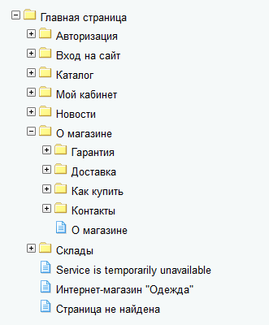
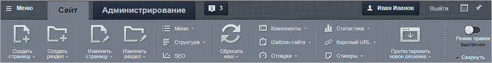
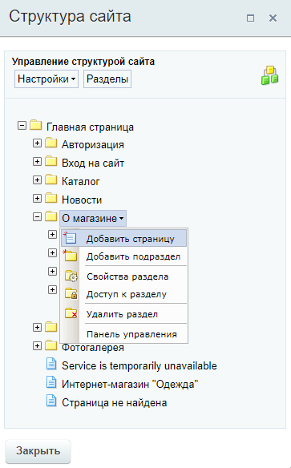
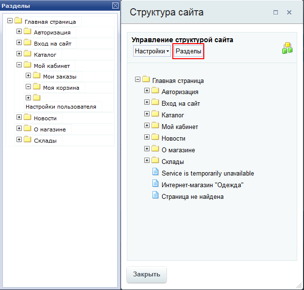

# Кнопка Структура

**Навигация**
- [← Оглавление курса](index.md)
- [← Предыдущий: 1950 — Управление структурой сайта](lesson_1950.md)
- [Следующий: 1853 — Менеджер файлов →](lesson_1853.md)

Официальная страница урока: https://dev.1c-bitrix.ru/learning/course/index.php?COURSE_ID=34&LESSON_ID=1852

Инструмент **Структура** обеспечивает легкий и удобный доступ к файлам и папкам прямо из публичной части. С его помощью контент-менеджер может быстро обратиться к

			логической структуре сайта

                    **Логическая структура** - это список файлов и папок, в том виде, в котором
 они видны
посетителям сайтов в виде разделов и страниц сайта.

Система *"1С-Битрикс: Управление сайтом"* обладает древовидной структурой.

То есть корневая папка делится на разделы, разделы на подразделы и т.д.

		 и отредактировать её.

### Видеоурок

### Быстрый доступ к управлению структурой

Инструмент **Структура** расположен на

			панели управления

                    На Панели управления собраны все команды, которые доступны контент-менеджеру при работе с сайтом. [Подробнее](lesson_1831.md)...

		:

При выборе в выпадающем списке варианта **В панели управления** произойдет переход к

			менеджеру файлов

                    Некоторые операции по работе со структурой можно выполнить только из административной части. В этом случае контент-менеджер может воспользоваться Менеджером файлов, который предоставляет широкие возможности по работе с файлами и папками, а принципы его работы повторяют знакомый всем проводник Windows.
[Подробнее](lesson_1853.md)...

		, о котором вы узнаете в следующем уроке. По нажатии сразу на кнопку **Структура** или на пункт **Управление структурой** в выпадающем списке, откроется специальная форма для управления структурой сайта (страницами и разделами).

Левым кликом мыши для каждой страницы / раздела открывается меню действий:

Действие **Добавить страницу** / **Добавить подраздел** создают страницу / подраздел в

			корне сайта

                    Например, на скриншоте выше, страница/подраздел создадутся на одном уровне с разделами Авторизация, Вход на сайт и т.д.

		, даже если вызваны для определенного подраздела. После создания страницу / подраздел можно переместить. К примеру мы хотим добавить новую страницу в подраздел О магазине &gt; Доставка. Нажимаем кнопку **Добавить страницу** для любого подраздела и создаём её. После перемещаем созданную страницу путем перетаскивания в требуемый подраздел (т.е. подраздел **Доставка**).

Также инструмент **Структура** позволяет редактировать и удалять файлы и папки, и задавать их

			свойства

                    Заголовок, ключевые слова, описание страницы. [Подробнее...](https://dev.1c-bitrix.ru/learning/course/index.php?COURSE_ID=34&CHAPTER_ID=01850&LESSON_PATH=3905.4461.1850)

		.

Кнопка

			Разделы

                    

		 превращает окно в своеобразный файловый менеджер, который позволяет более удобно перемещать файлы и папки простым перетаскиванием.

### Заключение

С помощью инструмента **Структура** можно осуществлять действия по созданию, управлению, удалению файлов и папок в любом месте структуры, не переходя в нужный раздел
