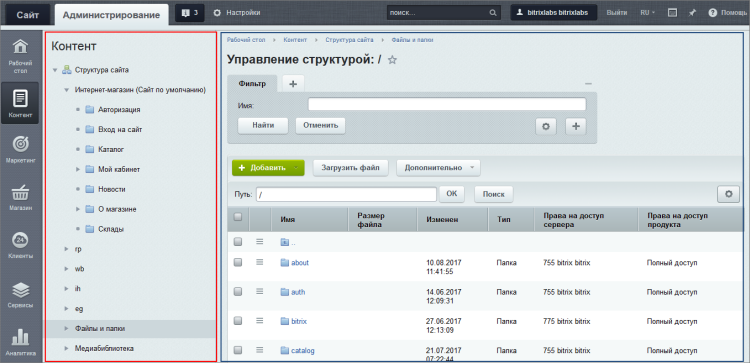
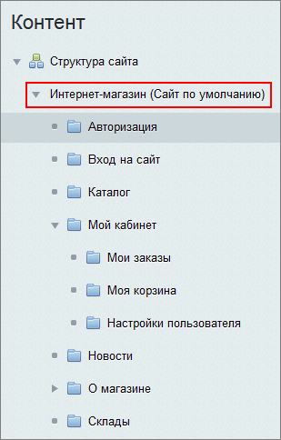
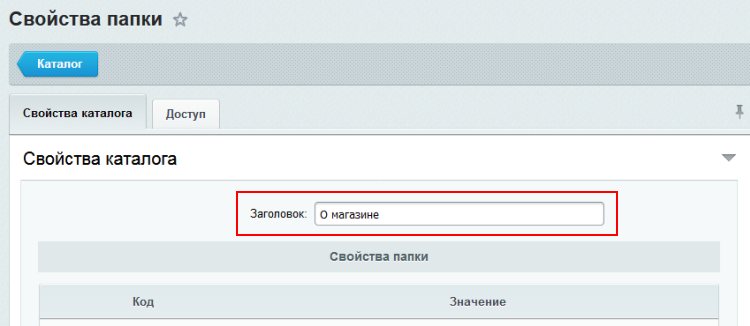
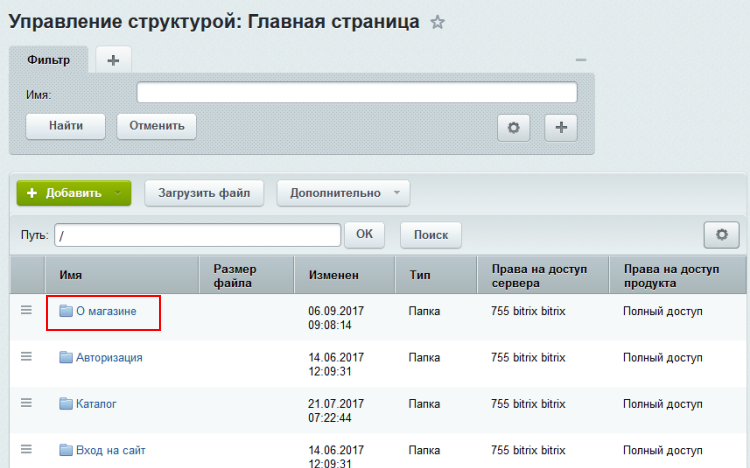
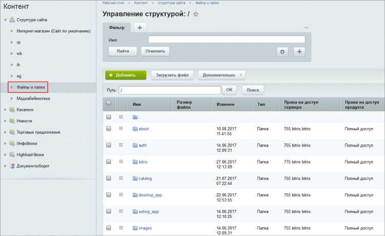

# Менеджер файлов

**Навигация**
- [← Оглавление курса](index.md)
- [← Предыдущий: 1852 — Кнопка Структура](lesson_1852.md)
- [Следующий: 1911 — Создание физических страниц →](lesson_1911.md)

Официальная страница урока: https://dev.1c-bitrix.ru/learning/course/index.php?COURSE_ID=34&LESSON_ID=1853

Некоторые операции по работе со структурой можно выполнить только из административной части. В этом случае контент-менеджер может воспользоваться **Менеджером файлов**, который предоставляет широкие возможности по работе с файлами и папками, а принципы его работы повторяют знакомый всем проводник Windows.

### Видеоурок

### Всё на своих местах

Инструменты Менеджера файлов позволяют:

- создавать и удалять папки и файлы;
- загружать файлы
                      Добавлять файлы в конкретную папку на сервере. [Подробнее...](lesson_1880.md)
  		 в систему;
- скачивать файлы;
- управлять свойствами
                      Задание заголовка, описания и ключевых слов. [Подробнее...](/learning/course/?COURSE_ID=35&LESSON_ID=1929)
  		 страниц и папок;
- переходить к созданию и редактированию страниц;
- управлять меню;
- управлять
  			правами доступа
                      Разрешение на просмотр тех или иных файлов и папок в системе. [Подробнее...](/learning/course/?COURSE_ID=35&LESSON_ID=2019)
  		 пользователей к страницам и разделам;

Перейти в Менеджер файлов можно как из административного раздела (Контент &gt; Структура сайта), так и из публичной части (Структура &gt; В панели управления):

В левой части окна мы выбираем нужную нам папку, а в правой отображается

			список элементов

                    Работа со списками в файловом менеджере аналогична работе с любыми списками в административной части. [Подробнее...](https://dev.1c-bitrix.ru/learning/course/index.php?COURSE_ID=34&CHAPTER_ID=01840&LESSON_PATH=3905.4455.4459.1840)

		 внутри этой папки. Общий подход напоминает работу с проводником Windows или другим файловым менеджером.

У нас есть возможность работать как с логической, так и физической структурой сайта.

### Работа с логической структурой

На верхнем уровне менеджера файлов расположен

			список сайтов

                    

		 и пункт **Файлы и папки**. Для работы с логической структурой нам необходимо выбрать нужный сайт и нажать на стрелку:

Структура в этом случае создается на основе заголовков, которые устанавливаются в свойствах папок в рамках физической структуры. Например, если для папки `/about` в свойствах установлен

			заголовок

                    

		 **О магазине**, то она будет показана в Менеджере файлов с

			этим именем

                    

		.

Контент-менеджеру рекомендуется работать со структурой сайта через Публичную часть. Если, всё же, принято решение работать через логическую структуру, то принципы работы полностью аналогичны

			работе с физической структурой

                    Создание раздела и страницы в Административной части выполняется в рамках либо логической либо физической структуры. На контекстной панели воспользуйтесь кнопкой Добавить и выберите какой элемент будет добавлен.

[Подробнее в курсе "Администратор.Базовый".](https://dev.1c-bitrix.ru/learning/course/index.php?COURSE_ID=35&LESSON_ID=2021)

		. Но в режиме работы с логической структурой часть функционала будет ограничена.

### Работа с физической структурой

**Важно**! Работа напрямую с физической структурой нежелательна. Если всё же приходится работать с физической структурой, то помните, что изменение файлов в папке `\bitrix` могут иметь фатальные последствия для сайта.

Для доступа к физической структуре предназначен пункт **Файлы и папки**:

В рамках физической структуры все файлы и папки отображаются так, как они расположены на сервере, без деления на сайты как в логической структуре. Также она позволяет удалять и перемещать файлы (в отличие от логической).

Стоит иметь в виду, что возможность просмотра физической структуры может быть отключена администратором во избежание неприятностей.

### Заключение

Файловый менеджер - инструмент для работы с физической и логической структурой сайта из административного раздела.

### Документация по теме

- [Менеджер файлов](https://dev.1c-bitrix.ru/user_help/content/fileman/fileman/fileman_admin.php)
