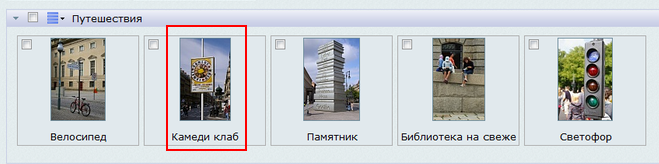

# Предварительная настройка

**Навигация**
- [← Оглавление курса](index.md)
- [← Предыдущий: 4521 — Медиабиблиотека](lesson_4521.md)
- [Следующий: 1855 — Коллекции →](lesson_1855.md)

Официальная страница урока: https://dev.1c-bitrix.ru/learning/course/index.php?COURSE_ID=34&LESSON_ID=1854

Для использования широких возможностей медиабиблиотеки нам необходимо предварительно настроить систему должным образом.

### Видеоурок

### Сделать в первую очередь

Для начала нам нужно включить использование Медиабиблиотеки в настройках модуля

			Управление структурой

                    Настройки &gt; Настройки продукта &gt; Настройки модулей &gt; Управление структурой &gt; Вкладка Медиабиблиотека

		:

Нас интересует опция **Использовать медиабиблиотеку**. Рассмотрим остальные параметры, но оставим в них значения по умолчанию:

- **Размеры картинок предпросмотра** - определяет размер изображения в
  			списке
                      
  		;
- **Другие разрешенные расширения медиафайлов** - список форматов файлов, которые можно будет загружать в библиотеку;
- **Максимальный размер изображений** - предельный допустимый размер изображения;
- **Использовать медиабиблиотеку по умолчанию** - если задать эту опцию, то для выбора любых медиафайлов в системе по умолчанию будет использована библиотека.

К блоку **Типы содержимого** мы вернемся чуть

			позже

                    Иногда стандартных трех типов коллекций бывает недостаточно. К примеру, мы хотим использовать в нашем примере документы в текстовом формате. Давайте создадим новый тип коллекций.

[Подробнее ...](lesson_1855.md#collection_types)

		. В нем задается группировка форматов файлов по типу (изображения, видео, аудио). Для этих трех типов содержимого библиотеки настраивается только один параметр - **Список расширений файлов**.
