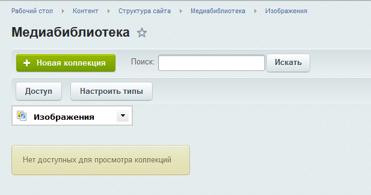
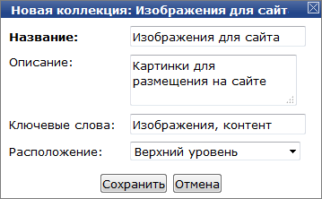
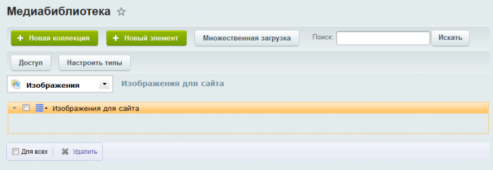
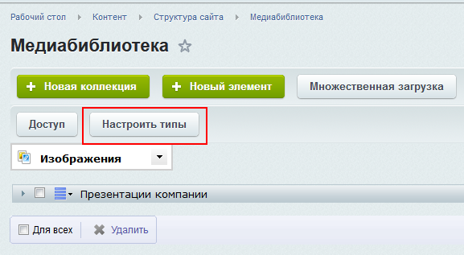
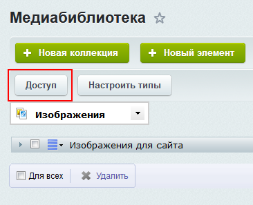

# Коллекции

**Навигация**
- [← Оглавление курса](index.md)
- [← Предыдущий: 1854 — Предварительная настройка](lesson_1854.md)
- [Следующий: 1856 — Загрузка файлов →](lesson_1856.md)

Официальная страница урока: https://dev.1c-bitrix.ru/learning/course/index.php?COURSE_ID=34&LESSON_ID=1855

Следующий этап работы с медиабиблиотекой - создание ее структуры и распределение прав доступа.

### Видеоурок

### Создание коллекций

Многоуровневая структура медиабиблиотеки создается с помощью коллекций. Перейдем в библиотеку (Контент &gt; Структура сайта &gt; Медиабиблиотека):

Коллекции группируются по типам. В системе заранее определены три типа: Изображения, Видео и Аудио. Для наполнения страницы **О компании** нам понадобится несколько коллекций. Давайте создадим по одной коллекции для изображений и видео.

В выпадающем списке выберем **Изображения** и нажмем кнопку **Новая коллекция**. Появится форма создания, в которой зададим название, описание и ключевые слова:

В качестве расположения оставим **Верхний уровень**. Это значит, что новая коллекция будет находиться в корне библиотеки. Если создана сложная структура коллекций, то мы можем выбрать другое расположение.

Нажимаем **Сохранить**. Коллекция отобразится в

			списке

                    

		. Теперь переключимся к типу **Видео** и аналогичным образом создадим коллекцию для видеофайлов.

### Типы коллекций

Иногда стандартных трех типов бывает недостаточно. К примеру, мы хотим использовать документы в текстовом формате. Для таких целей создадим новый тип. Воспользуемся кнопкой

			Настроить типы

                    

		. В открывшейся форме настроек в самом низу нажмем кнопку **Добавить** и заполним информацию о новом типе:

Сохраним созданный тип. Теперь у нас есть возможность создавать коллекцию документов.

**Примечание:** Изображения, Аудио и Видео - системные типы коллекций. Тип **Изображения** является основным и не может быть удалён.

### Настройка доступа

Иногда бывает необходимо задать специальные настройки доступа к коллекциям. К примеру, разрешить всем зарегистрированным пользователям просматривать коллекции.

Для настройки прав доступа воспользуйтесь кнопкой

			Доступ

                    

		.

В открывшейся форме мы можем выбрать конкретную коллекцию или определить доступ сразу ко всем коллекциям. После этого для группы пользователей **Зарегистрированные пользователи** выставим уровень доступа **Просмотр коллекций**:

### Заключение

Коллекция - основной структурный элемент медиабиблиотеки. Коллекции сгруппированы по типам данных. По умолчанию заданы три типа данных, однако при необходимости можно создать дополнительные.
