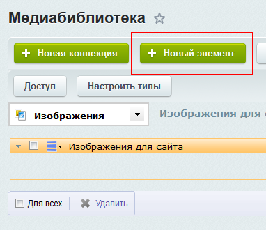
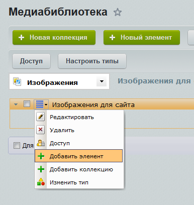
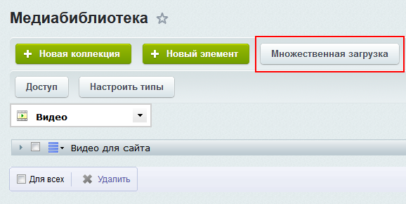
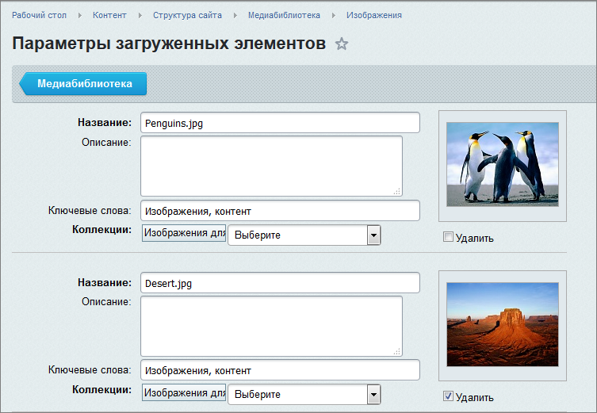
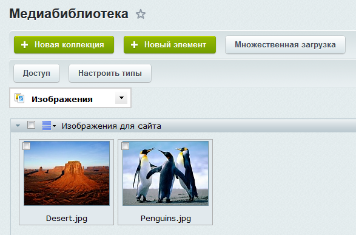

# Загрузка файлов

**Навигация**
- [← Оглавление курса](index.md)
- [← Предыдущий: 1855 — Коллекции](lesson_1855.md)
- [Следующий: 1858 — Работа с элементами коллекций →](lesson_1858.md)

Официальная страница урока: https://dev.1c-bitrix.ru/learning/course/index.php?COURSE_ID=34&LESSON_ID=1856

После создания структуры библиотеки мы можем перейти к наполнению коллекций файлами.

### Видеоурок

### Добавление файла

Добавим видеофайл в созданную ранее коллекцию:

- Нажмем кнопку
  			Новый элемент
                      
  		 на контекстной панели библиотеки или выберем пункт
  			Добавить элемент
                      
  		 в меню коллекции.
- Откроется форма загрузки файла:
- Нажмите кнопку **Обзор** для загрузки файла с локального компьютера или кнопку **Выбрать из структуры** для выбора файла из структуры сайта.
- Зададим название, описание и ключевые слова для нового элемента.
- Выберем коллекцию, в которые будет добавлен новый элемент. В нашем случае это **Видео для сайта**.
- Нажмем кнопку **Сохранить**. Элемент будет добавлен в библиотеку. Если расширение загружаемого файла не совпадает с указанными в настройках коллекции, то система выдаст ошибку о невозможности загрузить файл.

## А вы знали, что файлы в коллекцию могут быть загружены и при работе в публичном разделе?

Например, вы редактируете страницу и добавляете изображение. Изображение можно загрузить в **Медиабиблиотеку** по кнопке **Добавить элемент**:

### Добавление нескольких файлов

Загружать элементы по одному достаточно неудобно. Поэтому для загрузки изображений в коллекцию воспользуемся множественной загрузкой:

- Нажмем на кнопку
  			Множественная загрузка
                      
  		 на контекстной панели библиотеки. Откроется страница загрузки:
- Выберем из списка коллекцию **Изображения для сайта**.
- Добавим элементы простым перетаскиванием или с помощью кнопки **Загрузить**.

### Параметры элементов

После добавления элементов откроется страница **Параметры загруженных элементов**:

 

Мы видим список добавленных элементов и можем отредактировать данные каждого из них. Заполним необходимую информацию и нажмем кнопку **Сохранить**. Готово, элементы

			добавлены

                    

		 в коллекцию.

### Заключение

Файлы загружаются в коллекции по одиночке или группой. При загрузке задаются параметры элемента. После загрузки элемент готов к использованию на сайте.
