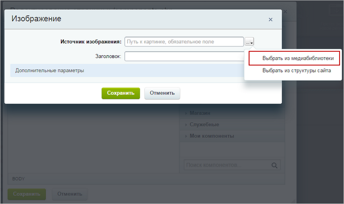

# Примеры использования медиабиблиотеки

**Навигация**
- [← Оглавление курса](index.md)
- [← Предыдущий: 1859 — Поиск](lesson_1859.md)
- [Следующий: 10175 — Проверьте себя →](lesson_10175.md)

Официальная страница урока: https://dev.1c-bitrix.ru/learning/course/index.php?COURSE_ID=34&LESSON_ID=1860

В уроке рассмотрим несколько примеров использования медиабиблиотеки.

### Видеоурок

### Добавление изображения на страницу

- По нажатию кнопки
  			**Изменить страницу**
                      
  		 перейдите к редактированию страницы в визуальном редакторе.
- Нажмите кнопку **Изображение**, расположенную на контекстной панели редактора, чтобы добавить изображение на страницу сайта. В
  			открывшейся форме
                      
  		 в поле **Источник изображения** укажите **Выбрать из медиабиблиотеки** и выберите подходящее изображение:
- Заполните остальные поля формы.
- Нажмите кнопку **Сохранить**.

После сохранения изменений, произведенных в визуальном редакторе, фото отобразится на странице сайта.

### Размещение на странице компонента для проигрывания медиафайлов

- По кнопке **Изменить** перейдите к редактированию страницы сайта в визуальном редакторе.
- Добавьте на страницу
                      В предыдущих уроках мы разобрались, что такое компонент . Система "1С-Битрикс: Управление сайтом" обладает стандартным набором компонентов, которые помогают решить практически все возможные задачи.
  [Подробнее ...](lesson_9163.md)
  		 компонент **Медиа проигрыватель (bitrix:player)** (Контент &gt; Медиа &gt; Медиа проигрыватель).
- В **Параметрах компонента** в поле **Путь к файлу** укажите расположение файла.
- С помощью кнопки  выберите
  			нужный файл
                      Несколько файлов за раз выбрать нельзя.
  		 из **Медиабиблиотеки**:
- Сохраните результаты редактирования страницы.

### Медиабиблиотека при работе с инфоблоками

В качестве примера рассмотрим добавление элементов каталога:

- Добавьте новый элемент в **Каталог книг** (Контент &gt; Каталог книг &gt; Книги).
- В открывшейся форме создания элемента перейдите на вкладку **Подробно**.
- В строке **Детальная картинка** с помощью кнопки выберите команду **Выбрать из медиабиблиотеки**:
- В открывшейся форме выберите нужное изображение. После этого в форме автоматически прописывается адрес выбранного файла.
