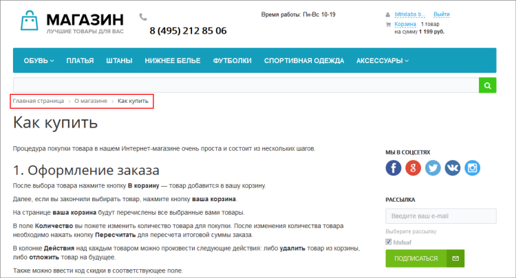
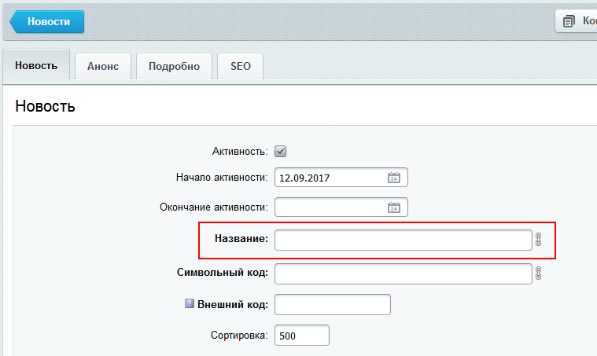
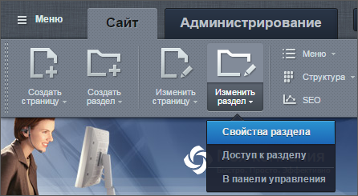
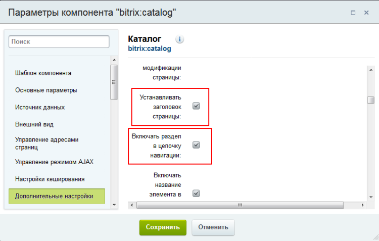

# Цепочка навигации

**Навигация**
- [← Оглавление курса](index.md)
- [← Предыдущий: 10243 — Карта сайта](lesson_10243.md)
- [Следующий: 4521 — Медиабиблиотека →](lesson_4521.md)

Официальная страница урока: https://dev.1c-bitrix.ru/learning/course/index.php?COURSE_ID=34&LESSON_ID=1863

### Видеоурок

Сайты зачастую обладают сложной структурой и несколькими уровнями вложенности. Не потеряться на таком сайте поможет цепочка навигации.
	Она помогает посетителю легко ориентироваться на сайте: быстро вернуться на главную страницу сайта или перейти на уровень выше, то есть перейти из подраздела в раздел.

### Цепочка навигации: как не потеряться на сайте

> **Цепочка навигации** (дублирующее меню, «хлебные крошки») – последовательный список ссылок на разделы сайта, который показывает уровень вложенности текущего раздела или страницы в структуру сайта.

Навигационная цепочка подключается с помощью компонента

			Навигационная цепочка (bitrix:breadcrumb)

                    Компонент выводит навигационную цепочку в шаблоне.

						[Описание компонента «Навигационная цепочка» в пользовательской документации.](http://dev.1c-bitrix.ru/user_help/detail.php?ID=63461)

		. Чтобы цепочка навигации по умолчанию выводилась на всех страницах сайта, ее обычно подключают в шаблоне дизайна сайта. Эту операцию выполняют

			разработчики сайта при его создании

                    Об управлении шаблоном навигационной цепочки подробно рассказывается в курсе [Разработчик Bitrix Framework](https://dev.1c-bitrix.ru/learning/course/index.php?COURSE_ID=43&CHAPTER_ID=04927).

		. Контент-менеджеру остается только управлять названиями разделов, которые и выводятся в цепочке навигации.

В цепочке отображаются те имена разделов, которые заданы в поле **Заголовок** в

			свойствах раздела

                    Контент-менеджер управляет свойствами страниц и разделов. Свойства нужны для тех, кто посещает ваш сайт, например: с их помощью строится цепочка навигации, в заголовке браузера выводится название страницы. Свойства сайта индексируются поисковыми системами и по ним ваш сайт попадает в результаты выдачи. [Подробнее...](https://dev.1c-bitrix.ru/learning/course/index.php?COURSE_ID=34&CHAPTER_ID=01850&LESSON_PATH=3905.4461.1850)

		. Если речь идет об элементах инфоблока, то используется поле

			Название

                    

		.

Изменить свойства раздела можно с помощью пункта

			Изменить раздел

                    

		 на панели управления. В открывшейся форме нас интересует поле **Заголовок**:

Просто измените название на нужное вам и после сохранения оно появится в цепочке навигации.

**Примечание**: некоторые компоненты могут самостоятельно изменять навигационную цепочку, добавляя в неё заголовок текущей страницы сайта или, например, заголовок текущей новости или название товара. Для использования своего заголовка отключите опции **Устанавливать заголовок страницы** и **Включать раздел в цепочку навигации** в

			настройках компонента

                    

		.

### Заключение

Цепочка навигации формируется из заголовков разделов и обеспечивает быстрый доступ к навигации по структуре сайта.

Некоторые компоненты могут самостоятельно изменять навигационную цепочку, добавляя в неё заголовок текущей страницы сайта или, например, заголовок текущей новости или название товара.
