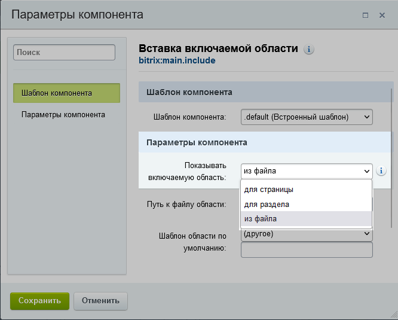
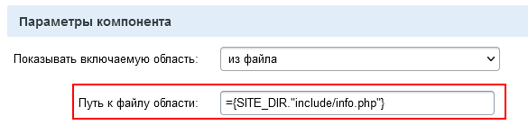

# Включаемые области

**Навигация**
- [← Оглавление курса](index.md)
- [← Предыдущий: 3080 — Короткие ссылки](lesson_3080.md)
- [Следующий: 1833 — Автосохранение →](lesson_1833.md)

Официальная страница урока: https://dev.1c-bitrix.ru/learning/course/index.php?COURSE_ID=34&LESSON_ID=1879

**Включаемая область** - это специально выделенная область на странице сайта, которую можно редактировать отдельно от основного содержания страницы.

### Видеоурок

Как быть, если надо отредактировать информацию в

			шаблоне сайта

                    Шаблон дизайна - программный код, который определяет как внешне будет выглядеть сайт. Создаётся разработчиком сайта, применяется к сайту - администратором, реже - контент-менеджером. [Подробнее...](https://dev.1c-bitrix.ru/learning/course/index.php?COURSE_ID=34&CHAPTER_ID=01851)

		? Редактировать шаблон сайта контент-менеджеру нельзя. Но

			статическую информацию

                    Статическая информация - это информация, которая редко меняется с течением времени. Например, рекламные тексты, история компании, контактная информация. Статическая информация создается и редактируется вручную. [Подробнее...](https://dev.1c-bitrix.ru/learning/course/index.php?COURSE_ID=34&CHAPTER_ID=01848&LESSON_PATH=3905.4461.1848)

		 вроде адреса компании, телефона и так далее очень часто размещают в "шапке" или в подвале сайта. Для такой информации разработчик сайта использует Включаемые области. Контент-менеджер может их редактировать.

### Как найти Включаемую область на сайте

Включаемая область - это

			компонент

                    Компонент - специальный элемент системы, предназначенный для вывода информации из Базы данных сайта. [Подробнее...](https://dev.1c-bitrix.ru/learning/course/index.php?COURSE_ID=34&CHAPTER_ID=04457)

		. Следовательно, искать её надо с помощью включённого

			режима Правки

                    Режим Правки - специальный режим работы "1С-Битрикс: Управление сайтом", в котором

происходит изменение информации на сайте.

[Подробнее...](lesson_1832.md)

		. При наведении указателя мыши на Включаемую область появится специальная панелька (красная рамка):

Если продолжить изучение страницы сайта, то можно найти ещё несколько Включаемых областей. На иллюстрации выше дополнительные Включаемые области показаны в зелёных рамках.

#### Для чего нужна Включаемая область и какие они бывают.

Включаемая область нужна для размещения информации в шаблоне сайта и на страницах и разделах, куда доступ контент-менеджеру запрещён. Не будет же разработчик сайта заниматься

			корректировкой номера телефона

                    Представим, что у нас возникла ситуация: нужно поменять номер телефона на сайте. Сделать это несложно. Давайте определимся в какой части сайта находится телефонный номер.
[Подробнее](lesson_12273.md)...

		 компании, не "барское это дело". Он создаст Включаемую область и поручит эту задачу контент-менеджеру.

В большинстве своём эти области служат для размещения статической информации: авторских прав, графических ссылок, контактной информации, логотипа компании и т.п. Кроме этого в них с помощью компонентов может выводиться и динамическая информация: различные формы (подписка, голосование, опросы), новости или фотографии.

Включаемые области в "1С-Битрикс: Управление сайтом" очень гибко реализованы. Они могут работать в разных условиях и отображаться как на всём сайте, так и в отдельных его местах. Выбор места показа осуществляется в

			настройках компонента

                    

		:

- **для страницы** - включаемая область страницы, выводится только при просмотре определенной страницы;
- **для раздела** - включаемая область раздела, выводится на всех страницах определенного раздела сайта;
- **из файла** - включаемая область выводится на всём сайте.

### Создание, редактирование и удаление

Разработчик размещает компонент Включаемая область на сайте. Но это не означает что область можно сразу наполнять содержанием. Её ещё нужно создать. Как правило, это тоже делает разработчик, но если он не сделал это, то создайте её сами при включённом

			режиме Правки

                    

		. В тех местах, где возможен вывод включаемой области, будет показана иконка **Добавить область**:

Нажмите на кнопку, откроется

			Визуальный редактор

                    Визуальный редактор - инструмент, позволяющий отображать редактируемый текст в точности так же, как он будет выглядеть на странице, без использования HTML кода. [Подробнее...](https://dev.1c-bitrix.ru/learning/course/index.php?COURSE_ID=34&CHAPTER_ID=06299)

		 для заполнения области информацией.

#### Удаление

Компонент **Включаемая область** располагается в шаблоне сайта. Удалить его можно, но это требует понимания того, как это правильно сделать, чтобы не "поехал" дизайн сайта. Оставим это дело разработчикам. Контент-менеджер, если ему позволяют права, может удалить отображение информации (не файла!) во включаемой области. Это можно сделать:

1. Удалением файла из файловой системы, если в настройках компонента **Включаемая область** выбрано значение
  			из файла
                      Путь к файлу отображается в самом компоненте. В нашем случае это `include/info.php`:
  
  		. Этот способ неудобен тем, что возвратиться к удалённому файлу не получится, его уже не будет. Поэтому лучше поступать как написано во втором пункте.
2. Сменой типа включаемой области. То есть вместо "из файла" поставить "для страницы" или "для раздела" и не создавать область для страницы или раздела.
3. Аналогично, сменив тип,  можно скрыть информацию для любого типа включаемой области.

### Важно запомнить!

1. Включаемая область не показывается на всём сайте, если она настроена на конкретный раздел или страницу.
2. Команда **Добавить область как PHP** в панели создания области предназначена для разработчиков и администраторов сайта.
3. Если вы размещаете во Включаемой области картинку или много текста, то вы должны быть уверены, что это не испортит внешний вид сайта. Если картинка больше, чем выделенное в шаблоне сайта место под Включаемую область, то дизайн сайта исказится, "поедет".

|  | #### Заключение |
| --- | --- |

Редактирование информации в шаблоне сайта делается с помощью Включаемых областей.
