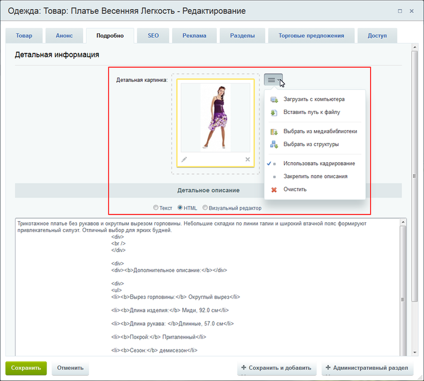
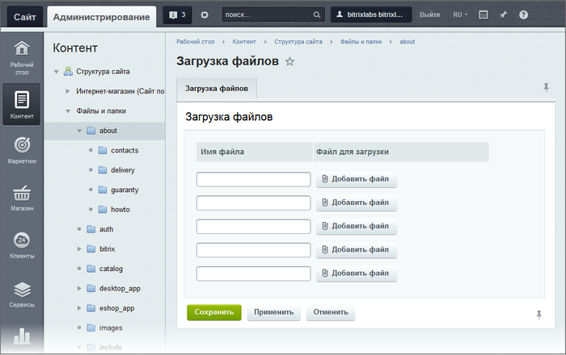

# Загрузка файлов

**Навигация**
- [← Оглавление курса](index.md)
- [← Предыдущий: 1972 — Контроль сессии](lesson_1972.md)
- [Следующий: 5320 — Бизнес-процессы →](lesson_5320.md)

Официальная страница урока: https://dev.1c-bitrix.ru/learning/course/index.php?COURSE_ID=34&LESSON_ID=1880

### Видеоурок

### Способ загрузки зависит от цели

Файлы на сайте размещаются с разными целями и разными способами. Разработчики "1С-Битрикс: Управление сайтом" максимально упростили загрузку файлов, но вам надо понимать с какой целью вы грузите файлы. От этого зависит оптимальный способ загрузки.

Загруженные на сайт файлы контент менеджер использует:

1. Как
  			статическую
                      Статическая информация - это информация, которая редко меняется с течением времени. Например, рекламные тексты, история компании, контактная информация. Статическая информация создается и редактируется вручную. [Подробнее...](https://dev.1c-bitrix.ru/learning/course/index.php?COURSE_ID=34&CHAPTER_ID=01848&LESSON_PATH=3905.4461.1848)
  		 информацию на статических страницах. Например, фотография на странице "О компании".
2. Как
  			динамическую информацию
                      Динамическая информация - информация, хранимая в Базе Данных сайта и выводимая специальными компонентами системы. Как правило, это - часто изменяемая информация со множеством свойств. [Подробнее...](https://dev.1c-bitrix.ru/learning/course/index.php?COURSE_ID=34&CHAPTER_ID=01848&LESSON_PATH=3905.4461.1848)
  		. Например, фотографии в Фотогалерее.
3. Как часть динамической информации в информационных блоках. Например, картинки к новости.

### Медиабиблиотека

Медиабиблиотека - основной инструмент работы с файлами

Медиабиблиотека

                    Медиабиблиотека - специальный инструмент для размещения и управления файлами: фотографиями, видео и другими. Используется для удобной и лёгкой сортировки по группам файлов определённого типа с дальнейшим применением на страницах сайта. [Подробнее](https://dev.1c-bitrix.ru/learning/course/index.php?COURSE_ID=34&CHAPTER_ID=04471&LESSON_PATH=3905.4460.4471)...

		 рекомендуется как основной и универсальный способ работы с файлами.

			Кнопки для использования картинок и файлов

                    

		 из Медиабиблиотеки есть во всех местах системы, где требуется вывод изображений и файлов.

### Компоненты

Компоненты, использующие медиафайлы (видео и фотографии) для показа имеют свои механизмы загрузки. Они описаны в главах:

- Фотогалерея
                      Модуль Фотогалерея 2.0 - это современный и удобный инструмент для создания и управления галереями и фотоальбомами пользователей, групп пользователей и сайта в целом
  [Подробнее ...](https://dev.1c-bitrix.ru/learning/course/index.php?COURSE_ID=34&CHAPTER_ID=04481&LESSON_PATH=3905.4753.4481)
  		,
- Размещение видео на сайте
                      Видео - современный и информативный метод подачи информации посетителю сайта. Для решения задачи по размещению видеоматериалов на сайте используются стандартные компоненты 1С-Битрикс: Управление сайтом Медиа проигрыватель и Видеотека.
  [Подробнее ...](https://dev.1c-bitrix.ru/learning/course/index.php?COURSE_ID=34&CHAPTER_ID=04591&LESSON_PATH=3905.4478.4591)
  		.

### Элементы инфоблока

Изображения и файлы используются и в элементах

			Инфоблока

                    Информационный блок (или Инфоблок) – специальный инструмент "1С-Битрикс: Управление сайтом" с помощью которого заносится информация в Базу данных.
 [Подробнее...](https://dev.1c-bitrix.ru/learning/course/index.php?COURSE_ID=34&CHAPTER_ID=04477&LESSON_PATH=3905.4477)

		. В самом простом случае это - картинки анонса и подробного описания элемента. В более сложных случаях - это файлы, загружаемые в свойства инфоблока. (Эти свойства создаются разработчиком или администратором сайта и выводятся в форме добавления элемента.) Во всех случаях механизм загрузки одинаковый:

**Примечание**: Если в элемент информационного блока картинка грузится с локального компьютера, то выбрать место хранения не получится. Система загрузит файл в какую-то случайную подпапку в рамках специальной папки для загрузки `/upload`.

Если нужно, чтобы картинки лежали в какой-то конкретной папке, то загружайте их либо как статическую информацию (п. 1), либо как часть динамической информации в информационных блоках (п. 3). При создании элемента инфоблока выбирайте либо команду **Выбрать из Медиабиблиотеки**, либо **Выбрать из структуры**.

Подробнее о работе с элементами информационных блоков можно прочитать в уроке [Элементы: создание, изменение, удаление](lesson_10131.md).

**Обратите внимание!** Удаление элементов информационных блоков **не** приводит к удалению загруженных картинок или файлов.

Достаточно часто при создании каталогов нужно загрузить большое количество файлов. В этом случае файлы грузятся как статическая информация, а пути к ним указываются через редактирование элемента инфоблока, как описано выше, либо прописываются с помощью

			импорта CSV-файла

                    Когда наполняете сайт данными через инструмент импорта, то вас, несомненно, волнует вопрос успешности загрузки данных. Избегайте ошибок и траты времени впустую, подготавливайте csv-файл правильно. Рассмотрим основные вопросы подготовки файла с данными.

[Подробнее ...](lesson_2012.md#image)

		.

### Загрузка из Административного раздела

Этот способ используется для загрузки файлов в роли статического контента. Например, вывести файл формата PDF для загрузки его пользователем.

В

			административном разделе

                    **Административный раздел** - раздел системы, недоступный для просмотра обычным посетителям сайта. В нём производятся настройки сайта и системы для работы.

[Подробнее...](https://dev.1c-bitrix.ru/learning/course/index.php?COURSE_ID=34&CHAPTER_ID=04459&LESSON_PATH=3905.4455.4459)

		 системы перейдите в папку, в которой будет храниться загружаемый файл. Нажмите на кнопку

			Загрузить файл

                    

		 под фильтром, откроется форма для загрузки. Добавьте файлы для загрузки и сохраните их.

Администратор сайта может ограничить размер загружаемого файла.

### Заключение

Вы узнали все способы загрузки файлов в "1С-Битрикс: Управление сайтом". Выбирайте оптимальный способ в зависимости от целей. Лучший из них способ работы с файлами - Медиабиблиотека.

### Документация по теме

- [Загрузка нового файла](https://dev.1c-bitrix.ru/user_help/content/fileman/fileman/fileman_file_upload.php)
