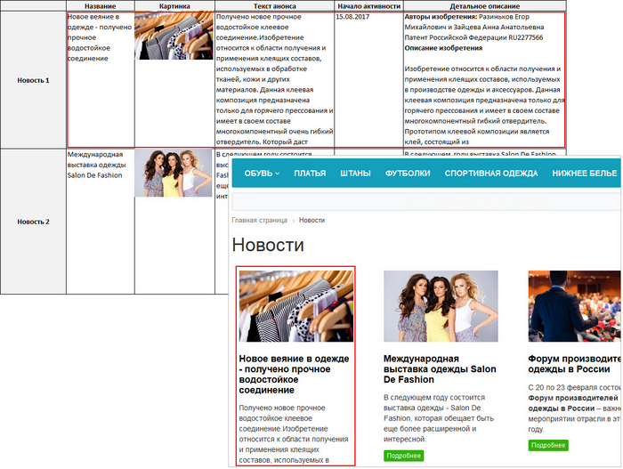

# Что такое информационные блоки

**Навигация**
- [← Оглавление курса](index.md)
- [← Предыдущий: 10237 — Практические задания](lesson_10237.md)
- [Следующий: 1882 — Как устроены информационные блоки →](lesson_1882.md)

Официальная страница урока: https://dev.1c-bitrix.ru/learning/course/index.php?COURSE_ID=34&LESSON_ID=1881

### Что такое информационные блоки?

Из предыдущих уроков вам уже известно, что на сайте может быть представлено 2 вида информации:

			статическая

                    Статическая информация - это информация, которая редко меняется с течением времени. Например, рекламные тексты, история компании, контактная информация. Статическая информация создается и редактируется вручную. [Подробнее...](https://dev.1c-bitrix.ru/learning/course/index.php?COURSE_ID=34&CHAPTER_ID=01848&LESSON_PATH=3905.4461.1848)

		 и

			динамическая

                    Динамическая информация - информация, хранимая в Базе Данных сайта и выводимая специальными компонентами системы. Как правило, это - часто изменяемая информация со множеством свойств. [Подробнее...](https://dev.1c-bitrix.ru/learning/course/index.php?COURSE_ID=34&CHAPTER_ID=01848&LESSON_PATH=3905.4461.1848)

		. Для управления динамической информацией, например, статьями, товарами в *«1С-Битрикс: Управление сайтом»* есть специальные сущности под названием информационные блоки (сокращенно "инфоблоки"). Они не только облегчают работу, но и сокращают время на создание, обновление материалов.

Давайте разберемся, что же такое инфоблоки.

Начнем с того, что эти сущности создаёт специальный

			модуль

                    Модуль - часть программного кода CMS, отвечающий за функционал определённой направленности. Например, модуль Интернет-магазин отвечает за продажи, модуль Блоги дает возможность ведения блогов на сайте и так далее. Модуль виден только в Административном разделе.

[Подробнее...](lesson_7987.md)

		 **Информационные блоки** в системе *«1С-Битрикс: Управление сайтом»*. Доступен он во всех редакциях и предназначен для управления именно однородной информацией, т.е. такой информацией, которая схожа по своей структуре.

Каждый отдельный инфоблок - это своего рода таблица, в ячейках которой хранятся нужные данные. Рассмотрим на примере новостей. В этом случае у нас есть таблица, где каждая строка - это отдельная новость (элемент инфоблока), а столбец - это параметры новости: название, картинка, анонс, детальное описание и т.д.

Отсюда видно, что новости удобно хранить в инфоблоке, поскольку они создаются и показываются на сайте по аналогии друг с другом. Но учтите, что инфоблоки самостоятельно не умеют «показывать» на сайте данные из таблиц, вам следует использовать

			компоненты

                    Компонент – это программный код, оформленный в визуальную оболочку, выполняющий определённую функцию какого-либо модуля по выводу данных в Публичной части. Мы можем вставлять этот блок кода на страницы сайта без непосредственного написания кода. [Подробнее...](https://dev.1c-bitrix.ru/learning/course/index.php?COURSE_ID=34&CHAPTER_ID=04457)

		 (это мы рассмотрим [позже](https://dev.1c-bitrix.ru/learning/course/index.php?COURSE_ID=34&CHAPTER_ID=09909&LESSON_PATH=3905.4477.9909)).

Область применения инфоблоков широка: это товары, статьи, доска объявлений или список подразделений компании - все, для чего можно составить каталог (представить в виде таблицы).

### Заключение

Вы познакомились с понятием "инфоблок". Узнали, что с помощью инфоблоков можно публиковать различные типы динамической информации. Прочитайте [следующий урок](lesson_1882.md) и вы узнаете как устроены инфоблоки.
