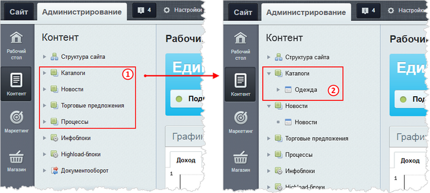
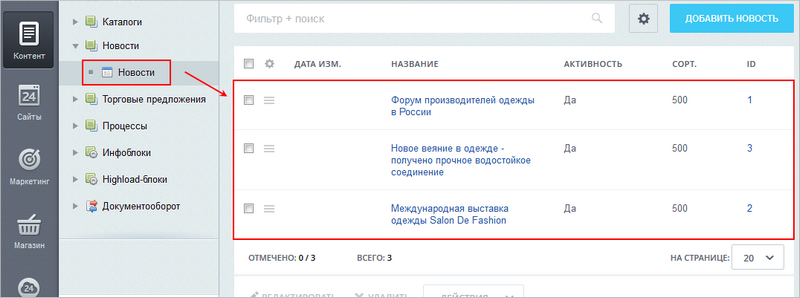
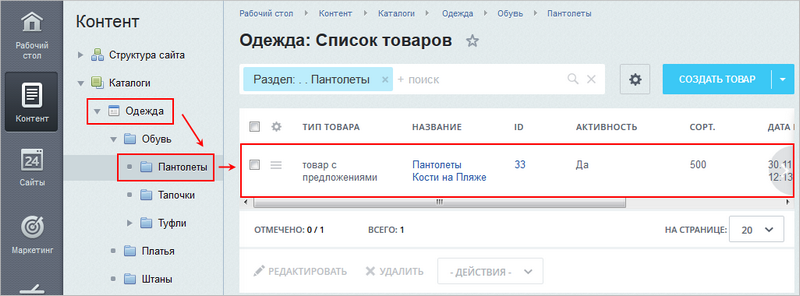

# Как устроены информационные блоки

**Навигация**
- [← Оглавление курса](index.md)
- [← Предыдущий: 1881 — Что такое информационные блоки](lesson_1881.md)
- [Следующий: 2039 — Общий порядок работы с информационными блоками →](lesson_2039.md)

Официальная страница урока: https://dev.1c-bitrix.ru/learning/course/index.php?COURSE_ID=34&LESSON_ID=1882

### Видеоурок

Посмотрите видеоролик и узнайте, как могут быть устроены информационные блоки:

### Как устроены инфоблоки?

Если просмотр видео вам не подходит, то для лучшего понимания откройте административный раздел своего (демонстративного) сайта:

1. В административном меню нажмите **Контент**. Записи 1 - это типы инфоблоков. Раскройте некоторый тип и вы увидите инфоблоки 2 выбранного типа:
   
2. Кликните по названию информационного блока. Возможны 2 ситуации:

  - Откроется сразу список
    			элементов
                        
    		. В этом случае инфоблок не имеет разделов и подразделов, т.е. имеет простую одноуровневую структуру.
    > **Элемент** - это непосредственно сама информация, которую мы размещаем в инфоблоках (товары, фотографии, статьи, справочники и т.д.).
  - Откроется список
    			разделов
                        
    		, когда инфоблок имеет многоуровневую структуру. В таком случае
    			элементы
                        
    		 открываются кликом по разделу.
    > **Раздел** - это логическая единица для группировки элементов внутри инфоблока.
    >
    >
    >
    > Например, в инфоблоке размещены разнообразные товары: платья, блузки, юбки. В этом случае товары следует сгруппировать соответственно по разделам: **Платья**, **Блузки** и **Юбки**.

### Важные особенности информационных блоков

Инфоблоки позволяют создавать

			иерархическую структуру вложенности

                     

		:

- Инфоблоки с похожей информацией объединяются (группируются) в типы инфоблоков.
- Тип инфоблоков определяет, можно ли в инфоблоках создавать разделы для группировки элементов.
- Количество разделов и элементов неограниченно.
- Разделы могут иметь подразделы.
- Один и тот же элемент может быть привязан к нескольким разделам.

### Заключение

Вы узнали, как устроены инфоблоки на сайте. Прочитайте [следующий урок](lesson_2039.md) и вы узнаете о подходах работы с инфоблоками в той или иной ситуации.
