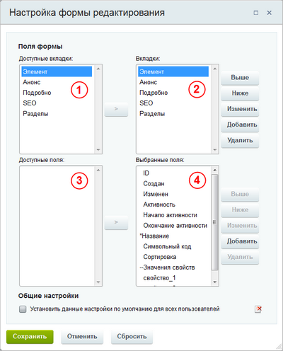
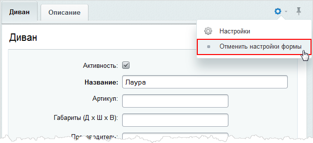
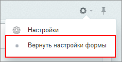

# Настройка форм элементов и разделов под себя

**Навигация**
- [← Оглавление курса](index.md)
- [← Предыдущий: 6305 — Настройка SEO информации](lesson_6305.md)
- [Следующий: 7051 — Подсказки в форме элемента →](lesson_7051.md)

Официальная страница урока: https://dev.1c-bitrix.ru/learning/course/index.php?COURSE_ID=34&LESSON_ID=1883

### Видеоурок

### Облегчаем работу

При работе с товарами, материалами статей, каталогами справочников вы зачастую обращаете внимание на следующий момент: в форме присутствуют поля, которые не используются на сайте. Лишние поля увеличивают размеры формы редактирования и затрудняют внесение данных.

Облегчите свой труд, используйте инструмент настройки форм инфоблоков. Инструмент учитывает индивидуальные потребности,  позволяет настроить формы редактирования разделов и элементов инфоблока под себя:

- удаляйте лишние поля или целые вкладки;
- перемещайте поля между вкладками;
- создавайте свои вкладки.

 Для каждого конкретного инфоблока формируйте свои уникальные формы и работайте с удовольствием.

### Как настроить форму?

**Примечание:** настройка формы выполняется только из административной части сайта.

- Если собираетесь настроить форму редактирования элемента, то откройте страницу со списком элементов инфоблока. Если же нужно настроить форму раздела, то страницу со списком разделов.
- Откройте на редактирование любой элемент (или раздел соответственно).
- В правой части формы нажмите на «шестеренку»  . Откроется окно с настройками:
  
  Сначала отредактируйте и настройте вкладки для формы. Обратите внимание, что все доступные по умолчанию в системе вкладки перечислены в окне 1, а вкладки, которые в действительности показываются в форме, размещаются в окне 2.
  - Выберите вкладку в окне 2 и измените ее расположение с помощью кнопок **Выше** и **Ниже**.
  - Если нужно изменить название одной из вкладок, то выберите ее в окне 2 и нажмите  **Изменить**.
  - Для добавления новой вкладки на форму нажмите **Добавить** справа от окна 2.
  - Если вкладка на форме лишняя, то отметьте ее в окне 2 и нажмите  **Удалить**.
  - Если в форму нужна вкладка, которая находится в окне 1, то отметьте ее и перенесите с помощью кнопки **[ &gt; ]**.
  Поочередно выбирайте вкладки в окне 2 и в окне 4 настраивайте их поля. Каждое поле настраивается аналогично вкладке:
  - вы выбираете поле и выполняете нужную операцию с помощью кнопок, расположенных около окна 4. Единственное отличие - новые поля добавлять нельзя, по кнопке **Добавить** создается разделитель для полей на форме.
  Поля в окне 3 некой вкладки окна 1 показываются только тогда, когда поле не выбрано для показа на форме. Это могут быть вынесенные лишние поля с формы, так и поля, которые, наоборот, следует добавить в форму. Такая ситуация может возникнуть, если форма была уже настроена, а потом добавили новое свойство инфоблока. Свойство в форме показываться не будет, пока вы не перенесете его из окна 3 в окно 4.
  **Внимание!** Все обязательные поля (поля, отмеченные звездочкой) несомненно должны быть перенесены из окна 3 в окно 4.
  Отметьте опцию **Установить данные настройки по умолчанию для всех пользователей**, если требуется выполненные вами настройки установить в качестве настроек по умолчанию для всех пользователей.
  Нажмите **Сохранить**.

Теперь форма редактирования имеет более понятный вид: исключены ненужные поля, а оставшиеся сгруппированы в необходимом порядке. Настроенная форма будет показываться вам при редактировании элементов (разделов) как в административном, так и в публичном разделе.

**Примечание:** вы всегда можете

			отменить

                    

		 выполненные вами настройки и вернуться к исходному виду формы. А затем вновь

			вернуться

                    

		 к своим настройкам.

**Важная особенность:** представьте, что вы настроили форму и изменили название для поля, которое является свойством инфоблока. Если потом вы отредактируете само свойство и измените его название, то в форме по-прежнему будет отображаться заданное вами ранее название поля.

### Заключение

Чтобы сделать формы разделов и элементов приятными для использования, настройте их:

1. откройте форму редактирования любого элемента (раздела);
2. нажмите на «шестеренку»;
3. отредактируйте список вкладок и полей, показываемых на форме.

В следующем уроке вы узнаете, как настроить подсказки по заполнению формы элемента.
