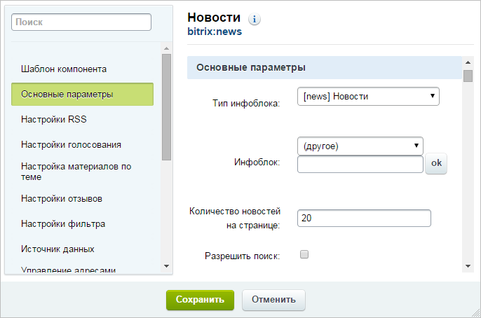

# Компоненты: выставляем информацию напоказ

**Навигация**
- [← Оглавление курса](index.md)
- [← Предыдущий: 13036 — Практические задания](lesson_13036.md)
- [Следующий: 2335 — Настройки инфоблока для корректного поиска элементов →](lesson_2335.md)

Официальная страница урока: https://dev.1c-bitrix.ru/learning/course/index.php?COURSE_ID=34&LESSON_ID=1884

### Компоненты: выставляем информацию напоказ

Информационный блок умеет хранить информацию, но самостоятельно вывести ее на сайт он не может.  За вывод информации отвечают

			компоненты

                    Компонент – это программный код, оформленный в визуальную оболочку, выполняющий определённую функцию какого-либо модуля по выводу данных в Публичной части. Мы можем вставлять этот блок кода на страницы сайта без непосредственного написания кода. [Подробнее...](https://dev.1c-bitrix.ru/learning/course/index.php?COURSE_ID=34&CHAPTER_ID=04457)

		. Компонент - это своего рода организатор выставки ваших экспонатов (элементов инфоблоков), спрятанных в хранилище. «Подружите» инфоблок с компонентами и опубликуйте вашу информацию для посетителей:

1. Создайте
  			раздел
  Создать новый раздел можно и через Публичный раздел, и через Административный. В Публичном разделе есть удобный инструмент - Мастер создания.
  Для создания раздела с помощью Мастера нажмите **Создать раздел**.
  
  [Подробнее](lesson_3450.md)...
  		 на сайте, в котором предполагаете вывести информацию из инфоблока.
2. В разделе создайте одну
  			страницу,
  Создавать страницу лучше сразу в том разделе, где она должна "жить". Перенести неверно созданную
   страницу можно, но зачем лишние действия? Создание страниц доступно с помощью Мастера,
   по шаблону и через документооборот.
   Самый простой и рекомендуемый нами способ - с помощью Мастера.
  
  [Подробнее](lesson_1911.md)...
  		 если планируете использовать
  			комплексный компонент
                      Комплексный компонент выполняет функционал нескольких простых компонентов
  		. Если вам нужно несколько простых компонентов, то следует создать несколько страниц.
3. На страницах
  			разместите
  Просто переместите его мышкой в рабочую область слева от списка. Заметьте, что у простых
  компонентов серая иконка, а у комплексных - зеленая.
  
  Сразу после размещения появится окно настройки компонента. Пока можете его закрыть, мы
  обратимся к настройке чуть позже.
  [Подробнее](lesson_9163.md)...
  		 подходящие вам компоненты.
4. В параметрах каждого компонента обязательно укажите тип и ваш инфоблок. Как правило поля для таких настроек расположены в группе **Основные параметры** (иногда может встречаться название **Основное**):
  
5. Остальные параметры настройте необходимым для вас образом.

Теперь информация доступна для просмотра посетителями. Внешний вид зависит от выполненных вами настроек в компоненте.

### Заключение

Чтобы вывести на сайт информацию из инфоблока, следует:

1. выбрать и разместить компонент на странице;
2. в настройках компонента указать текущий инфоблок.
