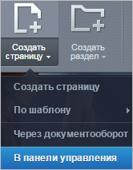
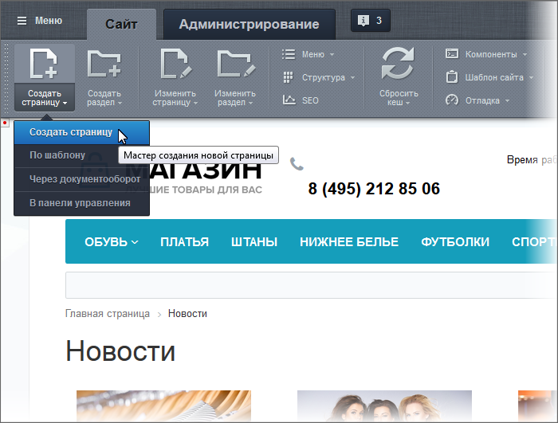
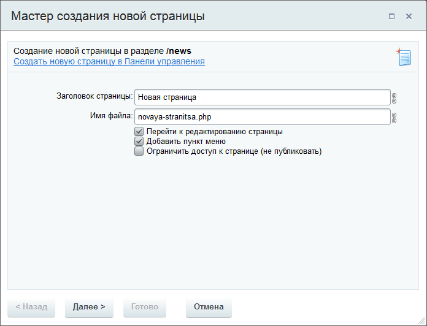
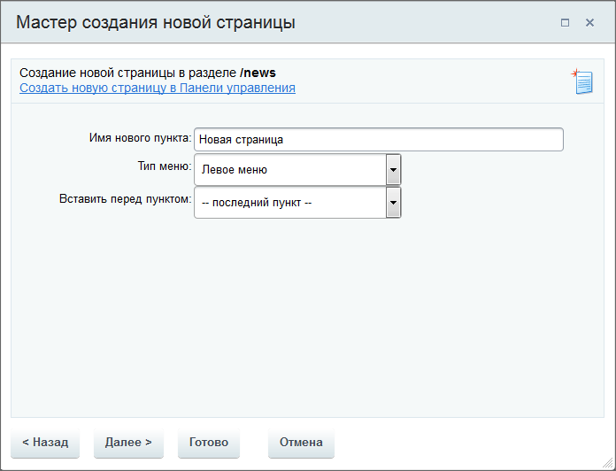
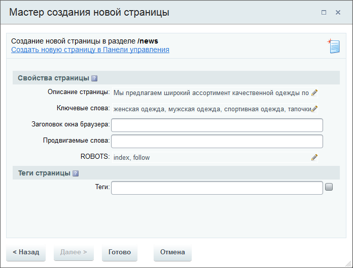
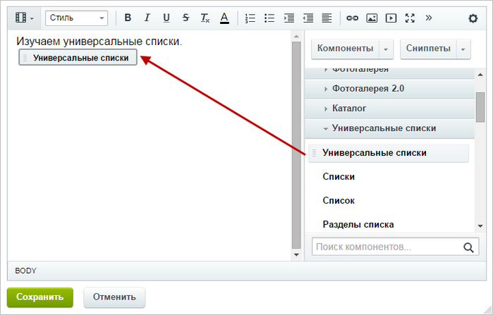

# Создание физических страниц

**Навигация**
- [← Оглавление курса](index.md)
- [← Предыдущий: 1853 — Менеджер файлов](lesson_1853.md)
- [Следующий: 3450 — Создание разделов →](lesson_3450.md)

Официальная страница урока: https://dev.1c-bitrix.ru/learning/course/index.php?COURSE_ID=34&LESSON_ID=1911

Создавать страницу лучше сразу в том разделе, где она должна "жить".

			Перенести неверно созданную страницу

                    При создании страниц и разделов система переходит на созданную страницу или раздел. Если требуется создание нескольких страниц  в одном разделе, то не забывайте возвращаться на главную страницу раздела. Если страница, все же, случайно создана в другом месте, то перенесите ее с помощью кнопки Структура...
[Подробнее](lesson_1852.md)...

		 можно, но зачем лишние действия? Создание доступно с помощью Мастера, по шаблону и через документооборот. Самый простой и рекомендуемый нами способ – с помощью Мастера.

### Видеоурок

### Пошаговое создание страницы

Тему урока можно изучить в новом формате — [в документации по Bitrix Framework](https://docs.1c-bitrix.ru/pages/get-started/create-page.html). В ней улучшена структура, описание, примеры.

Создать новую страницу можно и через Публичный раздел, и через

			Административный.

Для перехода к созданию страницы в Административном разделе

нажмите кнопку **В панели управления**

  

В открывшейся форме заполните требуемые поля

(значения полей указаны в [Документации](https://dev.1c-bitrix.ru/user_help/content/fileman/fileman/fileman_file_edit.php)).

		 В Публичном разделе есть удобный инструмент – Мастер создания новой страницы. Для его запуска нажмите **Создать страницу**:

1. **Первый шаг**, заполните поля формы.
  
  Поле **Имя файла** – это название файла в рамках
  			физической (файловой)
                      **Физическая структура** - это порядок размещения
  физических файлов в папках сайта на сервере.
   В том числе файлов с программным кодом.
  Мы рекомендуем
  работать с физической структурой с большой осторожностью.
  Вы можете повредить системные файлы и всё сломается:).
  
  		 структуры сайта. По умолчанию формируется
  			автоматически
                      Если кликнуть по иконке , то автоматическое формирование файла отключится и название вводится вручную. При ручном вводе допускается кириллица, но запрещены спецсимволы: **\ / ? * &lt; &gt; " '**
  		 из поля **Заголовок страницы**, которое будет использоваться для
  			логической структуры
                      **Логическая структура** - это список файлов и папок, в том виде, в котором
   они видны
  посетителям сайтов в виде разделов и страниц сайта.
  Система *"1С-Битрикс: Управление сайтом"* обладает древовидной структурой.
  То есть корневая папка делится на разделы, разделы на подразделы и т.д.
  
  		 сайта.
  От вашего выбора других опций зависит общее число шагов мастера. Если все опции будут неактивными, то работа Мастера завершится одним шагом нажатием на кнопку **Готово**.

  - Снятие флажка **Перейти к редактированию страницы** исключит из мастера последний шаг и система создаст пустую страницу.
  - Снятие флажка **Добавить пункт меню** исключит из мастера второй шаг и система создаст страницу, не отображаемую в меню.
  - Установка флажка **Ограничить доступ к странице** ограничит доступ к странице для выбранных групп пользователей. Функция удобна, если страница будет наполняться содержанием несколькими людьми или с течением времени.
  - Ссылка
                        Появится после установки флажка **Ограничить доступ к странице**
    		 **Настроить группы редакторов по умолчанию** позволяет быстро перейти в Административный раздел для редактирования прав доступа конкретных групп.
2. **Второй шаг**, задание пункта меню для страницы.
  

  - **Имя нового пункта** - название, под которым страница будет отображаться в меню.
  - **Тип меню** - меню, в которое будет добавлена страница.
  - **Вставить перед пунктом** - перед каким существующим пунктом должна показываться в меню создаваемая страница.
3. **Третий шаг**, задание свойств страницы. Начальные значения свойств наследуются из свойств раздела, в котором она создана, и уже прописаны в форме. Кликнув по иконке с карандашом, можно поменять эти значения.
  
  После этого шага нажмите на кнопку **Готово**, мастер перейдет к редактированию страницы.

  - Поле **Ключевые слова** - ключевые слова страницы, необходимы для поисковых систем (Google, Yandex и других).
  - Поле **Теги** - теги для поиска страницы. Функция активна при установленном флажке правее поля.
  - Поле **Заголовок окна браузера** - то, что будет написано на закладке браузера.
  - Поля **Продвигаемые слова** и **ROBOTS** нужны для поисковых систем. Их заполняем в том случае, если точно знаем, что там нужно писать.
4. **Четвертый шаг** - Добавьте на страницу нужную
  			статическую информацию или компоненты
                      
  		.

### Создание страницы по шаблону

Создание страницы по шаблону удобно, если стоит задача создания многих однотипных страниц. (Администратор должен создать такие [шаблоны заранее](https://dev.1c-bitrix.ru/learning/course/index.php?COURSE_ID=35&CHAPTER_ID=03090).) В этом случае создание страницы производится по команде Создать страницу &gt; По шаблону &gt; нужный шаблон. После этого проходятся все шаги мастера, только на этапе редактирования страницы будет отображён текст, добавленный администратором в шаблон.

### Документация по теме

- [Менеджер файлов](https://dev.1c-bitrix.ru/user_help/content/fileman/fileman/fileman_admin.php)
- [Создание и редактирование файла](https://dev.1c-bitrix.ru/user_help/content/fileman/fileman/fileman_file_edit.php)
