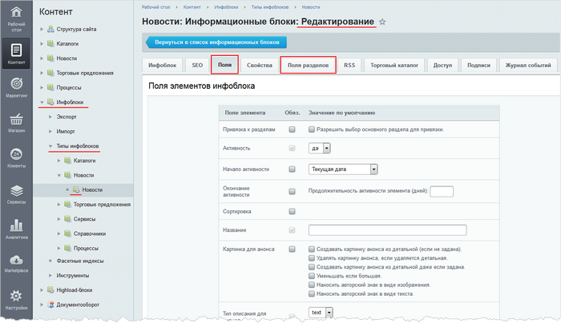

# Предустановленные данные для полей элементов и разделов

**Навигация**
- [← Оглавление курса](index.md)
- [← Предыдущий: 9411 — Настройка доступа к инфоблокам](lesson_9411.md)
- [Следующий: 26248 — Системная обработка фотографий →](lesson_26248.md)

Официальная страница урока: https://dev.1c-bitrix.ru/learning/course/index.php?COURSE_ID=34&LESSON_ID=1912

Стандартные формы редактирования элементов и разделов имеют множество полей, что создает трудности при заполнении. Облегчите свою ежедневную работу вместе с предустановленными данными для полей. Выполните настройки на вкладках

			**Поля** и **Поля разделов**

                    

		 формы редактирования инфоблока.

### Видеоурок

### Как выполнять настройки?

Откройте закладку **Поля**, чтобы выполнить настройки для полей формы элемента, или закладку **Поля разделов** - в случае настройки полей формы раздела соответственно. В каждой строке таблицы:

- отметьте флаг в колонке **Обяз.**, если поле обязательно к заполнению. Так вы не забудете заполнить важные параметры.
  **Примечание:** есть поля, которые системно обязательны для заполнения. Для них нельзя ни установить, ни снять флажок.
- задайте значение по умолчанию, если допустимо и позволяет система. Например, удобно использовать подстановку текущей даты при создании элемента в поле **Начало активности**.

**Примечание:** подробное описание каждого поля вы можете посмотреть на странице пользовательской документации [Создание и редактирование информационного блока](https://dev.1c-bitrix.ru/user_help/content/iblock/iblock_edit.php#filds).
