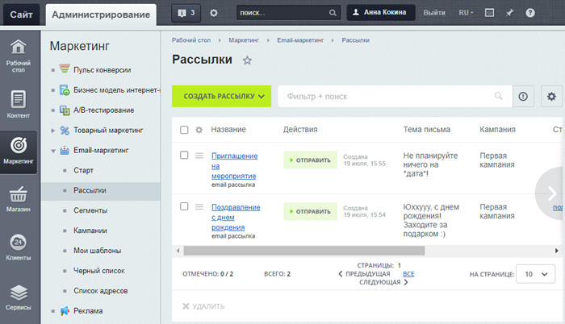

# Списки элементов

**Навигация**
- [← Оглавление курса](index.md)
- [← Предыдущий: 1975 — Основная рабочая область](lesson_1975.md)
- [Следующий: 3872 — Фильтр (старый интерфейс) →](lesson_3872.md)

Официальная страница урока: https://dev.1c-bitrix.ru/learning/course/index.php?COURSE_ID=34&LESSON_ID=1944

|  | ### Универсальный способ вывода списка любых элементов |
| --- | --- |

Что бы вы ни захотели посмотреть в административном разделе 1С-Битрикс: баннеры, товары, новости и так далее — вы увидите все в виде **Списка элементов**. В них отображена вся информация об элементах. Например, выбрав пункт **Баннеры** в разделе **Маркетинг**, пользователь получает информацию об имеющихся в системе баннерах:

На странице со списком элементов обычно выводится фильтр, контекстная панель, сам список элементов и панель действий под списком. Далее рассмотрим составные части списка элементов.

**Примечание:** В настоящее время происходит переход на новый, более удобный и современный интерфейс. Часть разделов уже отображается в новом интерфейсе, поэтому в следующих уроках вы сможете ознакомиться с работой сразу в двух интерфейсах.

