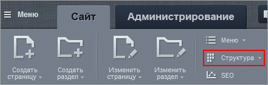

# Управление структурой сайта

**Навигация**
- [← Оглавление курса](index.md)
- [← Предыдущий: 10223 — Практические задания](lesson_10223.md)
- [Следующий: 1852 — Кнопка Структура →](lesson_1852.md)

Официальная страница урока: https://dev.1c-bitrix.ru/learning/course/index.php?COURSE_ID=34&LESSON_ID=1950

|  | ### Управление структурой: работа с файлами и папками |
| --- | --- |

Сайт в системе *"1С-Битрикс: Управление сайтом"* обладает логической и физической структурой.

- Логическая структура
                      **Логическая структура** - это список файлов и папок, в том виде, в котором
   они видны
  посетителям сайтов в виде разделов и страниц сайта.
  Система *"1С-Битрикс: Управление сайтом"* обладает древовидной структурой.
  То есть корневая папка делится на разделы, разделы на подразделы и т.д.
  
  		 показывает, как сгруппированы страницы и разделы по смыслу.
- Физическая структура
                      **Физическая структура** - это порядок размещения
  физических файлов в папках сайта на сервере.
   В том числе файлов с программным кодом.
  Мы рекомендуем
  работать с физической структурой с большой осторожностью.
  Вы можете повредить системные файлы и всё сломается:).
  
  		 показывает расположение файлов и папок на сервере.

Управление структурой сайта включает в себя:

- Инструмент **Структура**
                      
  		 для работы из
  			публичной части
                      **Публичный раздел** - это часть сайта, которая доступна всем пользователям ресурса. Иначе говоря, это сам сайт в том виде, в котором его видят посетители сайта. [Подробнее...](https://dev.1c-bitrix.ru/learning/course/index.php?COURSE_ID=34&CHAPTER_ID=04458&LESSON_PATH=3905.4455.4458)
  		;
- [**Менеджер файлов**](lesson_1853.md) для работы из
  			административного раздела
                      **Административный раздел** - раздел системы, недоступный для просмотра обычным посетителям сайта. В нём производятся настройки сайта и системы для работы.
  [Подробнее...](https://dev.1c-bitrix.ru/learning/course/index.php?COURSE_ID=34&CHAPTER_ID=04459&LESSON_PATH=3905.4455.4459)
  		;
- [Управление меню и цепочкой навигации](lesson_10269.md);
- Работу с
  			медиабиблиотекой
                      Медиабиблиотека - специальный инструмент для размещения и управления файлами: фотографиями, видео и другими. Используется для удобной и лёгкой сортировки по группам файлов определённого типа с дальнейшим применением на страницах сайта. [Подробнее](https://dev.1c-bitrix.ru/learning/course/index.php?COURSE_ID=34&CHAPTER_ID=04471&LESSON_PATH=3905.4460.4471)...
  		.

|  | #### Документация по теме: |
| --- | --- |

- [Модуль Управление структурой](https://dev.1c-bitrix.ru/user_help/content/fileman/index.php)
