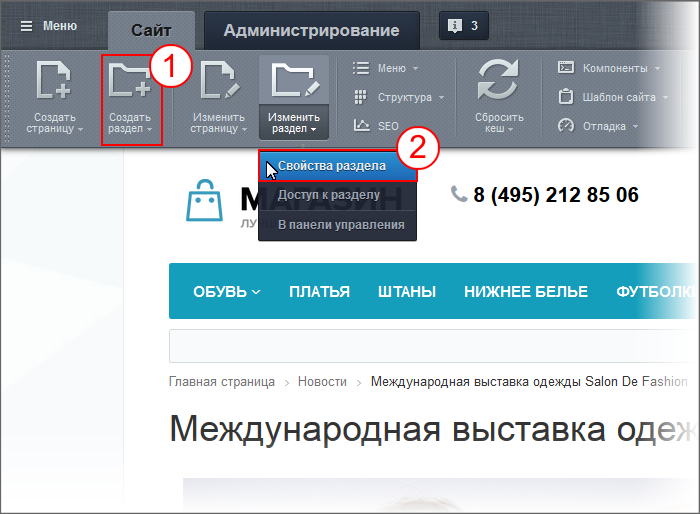

# Управление свойствами раздела

**Навигация**
- [← Оглавление курса](index.md)
- [← Предыдущий: 1962 — Управление свойствами страницы](lesson_1962.md)
- [Следующий: 4492 — Управление доступом к информации →](lesson_4492.md)

Официальная страница урока: https://dev.1c-bitrix.ru/learning/course/index.php?COURSE_ID=34&LESSON_ID=1959

Суть и использование свойств разделов аналогично сути и использованию свойств страниц. И управление свойствами раздела идентично управлению свойствами страницы. Это - большое удобство системы "1С-Битрикс: Управление сайтом". Но есть несколько существенных отличий, которые обязательно учитываются в работе контент-менеджером. Сначала расскажем о том, как управлять, а потом - об этих различиях.

### Управление свойствами раздела

Контент-менеджер управляет свойствами разделов из

			публичного раздела

                    Публичный раздел - то, что видит посетитель сайта, но для контент-менеджера - это основное место работы . [Подробнее](https://dev.1c-bitrix.ru/learning/course/index.php?COURSE_ID=34&CHAPTER_ID=04458&LESSON_PATH=3905.4455.4458)...

		. Свойства задаются при создании раздела  1 или при редактировании  2:

В обоих случаях открываются практически идентичные

			формы

                    Форма редактирования - как правило отдельное всплывающее окно, в котором можно вносить изменения в содержание сайта.

		:

### Наследование свойств

В "1С-Битрикс: Управление сайтом" для облегчения труда контент-менеджера свойства раздела автоматически

			наследуются

                    Наследование - свойство системы когда права вышележащего раздела по умолчанию присваиваются всем подразделам и страницам. [Подробнее](lesson_6676.md)...

		 всеми подразделами и страницами данного раздела. То есть вам не надо задавать свойства для каждого подраздела каталога или товара: сайт это сделает за вас. Но при необходимости вы можете отредактировать свойства любой отдельно взятой страницы раздела под конкретную ситуацию.

### Важно запомнить!

Если в разделах или на страницах сайта представлена

			динамическая информация

                    Динамическая информация - информация, хранимая в Базе Данных сайта и выводимая специальными компонентами системы. Как правило, это - часто изменяемая информация со множеством свойств. [Подробнее](https://dev.1c-bitrix.ru/learning/course/index.php?COURSE_ID=34&CHAPTER_ID=01848&LESSON_PATH=3905.4461.1848)...

		 из

			Информационных блоков

                    Информационный блок - специальный инструмент "1С-Битрикс: Управление сайтом" с помощью которого заносится информация в Базу данных [Подробнее](https://dev.1c-bitrix.ru/learning/course/index.php?COURSE_ID=34&CHAPTER_ID=04477&LESSON_PATH=3905.4477)...

		, то заголовок, ключевые слова и описание для них могут устанавливаться системой автоматически. Это существенно облегчает труд контент-менеджера. Для этого в информационном блоке должны быть настроены

			метаданные

                    Метаданные - это информация об информации. Например, ключевые слова - это метаданные о статье, дата съёмки - метаданные о фотографии.

		 на

			закладке **SEO**

                    Закладка SEO - специальная закладка в форме элемента инфоблока, где задаются эти данные. [Подробнее](lesson_6305.md)...

		 и для его публикации использоваться штатные

			компоненты

                    Компонент - специальный элемент системы, предназначенный для вывода информации из Базы данных сайта. [Подробнее](https://dev.1c-bitrix.ru/learning/course/index.php?COURSE_ID=34&CHAPTER_ID=04457&LESSON_PATH=3905.4457)...

		 системы.

С помощью

			пользовательских типов свойств

                    Пользовательские типы свойств - возможность создавать свои свойства разделов или страниц для получения каких-то дополнительных возможностей. Эти типы создаются администратором сайта.

		 системы администратор сайта задаёт **дополнительные средства управления показом информации** на страницах раздела. Например: задаётся собственное изображение для показа на страницах разделов. С этой целью для разделов сайта создаются свойства для хранения названия и пути к изображениям, а в

			шаблоне дизайна сайта

                    Шаблон дизайна - программный код, который определяет как внешне будет выглядеть сайт. Создаётся разработчиком сайта, применяется к сайту - администратором, реже - контент-менеджером.

[Подробнее](https://dev.1c-bitrix.ru/learning/course/index.php?COURSE_ID=34&CHAPTER_ID=01851&LESSON_PATH=3905.4461.1851)...

		 предусматривается соответствующая программная обработка значения этого свойства.

Если такое свойство реализовано, то форма редактирования раздела может иметь другой вид: с дополнительными полями. Суть этих полей выясните у администратора или разработчика сайта.

### Заключение

1. Управление свойствами возможно при создании и редактировании.
2. Компоненты могут сами, автоматически, устанавливать свойства раздела.
3. Администратор может установить дополнительные свойства раздела
4. Свойства вышестоящего раздела транслируются на нижележащие разделы.

### Документация по теме

- [Настройка SEO информации](lesson_6305.md) (Контент-менеджер)
- [Настройка SEO данных в инфоблоке](lesson_5840.md) (Администратор сервиса Битрикс24 (коробочная версия))
