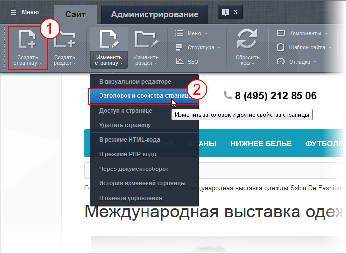
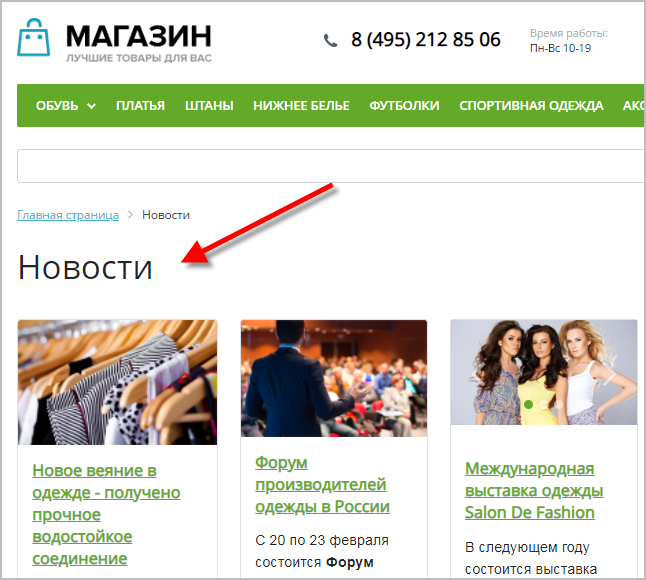
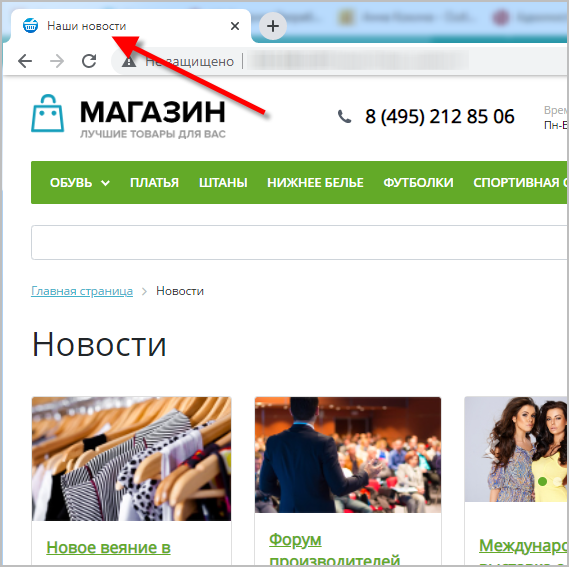

# Управление свойствами страницы

**Навигация**
- [← Оглавление курса](index.md)
- [← Предыдущий: 4576 — Управление заголовком](lesson_4576.md)
- [Следующий: 1959 — Управление свойствами раздела →](lesson_1959.md)

Официальная страница урока: https://dev.1c-bitrix.ru/learning/course/index.php?COURSE_ID=34&LESSON_ID=1962

Контент-менеджер управляет свойствами страниц из

			публичного раздела

                    Публичный раздел - то, что видит посетитель сайта, но для контент-менеджера - это основное место работы . [Подробнее](https://dev.1c-bitrix.ru/learning/course/index.php?COURSE_ID=34&CHAPTER_ID=04458&LESSON_PATH=3905.4455.4458)...

		. Если контент-менеджеру не помогает специалист в области продвижения сайтов (SEO), то определять какими значениями заполнять поля свойств ему придётся самому. Поможет ему в этом курс [Продвижение сайта и маркетинг](https://dev.1c-bitrix.ru/learning/course/index.php?COURSE_ID=139).

### Видеоурок

### Где и как задаются свойства

Свойства задаются при создании страницы  1 или при редактировании  2:

В обоих случаях открываются практически одинаковые

			формы

                    Форма редактирования - как правило отдельное всплывающее окно, в котором можно вносить изменения в содержание сайта.

		:

- **Заголовок** – главный
  			заголовок
  
  		, отображаемый на странице (заголовок первого уровня).
- **Заголовок окна браузера** (title) – то, что будет написано
  			на закладке браузера
  
  		. Если это поле не заполнено, то в заголовок окна браузера будет подставляться значение из поля **Заголовок**.
- **Описание страницы** (description) – описание, которое поисковые роботы могут взять как краткое содержание текста на странице.
- **Ключевые слова** (keywords) – ключевые слова и словосочетания страницы, указанные через запятую.
- **Продвигаемые слова** – те слова и словосочетания, по которым Вы планируете продвигать страницу.
- **ROBOTS** – служебная информация для роботов поисковых систем.
- **Теги** –
  			теги
                      Как правило это слова и словосочетания, определяющие тематику материала.
  		 для быстрого поиска страницы внутри системы.

**Примечание**: если информация размещена в

			Информационных блоках

                    **Информационный блок** – специальный инструмент "1С-Битрикс: Управление сайтом" с помощью которого заносится информация в Базу данных [Подробнее](https://dev.1c-bitrix.ru/learning/course/index.php?COURSE_ID=34&CHAPTER_ID=04477&LESSON_PATH=3905.4477)...

(т.е. является

			динамической информацией

                    **Динамическая информация** - информация, хранимая в Базе Данных сайта и выводимая специальными компонентами системы. Как правило, это - часто изменяемая информация со множеством свойств. [Подробнее](https://dev.1c-bitrix.ru/learning/course/index.php?COURSE_ID=34&CHAPTER_ID=01848&LESSON_PATH=3905.4461.1848)...

		), и выводится на странице штатным

			компонентом,

                    **Компонент** – специальный элемент системы, предназначенный для вывода информации из Базы данных сайта. [Подробнее](https://dev.1c-bitrix.ru/learning/course/index.php?COURSE_ID=34&CHAPTER_ID=04457&LESSON_PATH=3905.4457)...

		 то можно значительно облегчить труд контент-менеджера – настроить **автоматическое заполнение** свойств страницы (заголовка, ключевых слов и описания).

Для этого в информационном блоке должны быть настроены

			метаданные

                    **Метаданные** – это информация об информации. Например, ключевые слова - это метаданные о статье, дата съёмки - метаданные о фотографии.

		 на

			закладке SEO.

                    **Закладка SEO** – специальная закладка в форме элемента инфоблока, где задаются эти данные.

Ознакомьтесь с видео данного урока и научитесь настраивать метаданные.

[Подробнее](lesson_6305.md)...

### Откуда берутся дополнительные поля?

Администратор магазина может создать дополнительные поля формы редактирования страницы.

Это делается с помощью

			пользовательских типов свойств

                    **Пользовательские типы свойств** – возможность администратора сайта создавать свои свойства разделов или страниц для получения каких-то дополнительных возможностей.

Для разделов сайта создаются свойства для хранения названия и пути к изображениям, а в шаблоне дизайна сайта предусматривается соответствующая программная обработка значения этого свойства.

		 системы. Администратор сайта задаёт **дополнительные средства управления показом информации** на страницах раздела. Например: задаётся собственное изображение для показа на страницах разделов.

Суть этих полей уточните у администратора или разработчика сайта.

### Заключение

1. Управление свойствами возможно при создании и редактировании.
2. Компоненты могут сами, автоматически, устанавливать свойства страницы.
3. Администратор может установить дополнительные свойства страницы
