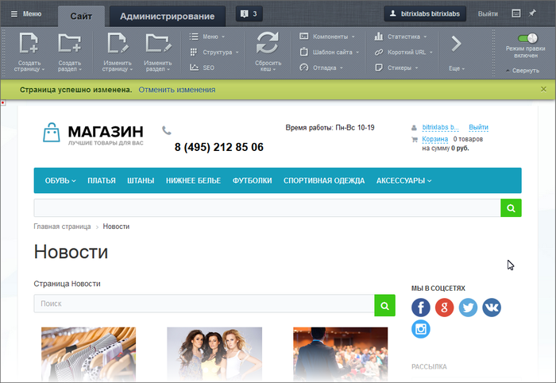

# Отмена действий

**Навигация**
- [← Оглавление курса](index.md)
- [← Предыдущий: 1833 — Автосохранение](lesson_1833.md)
- [Следующий: 1972 — Контроль сессии →](lesson_1972.md)

Официальная страница урока: https://dev.1c-bitrix.ru/learning/course/index.php?COURSE_ID=34&LESSON_ID=1965

Используйте функцию **Отмена действий**, если после внесения каких-то изменений стало понятно, что вы ошиблись. Добавлен какой-то текст на страницу. Или изменены параметры

			компонента

                    Компонент - специальный элемент системы, предназначенный для вывода информации из Базы данных сайта. [Подробнее](https://dev.1c-bitrix.ru/learning/course/index.php?COURSE_ID=34&CHAPTER_ID=04457&LESSON_PATH=3905.4457)...

		. После сохранения изменений вы понимаете, что изменения неправильные и нужно вернуть всё обратно. Для такого возврата достаточно нажать на **Отменить изменения** и страница вернётся к прежнему состоянию.

### Видеоурок

### Отмена действий: исправляем ошибки

Система допускает отмену последнего совершенного действия. После каждого изменения, внесенного в содержание сайта, под

			Панелью управления

                    Панель управления - основной инструмент управления содержимым сайта. [Подробнее](lesson_1831.md)...

		 отображается **Строка отмены действия**:

В этой строке выводится описание совершенного пользователем действия и команда на отмену действия. Кликнув по ссылке, вы совершите отмену. Для закрытия строки щёлкните по крестику у правого края строки.

Если изменены только настройки компонентов, то будет выведена соответствующая надпись: **Параметры компонента успешно изменены** и отменяются только настройки компонента. Если одновременно изменены и параметры компонента, и содержание страницы, то будет выведена соответствующая надпись: **Страница успешно изменена** и отменятся все изменения целиком.

### Важно запомнить!

Отменяется только последнее изменение. Если вы внесли изменения, не отменили их, перешли на другую страницу, а потом вернулись, то система не предложит вам отмену действий.

**Внимание!**

- Отменяется только **одно** последнее действие. В системе не предусмотрена возможность отменять последовательность или ряд последних действий.
- Любое другое действие после неправильного изменения (обновление страницы, сброс кэша, переход на другую страницу и др.) сразу же сделает невозможным отмену изменений.
- Восстановление полностью испорченных или удаленных страниц недоступно контент-менеджеру.
- Для минимизации последствий возможных неправильных действий контент-менеджеров,
  			администратор сайта
                      **Администратор сайта** управляет модулями системы, структурой, содержанием, посетителями и другими составляющими сайта.
  [Курс для Администратора сайта](https://dev.1c-bitrix.ru/learning/course/index.php?COURSE_ID=35)
  		 может:

### Заключение

**Отмена действий** - удобный инструмент для быстрого восстановления исходного состояния после неправильных изменений.
