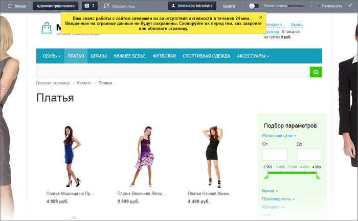

# Контроль сессии

**Навигация**
- [← Оглавление курса](index.md)
- [← Предыдущий: 1965 — Отмена действий](lesson_1965.md)
- [Следующий: 1880 — Загрузка файлов →](lesson_1880.md)

Официальная страница урока: https://dev.1c-bitrix.ru/learning/course/index.php?COURSE_ID=34&LESSON_ID=1972

### Контроль сессии: следим за временем жизни авторизации

Исключить допуск к управлению сайтом стороннего человека - основа безопасной работы сайта. Для достижения этой цели придумано много инструментов. Один из них -

			сессия

                    Сессия - это время в течение которого возможен авторизованный доступ к сайту с определённого компьютера и под одним логином.
 О настройке времени жизни сессии читайте в курсе [Администратор.Базовый](https://dev.1c-bitrix.ru/learning/course/index.php?COURSE_ID=35&LESSON_ID=3799)

		.

**Какое значение для Контент-менеджера имеет сессия?**

Вы потратите рабочее время впустую если вы набираете текст на сайте, а сессия в это время закончилась. В этом случае после нажатия на кнопку **Сохранить** ваш компьютер отправит данные на сайт, но они, увы, не будут записаны.

В  *"1С-Битрикс: Управление сайтом"* реализована "живая сессия". Если вы долго пишете в блог или заполняете какую-либо форму, то есть обращений к сайту с вашего компьютера не происходит, то сессия формально истекает. Но система проверяет ваши действия на компьютере: нажатия кнопок клавиатуры, движения или клики мышью. Обнаружив подобную активность в окне браузера, где открыт сайт, она автоматически продлевает вашу сессию. Если никаких действий не происходит, то сессия истекает и появляется жёлтое сообщение:

Сообщение предупреждает об опасности потерять все несохраненные данные. Для большей надежности текст рекомендуется сохранить где-либо (в отдельном файле, буфере обмена), а после авторизации на сайте заново ввести текст.

### Заключение

> **Сессия** - это сеанс работы пользователя с сайтом. Определяется как серия запросов к
>
> 			серверу
>
>
>
>                     Сервер - компьютер, на котором размещён ваш сайт. Находится, как правило, у специальной организации - провайдера.
>
>
>
> 		, сделанных одним пользователем в заданный промежуток времени.

Система отслеживает время жизни сессии и уведомляет вас о завершении. Если вы, получив такое уведомление, не сохраните где-то неотправленные данные, то сами виноваты. :)

Время жизни сессии изменяется. Сессией управляют администраторы, выставляя определённые параметры в настройках сайта. По умолчанию после установки продукта это время устанавливается в 30 минут. Если возникла необходимость увеличить время - обратитесь к администратору сайта.
