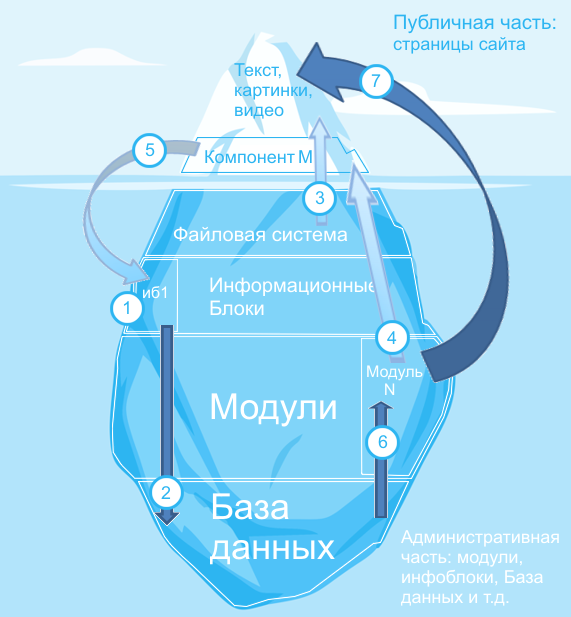
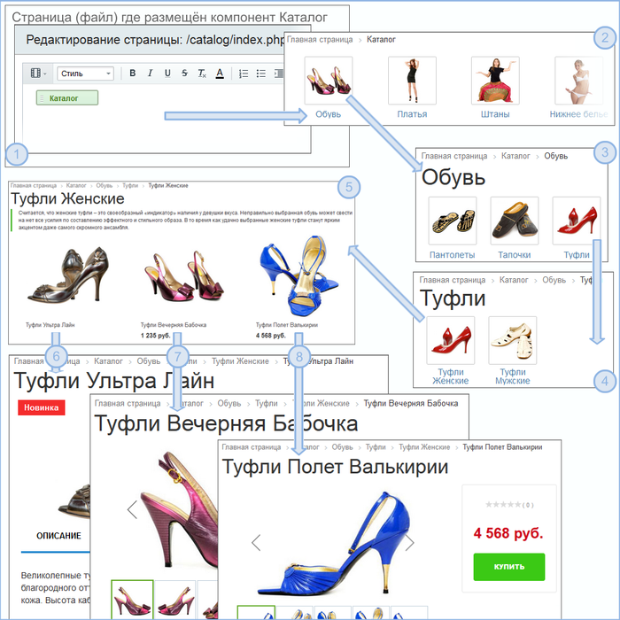

# Работа с инфоблоками

**Навигация**
- [← Оглавление курса](index.md)
- [← Предыдущий: 7981 — Создание физических страниц](lesson_7981.md)
- [Следующий: 8589 — Работа без инфоблоков →](lesson_8589.md)

Официальная страница урока: https://dev.1c-bitrix.ru/learning/course/index.php?COURSE_ID=34&LESSON_ID=1973

Это ознакомительный материал. Детальнее смотрите в главе [Информационные блоки](https://dev.1c-bitrix.ru/learning/course/index.php?COURSE_ID=34&CHAPTER_ID=04477&LESSON_PATH=3905.4477)

### Работа с динамически формируемой информацией - работа с инфоблоком

Условная схема работы с динамической информацией с помощью инфоблока и компонентов. Кажется сложной, но это не так. Внимательно посмотрите и всё поймёте. Стрелки светлого цвета - действия контент-менеджера, стрелки тёмного цвета - автоматические действия системы.

#### Добавляем информацию

Прежде чем показать информацию, её добавляют:

1. Создаём инфоблок (иб1), настраиваем поля и добавляем в него данные.
2. Инфоблок размещает эту информацию в Базе данных.

#### Создание страницы для динамической информации

1. В рамках файловой структуры в нужном разделе создаём страницу.
2. На странице размещаем нужный нам компонент M из модуля N.
3. Настраиваем компонент на созданный нами инфоблок (иб1).

#### Посетитель открыл страницу, что происходит

1. По запросу компонента М База данных передаёт данные из инфоблока (иб1) модулю N.
2. Модуль выполняет необходимые изменения этой информации и выдаёт её компоненту М для показа.

В результате посетитель на странице видит текст, картинки, видео и так далее.

### Особенность динамической информации

Несмотря на то, что в описанном алгоритме создаётся одна физическая страница с компонентом, на сайте этот компонент показывает один или несколько разделов со множеством программно создаваемых страниц.

Подходящий пример - Каталог товаров. На физической странице размещается компонент Каталог и настраивается на инфоблок, куда добавлены товары. В результате посетитель сайта увидит раздел со страницами, по одной на каждый товар. Итак: одна физическая страница + компонент = множеству динамических страниц.

Рассмотрим это на примере:

1 -  в отдельном файле размещаем компонент Каталог и настраиваем его на инфоблок.

2 - в Публичной части сайта на этой же странице (Помните: Файл = Страница?) видим разделы инфоблока, выводимые как разделы каталога: Обувь, Платья, Штаны и так далее. И это единственная страница, которая существует физически. Все остальные, что описаны ниже - виртуальные.

3 - Кликнув по Обувь переходим в раздел Обуви и видим там три раздела: Пантолеты, Тапочки, Туфли.

4 - Кликнув по Туфлям переходим раздел Туфли и видим ещё два раздела: Туфли женские и Туфли мужские.

5 - Кликнув по Туфлям женским переходим в этот раздел и видим уже конкретные товары из этой категории.

6, 7, 8 - Поочерёдно открываем страницы конкретных товаров.

Таким образом, на одной физической странице размещён компонент, создающий динамически большое количество виртуальных страниц, чем существенно упрощает работу контент-менеджера. (Представьте себе необходимость создания каталога из хотя бы пары сотен товаров.)

### Важно запомнить!

- С помощью компонентов и инфоблоков можно программно создавать произвольное число страниц сайта.
- Компонент размещается на физической странице и настраивается на инфоблок.
