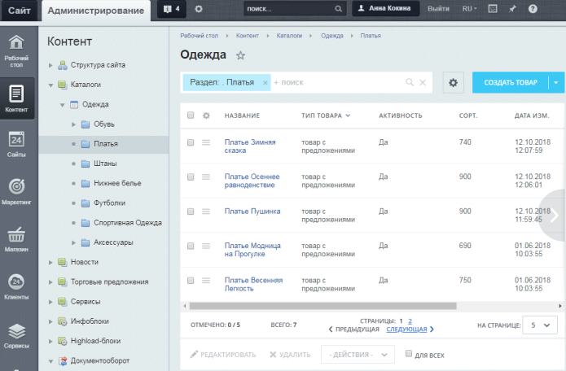
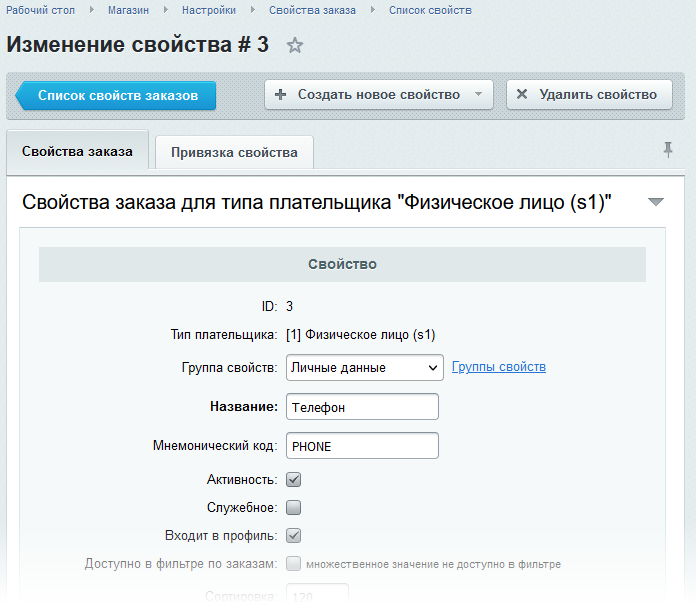
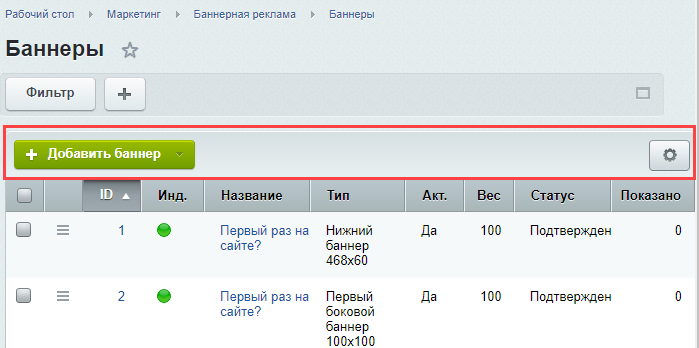

# Основная рабочая область

**Навигация**
- [← Оглавление курса](index.md)
- [← Предыдущий: 2735 — Меню функций](lesson_2735.md)
- [Следующий: 1944 — Списки элементов →](lesson_1944.md)

Официальная страница урока: https://dev.1c-bitrix.ru/learning/course/index.php?COURSE_ID=34&LESSON_ID=1975

### Видеоурок

### Третий уровень: там, где выполняются работы

**Рабочая область** - это место, где производится большинство операций по управлению сайтом:

- просмотр элементов, составляющих контент сайта (например,
  			информационных блоков
                      Информационный блок (или Инфоблок) – специальный инструмент "1С-Битрикс: Управление сайтом" с помощью которого заносится информация в Базу данных.
   [Подробнее...](https://dev.1c-bitrix.ru/learning/course/index.php?COURSE_ID=34&CHAPTER_ID=04477&LESSON_PATH=3905.4477)
  		, баннеров и т.п.);
- добавление контента;
- создание и удаление папок и файлов;
- настройка меню и т.д.

Такие операции реализуются формами двух основных видов:

- **Формы отчётов** - в основном это
  			списки элементов
                      Что бы вы ни захотели посмотреть в административном разделе «1С-Битрикс: Управление сайтом»:
   баннеры, товары, новости и так далее, вы всё увидите в виде Списка элементов.
  В них отображена вся информация об элементах.
  
  [Подробнее ...](https://dev.1c-bitrix.ru/learning/course/index.php?COURSE_ID=34&CHAPTER_ID=01840)
  		, которые предназначены для просмотра элементов в виде таблиц. А также, в отдельных случаях (например, формы статистики), формы отчётов представлены в виде графиков и диаграмм;
- Формы редактирования
                      Каждый элемент системы можно изменить: отредактировать новость, изменить описание товара,
   изменить SEO параметры страницы, создать скидку, настроить параметры модуля и так далее.
  Форма изменения появляется по команде **Изменить**. Несмотря на то, что формы различаются полями,
  объёмом изменяемой информации, можно выделить некоторые общие моменты для всех форм.
  
  [Подробнее ...](lesson_1841.md)
  		 - применяются для добавления и правки элементов, а также для задания настроек модулей и системы в целом.

Формы, отображаемые в рабочей области, хоть и разные, но имеют общие элементы. Ознакомьтесь с их функциями - это значительно облегчит дальнейшую работу с сайтом.

Для удобства текущего управления сайтом рекомендуется настроить

			Рабочий стол

                    Рабочий стол - инструмент для организации удобного управления работой сайта с помощью произвольно размещаемых гаджетов. Система запоминает настройки Рабочего стола для каждого пользователя, то есть никто не изменит то, что вы настроили для себя.

[Подробнее ...](https://dev.1c-bitrix.ru/learning/course/index.php?COURSE_ID=34&CHAPTER_ID=03068&LESSON_PATH=3905.4455.4459.3068)

		 в **Основной рабочей области**.

Клик по пиктограмме , расположенной рядом с

			названием

                    

		, добавляет ссылку на текущую страницу в

			Избранное

                    Избранное позволяет в один клик мыши перейти на нужную страницу сайта
 или в нужный раздел Административного интерфейса.

[Подробнее ...](lesson_1990.md)

		 команды **Меню**.

### Контекстная панель

Если форма позволяет производить какие-либо действия в отношении отображаемых элементов, то между фильтром и собственно списком на форме располагается **контекстная панель**, содержащая команды. Контекстные панели могут отображаться как в списках элементов, так и на формах редактирования. Например, список баннеров на Маркетинг &gt; Баннерная реклама &gt; Баннеры имеет такую контекстную панель:

Контекстная панель имеет кнопку , в которой содержатся дополнительные команды. Обязательно присутствуют команды:

- **Настроить** выводит диалоговое
  			окно, где пользователь выбирает колонки
                      Удобство работы со списком элементов - один из факторов быстрой и производительной работы контент-менеджера. Но каждый сайт - это свои информационые блоки со своими параметрами, свои опросы, свои группы баннеров и так далее. Создать удобный для всех случаев интерфейс списка элементов - невозможно. Поэтому в «1С-Битрикс: Управление сайтом» реализована возможность настройки списка элементов.
  [Подробнее ...](lesson_2776.md)
  		 для отображения в списке и задаёт некоторые параметры, применяемые по умолчанию (поле и направление сортировки и т.п.).
- **Excel** выполняет
  			экспорт элементов
                      Сохранить данные из «1С-Битрикс: Управление сайтом» на локальный компьютер - достаточно частая задача. Для такой операции используется формат MS Excel. Экспорт в него прост, выполняется в пару кликов прямо из Списка элементов. Используйте для этого кнопку **Настроить**.
  [Подробнее ...](lesson_5067.md)
  		 из списка в файл **Microsoft Excel**.
